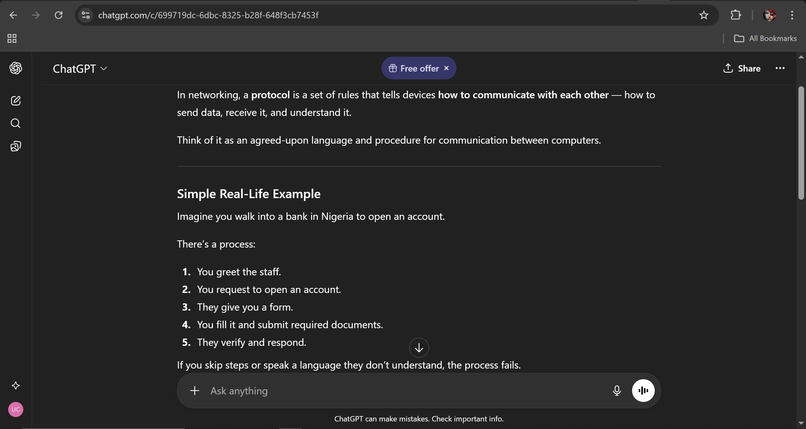
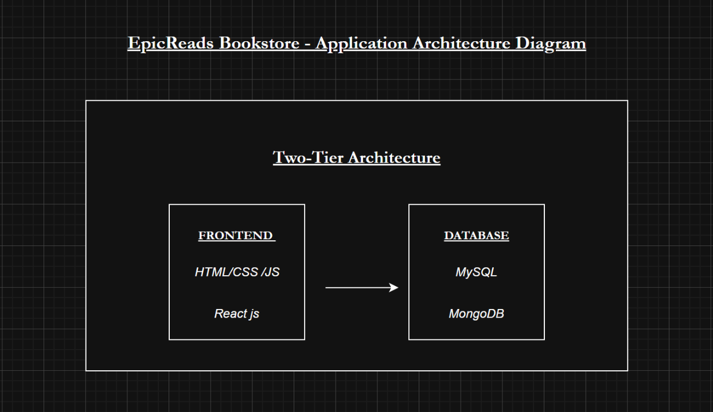
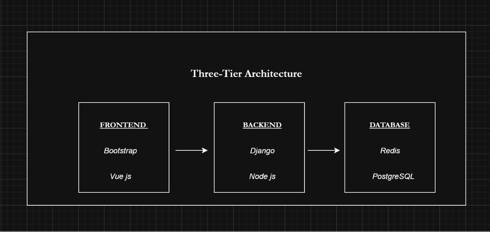
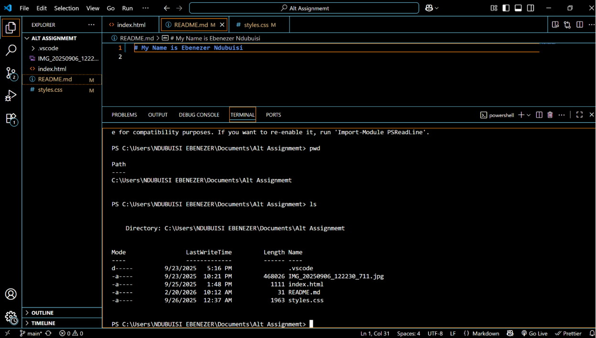

# Week 00 - Internet and Networking

Part of the DevOps Micro Internship (DMI) Cohort 3 with Agentic AI

---

# 🧑‍💻 Task 1: Using ChatGPT as Your Learning Assistant

## Scenario

You're new to DevOps and will frequently encounter technical questions. ChatGPT can be your learning companion.

## Your Task

Write a clear ChatGPT prompt to help you understand:

> "What is a protocol in networking? Explain with a simple real-life example."

Take a screenshot of your interaction showing:

* Your detailed prompt (with clear expectations)
* ChatGPT's simplified response with an example

## Screenshot

Save your screenshot in the `screenshots` folder and update the file name below.



---

## What I Learned (2–3 lines)

I learned that Chatgpt can actually help me in my learning

---

# 🌐 Task 2: Internet and Networking

## Scenario

Your friend is launching an online bookstore named **EpicReads**.

He asked you to explain how users globally can access his website hosted in Finland.

## Your Task

Write a short explanation (**100–150 words**) that includes:

* Packet Switching
* IP Address
* TCP/IP
* HTTP/HTTPS

💡 **Tip:** You may use ChatGPT (as demonstrated in Task 1) to refine your explanation.

## Answer

EpicReads can be accessed globally because the internet uses **packet switching**, which breaks website data into small packets that travel independently across different networks before being reassembled on the user's device. The bookstore's server in Finland has a unique **IP address**, allowing computers worldwide to locate it. The **TCP/IP** protocol suite ensures these packets are delivered accurately, in the correct order, and without data loss. When a user enters the EpicReads web address in a browser, **HTTP** or the more secure **HTTPS** protocol is used to request and receive the website's pages. HTTPS also encrypts the communication, protecting sensitive information such as login credentials and payment details. Together, these technologies make EpicReads fast, reliable, and securely accessible from anywhere in the world.

---

# 🏗️ Task 3: Application Architecture & Stack

## Scenario

EpicReads bookstore has two application versions:

### Two-Tier Application

* Frontend
* Database

### Three-Tier Application

* Frontend
* Backend
* Database

## Your Task

* Draw simple diagrams (hand-drawn or tool-based such as draw.io)
* Label each layer clearly
* List at least two common technologies or tools used for each layer
* Submit a screenshot or photo clearly showing your own drawing

## Diagram Screenshot / Photo

Save your diagram image in the `screenshots` folder and update the file name below.







---

## Technologies Used

### Frontend

* HTML
* CSS

### Backend

* Django
* Node.js

### Database

* Redis
* PostgreSQL

---

# 🌍 Task 4: Domain Name & DNS (Basic Concepts)

## Scenario

Your friend's bookstore **EpicReads** is currently accessible through:

```text
52.172.142.222:3000
```

He purchased the domain:

```text
epicreads.com
```

## Your Task

In **50–100 words**, explain in your own words:

1. What is DNS (Domain Name System)?
2. Which DNS record type should be used to connect the domain to the given IP, and why?

## Answer

DNS (Domain Name System) explained
DNS works like the internet’s directory. Rather than memorizing a long IP address such as 52.172.142.222, users can simply type an easy name like epicreads.com. When that domain name is entered into a browser, DNS converts it into the corresponding IP address of the server hosting the website. This translation allows the browser to locate and connect to the correct server quickly and display the site.
DNS Record Type Needed
My friend should use an A record (Address record) because it directly connects a domain name(epicreads.com) to the IP address 52.172.142.222.

Why should an A record be used?
It directly maps a domain name to an IPv4 address, making it the most straightforward way to connect a website to a server.
It allows browsers to resolve the domain quickly without needing additional lookups or redirections.
It is widely supported and universally recognized by all DNS servers and web browsers.
It provides full control over where the domain points, which is useful for hosting websites on custom servers or cloud instances.


---

# 💻 Task 5: Visual Studio Code Setup (Hands-on)

## Your Task

Install Visual Studio Code (if not already installed).

Take a screenshot of your VS Code environment showing:

* Terminal open inside VS Code
* Running a basic command:

### Windows

```powershell
dir
```

### Linux / macOS

```bash
pwd
ls
```

* Your selected VS Code theme clearly visible

⚠️ **Important:** The screenshot must show your username or another identifiable detail to confirm it is your environment.

## Screenshot

Save your screenshot in the `screenshots` folder and update the file name below.




---

# 🔗 Task 6: Publish Your Assignment as a LinkedIn Post

## Objective

Publishing on LinkedIn helps you:

* Build your professional online presence
* Reinforce your learning
* Document your DevOps journey publicly

## Your Task

Summarize your answers from Tasks 1–5 into a LinkedIn post.

Clearly structure your post into the following sections:

* ChatGPT
* Internet & Networking
* App Architecture
* DNS
* VS Code Setup

Add the following credit note at the end of your post:

> **P.S. This post is part of the DevOps Micro Internship (DMI) with Agentic AI — Cohort 3 — by Pravin Mishra. My graded progress is public: https://dmi.pravinmishra.com/s/YOUR-GITHUB-USERNAME.html · Start your DevOps journey: https://dmi.pravinmishra.com/?utm_source=student&utm_medium=ps-linkedin&utm_campaign=cohort3**

---

## LinkedIn Post URL

Paste your LinkedIn post URL here:

```text
https://www.linkedin.com/posts/ebenezer-ndubuisi-a5a534383_devops-micro-internship-dmi-by-pravin-activity-7430653572142448640-h74b?utm_source=share&utm_medium=member_desktop&rcm=ACoAAF6Vv-YBpareXxzEoePT2MVfT83U98JRzVU
```

---

## LinkedIn Post Backup Copy

Paste the full text of your LinkedIn post here:

Week 0 in DevOps: Laying the Groundwork
As part of the FREE DevOps for Beginners Cohort by Pravin Mishra, I successfully completed all Week 0 tasks, focusing on building a strong foundation in DevOps and core internet concepts. Here’s a breakdown of what I worked on:
Task 1: ChatGPT & Internet Fundamentals
I explored how ChatGPT can support DevOps workflows, from explaining technical concepts to assisting with automation scripts and troubleshooting. I also strengthened my understanding of internet fundamentals, including how data moves across networks and the roles of IP addressing and DNS in global communication.
Task 2: Internet & Networking Deep Dive
I analyzed how a user in one country can access a website hosted in another. This helped me clearly understand packet switching, IP addressing, TCP/IP communication, and HTTP/HTTPS protocols and how they work together to power global connectivity.
Task 3: Application Architecture & Technology Stack
I compared two-tier and three-tier architectures using a bookstore example. I examined how frontend, backend, and database layers interact, and reviewed common technologies such as React and Angular (frontend), Node.js and Django (backend), and MySQL and MongoDB (database). This strengthened my understanding of scalable and structured application design.
Task 4: Domain Names & DNS Basics
I studied how DNS translates domain names into IP addresses, enabling users to access websites using simple, human-friendly URLs instead of complex numerical addresses. This reinforced my understanding of how domain resolution supports web accessibility.
Task 5: Visual Studio Code Setup (Hands-On)
I configured Visual Studio Code for DevOps practice, optimizing my environment with essential settings and tools. I documented my setup with a screenshot, showing my preferred theme and an active terminal session running commands, marking the start of my practical DevOps workflow.

P.S. This post is part of the FREE DevOps Micro Internship Cohort run by Pravin Mishra. You can start your DevOps journey for free from his YouTube Playlist https://lnkd.in/ds5cUvWB

#DevOps #Internship

---

# Reflection – Week 0

### What did you find easy?

Prompting Chatgpt for solutions

---

### What was difficult?

Drawing the two tier and three tier diagram

---

### What will you improve next week?

I will be more dedicated and focused

---

## 📌 About DMI & CloudAdvisory

DevOps Micro Internship (DMI) is a project-based DevOps program run by Pravin Mishra (The CloudAdvisory) focused on real-world execution, systems thinking, and career readiness.

It helps learners build strong DevOps foundations with hands-on experience.


## 📌 Resources

- 🌐 **DMI Official Website:** https://dmi.pravinmishra.com?utm_source=github&utm_medium=readme  
- 🎓 **University:** https://university.pravinmishra.com?utm_source=github&utm_medium=readme  
- 💬 **Discord Community:** https://discord.pravinmishra.com?utm_source=github&utm_medium=readme  
- 📝 **Blog:** https://dmi.pravinmishra.com/blog?utm_source=github&utm_medium=readme  
- ▶️ **YouTube Playlist (DMI Cohort 3):** https://www.youtube.com/playlist?list=PLFeSNDtI4Cho  
- 🔗 **Pravin Mishra (LinkedIn):** https://www.linkedin.com/in/pravin-mishra-aws-trainer/  
- 🏢 **CloudAdvisory (LinkedIn):** https://www.linkedin.com/company/thecloudadvisory/

---

*This submission is part of DevOps Micro Internship (DMI) Cohort 3 — Agentic AI Track*