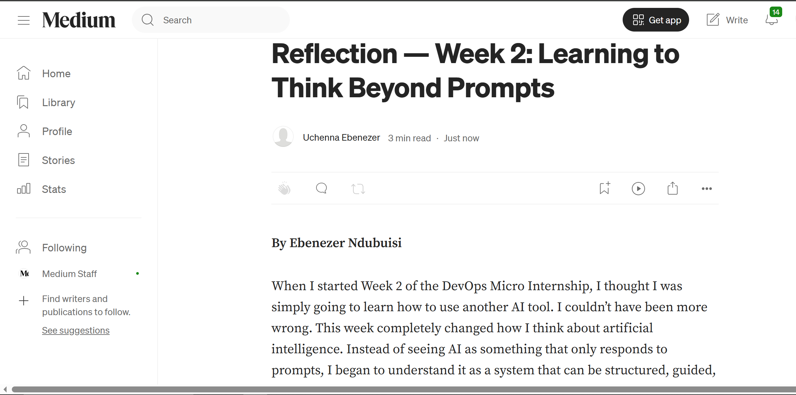
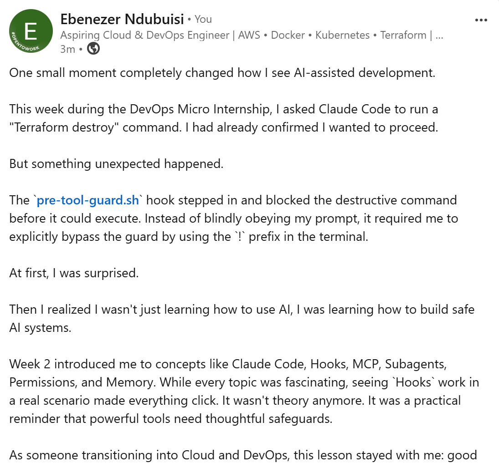

# Assignment 8 — Week 2 Reflection Blog

Part of the DevOps Micro Internship (DMI) Cohort 3 with Agentic AI

---

# Purpose

In this assignment, you will reflect on your Week 2 learning journey and write a short blog capturing your experience working with Agentic AI tools such as Claude Code, Skills, Subagents, MCP, Hooks, Permissions, and Memory.

You will also publish a LinkedIn post summarizing your learning and share both links for evaluation.

---

# Task 1 — Write Your Reflection Blog

## Goal

Write a reflection blog covering your Week 2 learning experience.

### Blog Requirements

Your blog must include:

- Title: **Reflection – Week 2**
- Minimum 300 words
- At least 2–3 topics from Week 2 (Claude Code, Skills, Subagents, MCP, Hooks, Permissions, Memory)
- Honest personal reflection (learning, challenges, mindset)
- One habit/system you plan to implement
- Your full name clearly visible

### Allowed Platforms

You can publish your blog on:

- Hashnode
- Medium
- Dev.to
- LinkedIn Article
- GitHub Markdown file
- Substack

---

### Evidence

#### Screenshot 1 — Blog published and visible



---

### Submission Field

Blog Link:

`https://medium.com/@uchennaebenezer01/reflection-week-2-learning-to-think-beyond-prompts-b365c180a1b8`

---

# Task 2 — Create LinkedIn Post

## Goal

Share your Week 2 learning publicly on LinkedIn.

---

### LinkedIn Post Requirements

Your post must include:

- One screenshot from any Week 2 assignment
- Short reflection (what you learned or built)
- Required P.S. line exactly as given below

---

### Required P.S. Line (Must Include Exactly)

> **P.S. This post is part of the DevOps Micro Internship (DMI) with Agentic AI — Cohort 3 — by [Pravin Mishra](https://www.linkedin.com/in/pravin-mishra-aws-trainer/). My graded progress is public: https://dmi.pravinmishra.com/s/YOUR-GITHUB-USERNAME.html · Start your DevOps journey: https://dmi.pravinmishra.com/?utm_source=student&utm_medium=ps-linkedin&utm_campaign=cohort3**

---

### Suggested Hashtags

#DMIByPravinMishra #AgenticAI #ClaudeCode #DevOps #LearningInPublic

---

### Evidence

#### Screenshot 2 — LinkedIn post published



---

### Submission Field

LinkedIn Post Content (copy-paste here):

```
One small moment completely changed how I see AI-assisted development.

This week during the DevOps Micro Internship, I asked Claude Code to run a "Terraform destroy" command. I had already confirmed I wanted to proceed.

But something unexpected happened.

The `pre-tool-guard.sh` hook stepped in and blocked the destructive command before it could execute. Instead of blindly obeying my prompt, it required me to explicitly bypass the guard by using the `!` prefix in the terminal.

At first, I was surprised.

Then I realized I wasn't just learning how to use AI, I was learning how to build safe AI systems.

Week 2 introduced me to concepts like Claude Code, Hooks, MCP, Subagents, Permissions, and Memory. While every topic was fascinating, seeing `Hooks` work in a real scenario made everything click. It wasn't theory anymore. It was a practical reminder that powerful tools need thoughtful safeguards.

As someone transitioning into Cloud and DevOps, this lesson stayed with me: good engineering isn't only about automation, it's about responsibility. The best systems don't just help us move faster; they protect us from costly mistakes, even the ones we accidentally ask them to make.

Every week of this internship reminds me how much I still have to learn, and strangely, that's becoming my favorite part of the journey. A few months ago, many of these concepts would have sounded intimidating. Today, they're becoming building blocks for the engineer I aspire to become.

Learning in public isn't always comfortable, but it makes every small win feel meaningful.

Here's to becoming a little better every single day.🌚

> P.S. This post is part of the DevOps Micro Internship with Agentic AI Cohort-3 by Pravin Mishra. You can start your DevOps journey by joining the **DMI waiting list**: [https://lnkd.in/ehrTgGUS)

#DMIByPravinMishra #AgenticAI #ClaudeCode #DevOps #LearningInPublic #Terraform #CloudEngineering #AIEngineering #Hooks
```

---

### LinkedIn Post Link:

`https://lnkd.in/p/enX4W2yg`

---

# Submission Instructions

- Blog must be publicly accessible
- LinkedIn post must be visible (public or unlisted where applicable)
- All required fields must be filled
- Screenshot proofs must be added to GitHub repository
- Do not include sensitive information in blog or post

---

# Completion Checklist

- [✅] Blog written with required structure
- [✅] Blog includes at least 2–3 Week 2 topics
- [✅] Blog is publicly accessible
- [✅] LinkedIn post created
- [✅] Required P.S. line included
- [✅] LinkedIn post content copied in submission field
- [✅] Blog link added
- [✅] LinkedIn post link added
- [✅] Screenshots added to GitHub repo

---

# About DMI & CloudAdvisory

DevOps Micro Internship (DMI) is a project-based DevOps program run by Pravin Mishra (The CloudAdvisory), focused on real-world execution, systems thinking, and agentic AI workflows.

It helps learners build strong DevOps foundations through hands-on experience.

---

# Resources

- 🌐 DMI Official Website: [https://pravinmishra.com/dmi](https://pravinmishra.com/dmi)
- 🎓 DevOps for Beginners (Udemy): [https://www.udemy.com/course/devops-for-beginners-docker-k8s-cloud-cicd-4-projects/](https://www.udemy.com/course/devops-for-beginners-docker-k8s-cloud-cicd-4-projects/)
- 🎓 Agentic AI DevOps with Claude Code: [https://www.udemy.com/course/ultimate-agentic-ai-devops-with-claude-code/](https://www.udemy.com/course/ultimate-agentic-ai-devops-with-claude-code/)
- 🎓 DevOps with Claude Code: Terraform, EKS, ArgoCD & Helm: [https://www.udemy.com/course/devops-with-claude-code-terraform-eks-argocd-helm/](https://www.udemy.com/course/devops-with-claude-code-terraform-eks-argocd-helm/)
- ▶️ YouTube Playlist: [https://www.youtube.com/playlist?list=PLFeSNDtI4Cho](https://www.youtube.com/playlist?list=PLFeSNDtI4Cho)
- 🔗 Pravin Mishra (LinkedIn): [https://www.linkedin.com/in/pravin-mishra-aws-trainer/](https://www.linkedin.com/in/pravin-mishra-aws-trainer/)
- 🏢 CloudAdvisory (LinkedIn): [https://www.linkedin.com/company/thecloudadvisory/](https://www.linkedin.com/company/thecloudadvisory/)
