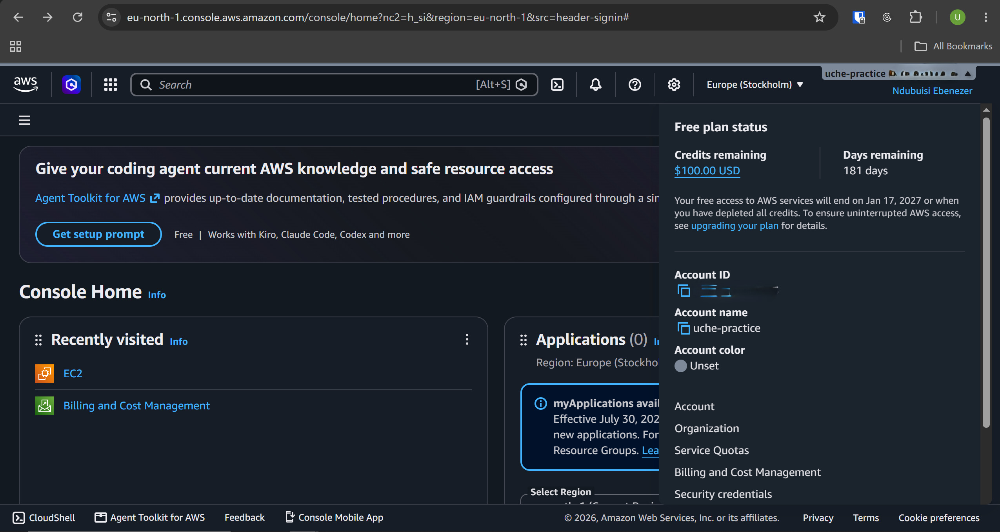

# Assignment 1 — AWS Free Tier Account Setup (EpicReads Cloud Onboarding)

Part of the DevOps Micro Internship (DMI) Cohort 3 with Agentic AI

---

## Purpose

In this assignment, you will create and verify an AWS Free Tier account as part of onboarding EpicReads — an online bookstore moving to the cloud. You will demonstrate an understanding of AWS fundamentals, Free Tier services, and account setup by answering conceptual questions and capturing proof of a working AWS Console login.

---

# Task 1 — Understanding AWS & Free Tier

## Goal

Demonstrate understanding of AWS basics and Free Tier usage by answering the following questions in your own words (3–4 lines each).

### Answers

#### Question 1 — What is an AWS account, and why do you need it at this stage?

An individual or business can access AWS cloud services by creating an AWS account, which is a unique identity. To create and manage cloud resources like EC2 instances, S3 buckets, and ECR repositories, as well as to track consumption and handle billing for whatever is utilized, it provides users with a login and billing profile.
Currently, a DMI student's understanding of Cloud Computing and DevOps requires an AWS account. The practical experience obtained from working directly with real cloud infrastructure,the same environment utilized in a true DevOps role cannot be replaced by tutorials and documentation, even though they offer solid core knowledge.
With a Free Tier account, students can develop practical skills by developing real-world solutions such as setting up virtual machines, deploying websites, utilizing S3 buckets and protocols for security.

---

#### Question 2 — What is AWS Free Tier, and how long does it last?

More than 100 cloud products are accessible to new users through the AWS Free Tier. It offers a Free Plan that lasts for six months or until you use up all of your $200 in initial credits, whichever comes first, as well as Always Free services that never expire.
There are three different kinds of offers under the AWS Free Tier:
Six-month free plan: New customers can earn an additional $100 by exploring some foundational services after receiving $100 in credits upon signing up. This creates a risk-free learning environment because your account is suspended rather than unexpectedly charged if you run out of credits or hit the six-month mark.
Always Free (No Expiration): Some services have monthly usage caps that are set in stone. For instance, you receive 25GB of storage on Amazon DynamoDB and 1,000,000 free queries on AWS Lambda each month.
Brief Trials: Certain free trials are available for specialized software or services from the AWS Marketplace; these trials often last between 30 and 90 days, depending on the offering.

---

#### Question 3 — Name three AWS Free Tier services and their free usage limits.

AWS Lambda: 400,000 GB-seconds of compute time per month and one million free compute queries.
With 25 GB of storage and 25 read capacity units (RCUs) and 25 write capacity units (WCUs), Amazon DynamoDB can process up to 200 million requests per month.
Amazon CloudFront: 10 million HTTP or HTTPS queries and 1 TB of data transmission every month.
There is also a legacy 12-Month Free Tier for accounts created prior to July 15, 2025, which provides 750 hours of Amazon EC2 t2.micro/t3.micro instances per month. For those infrastructural resources, newer customers use a New Credit Plan that provides $200 in temporary credits.
---

# Task 2 — Create AWS Free Tier Account

## Goal

Create a valid AWS Free Tier account and sign in to the AWS Management Console.

> No screenshots required for this task. Completion is verified through Task 3.

---

# Task 3 — Verify AWS Account

## Goal

Confirm that your AWS account setup is complete by navigating to the Account section and capturing proof.

### Evidence

#### Screenshot 1 — AWS Account page showing account name (email may be blurred)

# Submission Instructions

- Add all required screenshots in your GitHub repository submission
- Full name must be visible in required screenshots
- Do not expose sensitive information (keys, passwords, account IDs)

---

# Completion Checklist

- [✅] Task 1 answers written in own words
- [✅] AWS Free Tier account created successfully
- [✅] Signed in to AWS Management Console
- [✅] Screenshot of AWS Account page captured (full name visible, no sensitive data)
- [✅] All required screenshots added to repository

---

## 📌 About DMI & CloudAdvisory

DevOps Micro Internship (DMI) is a project-based DevOps program run by Pravin Mishra (The CloudAdvisory) focused on real-world execution, systems thinking, and career readiness.

It helps learners build strong DevOps foundations with hands-on experience.

---

## 📌 Resources

- 🌐 DMI Official Website: https://pravinmishra.com/dmi  
- 🎓 DevOps for Beginners (Udemy): https://www.udemy.com/course/devops-for-beginners-docker-k8s-cloud-cicd-4-projects/  
- 🎓 Agentic AI DevOps with Claude Code: https://www.udemy.com/course/ultimate-agentic-ai-devops-with-claude-code/  
- 🎓 DevOps with Claude Code: Terraform, EKS, ArgoCD & Helm: https://www.udemy.com/course/devops-with-claude-code-terraform-eks-argocd-helm/  
- ▶️ YouTube Playlist: https://www.youtube.com/playlist?list=PLFeSNDtI4Cho  
- 🔗 Pravin Mishra (LinkedIn): https://www.linkedin.com/in/pravin-mishra-aws-trainer/  
- 🏢 CloudAdvisory (LinkedIn): https://www.linkedin.com/company/thecloudadvisory/

---

*This submission is part of DevOps Micro Internship (DMI) Cohort 3 — Agentic AI Track.*