# Assignment 3 — Production Maintenance Drill (OPS Checklist)

Part of the DevOps Micro Internship (DMI) Cohort 3 with Agentic AI

---

## Purpose

In this assignment, you will treat your already deployed React application (on Ubuntu VM with Nginx) as a live production system. You will perform structured operational checks covering network validation, service health, log analysis, resource monitoring, configuration verification, and incident simulation with recovery — mirroring real on-call DevOps responsibilities.

---

# Task 1 — Server Access & Networking Validation

## Goal

Verify that the deployed React application is reachable from the browser and confirm basic network connectivity of the Ubuntu VM.

### Evidence

#### Screenshot 1 — Browser showing the React app with your Full Name visible on the UI

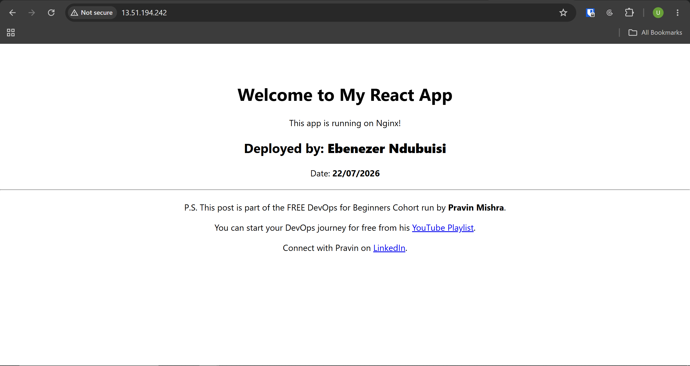

---

#### Screenshot 2 — Output of `ip a`

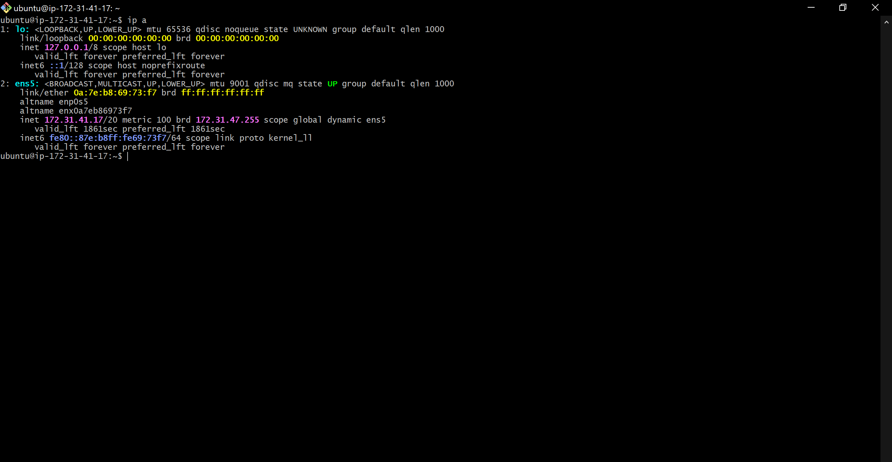

---

#### Screenshot 3 — Output of `sudo ss -tulpen`

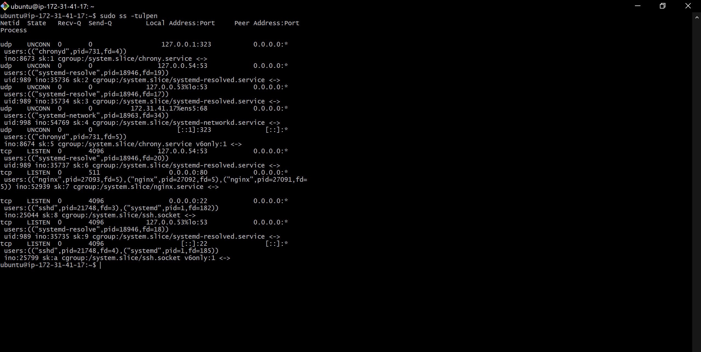

---

#### Screenshot 4 — Output of `sudo ufw status`

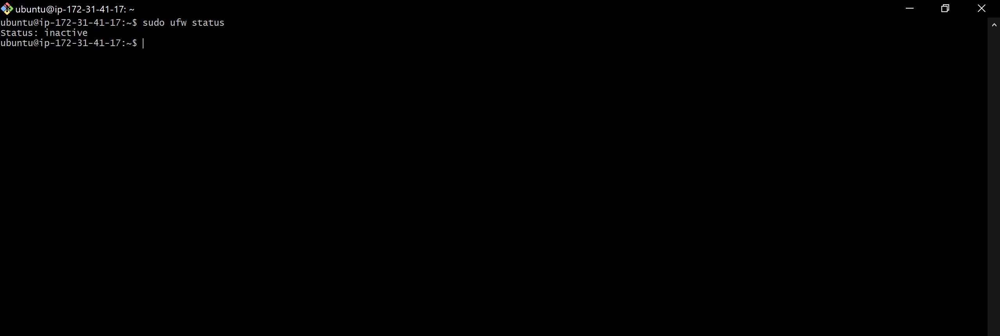

---

### Notes

Answer the following in your own words:

**1. What proves Nginx is listening on 0.0.0.0:80?**

This is confirmed by the line tcp LISTEN 0.0.0.0:80 ... nginx in the sudo ss -tulpen output. Nginx may accept HTTP connections from any IP address, even external traffic from the internet, because the 0.0.0.0 indicates that it is tied to all network interfaces, not only localhost. The process name nginx next to the port indicates that it is Nginx and not another service that is keeping this port open.

---

**2. What proves SSH is active on port 22?**

The SSH daemon (sshd) is confirmed to be actively listening on port 22 across all interfaces by the same ss -tulpen output, which displays tcp LISTEN 0.0.0.0:22 ... sshd. This enables remote server login (e.g., via ssh ubuntu@<public-ip>).

---

**3. Did you find any unexpected open ports? Explain briefly.**

There were no unexpected ports discovered. The only other listening services, aside from SSH (port 22) and Nginx (port 80), were systemd-resolved (DNS resolution) and chronyd (time sync), both of which were restricted to loopback addresses (127.0.0.1, 127.0.0.53, and 127.0.0.54), which means they cannot be accessed from outside the server. This verifies that the web server and SSH are the only two services that are exposed to the outside world.

---

# Task 2 — Service Health & Systemd Validation (Nginx)

## Goal

Verify that Nginx is properly installed, running, enabled at boot, and safely configured.

### Evidence

#### Screenshot 1 — Output of `systemctl status nginx --no-pager`

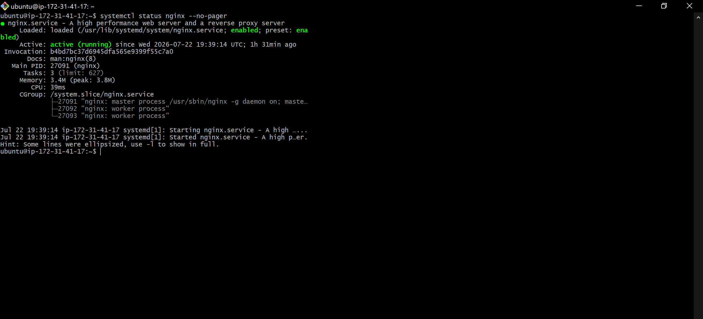

---

#### Screenshot 2 — Output of `sudo nginx -t`

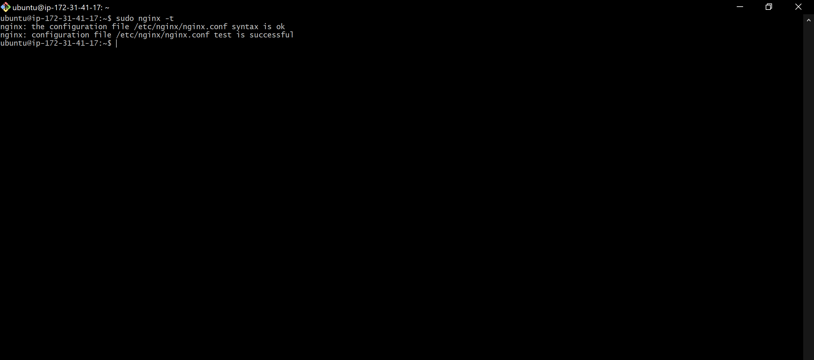

---

#### Screenshot 3 — Output of `sudo ss -lptn '( sport = :80 )'`

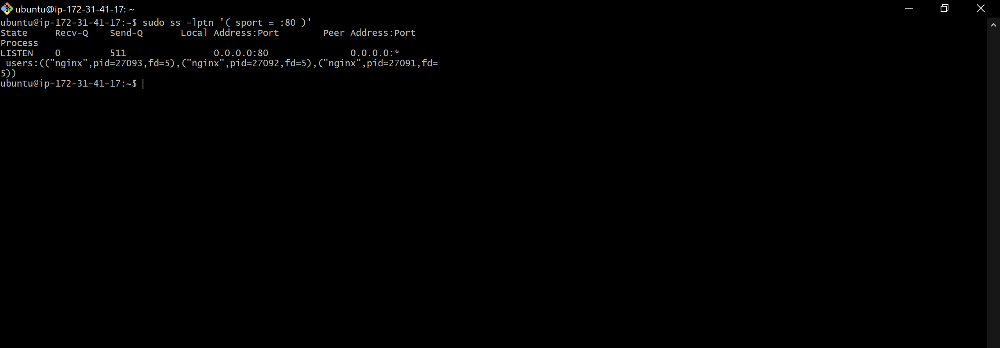

---

### Notes

Answer the following in your own words:

**1. What happens if Nginx fails to restart in production?**

Since Nginx is the only process handling HTTP traffic on port 80, the website becomes totally inaccessible if Nginx is unable to resume. Since nothing would be listening on that port anymore, every user visiting the website would receive a connection error or timeout. This is particularly dangerous if the failure occurs during a deployment or configuration change because it could cause the site to go down without automated recovery, necessitating manual intervention for diagnosis and repair..

---

**2. What's your basic rollback plan?**

Run sudo nginx -t to verify the configuration syntax before making any changes. This will catch the majority of problems before they cause a restart. Checking systemctl status nginx --no-pager and sudo journalctl -u nginx --no-pager -n 50 will provide the precise error if a restart attempt fails.
 Reverting the configuration file to its most recent known-good version (preferably from a backup or version control) and running sudo nginx -t and sudo systemctl restart nginx again is the solution if the failure was caused by a poor configuration update. The easiest protection is to have a backup copy of the working configuration before making any modifications, as this enables an instant rollback without any debugging under pressure.

---

# Task 3 — Logs & Request Trace

## Goal

Verify real traffic flow and analyze logs to understand system behavior and errors.

### Evidence

#### Screenshot 1 — Output of `sudo tail -n 30 /var/log/nginx/access.log`

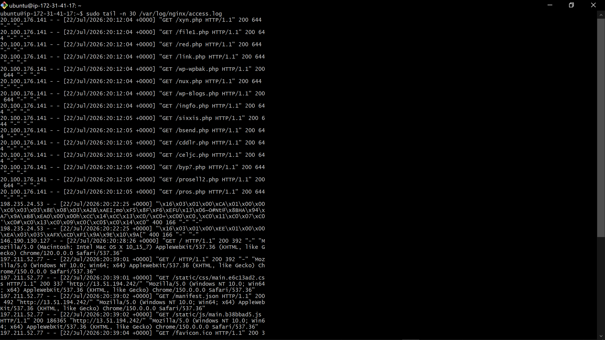

---

#### Screenshot 2 — Output of `sudo tail -n 30 /var/log/nginx/error.log`

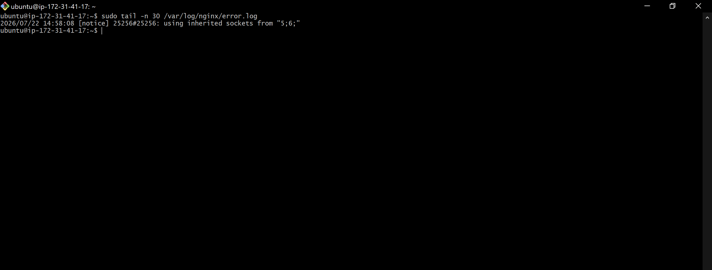

---

#### Screenshot 3 — Output of `sudo journalctl -u nginx --no-pager -n 50`

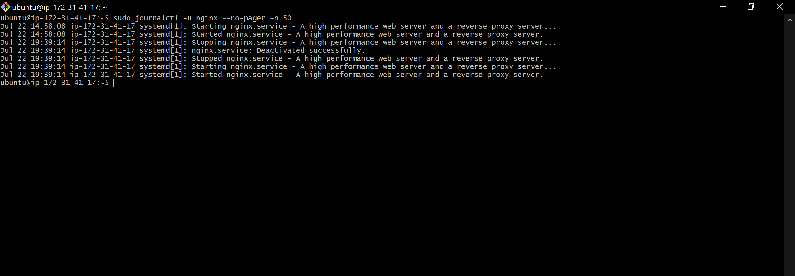

---

### Notes

Answer the following in your own words:

**1. Were there any errors in the logs?**

- If yes, mention 1–2 example error lines from the logs and explain what each one means in simple terms.
- If no, explain what it means if the error log is empty or shows no recent errors during your check.

The error log file is presently empty (or contains no recent entries) since no output was returned. This is encouraging because it shows that Nginx has not recently experienced any internal issues, misconfigurations, or unsuccessful requests.

---

**2. If there were no errors, what does that indicate about the system?**

Nginx has not experienced any internal issues, misconfigurations, or failed lifecycle events during the time period covered by these logs if the error log is empty and the journalctl history is clean. This indicates that the system is currently in good health, but it is not a permanent assurance; rather, it simply shows that nothing went wrong during the window that was really examined. Logs like this should be reviewed on a regular basis rather than just once because new problems may still arise as traffic, configuration changes, or system conditions change.

**3. Based on the access logs, were your curl requests visible in the log entries? What does that prove about traffic flow?**

Indeed. Access displayed the curl request.log as a GET / request with the user agent curl/8.18.0 and a 200 status from the server's own public IP. This demonstrates that the entire traffic path is operational from beginning to end: the request left the client, passed via the network, arrived at Nginx, was properly processed and served, and was logged, indicating that there was no interruption in that chain.

# Task 4 — System Resource Health Check (Capacity Red Flags)

## Goal

Assess server capacity and detect potential performance or failure risks.

### Evidence

#### Screenshot 1 — Output of `uptime`

Add your screenshot here.

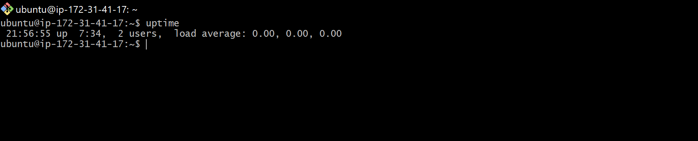

#### Screenshot 2 — Output of `free -h`

---

#### Screenshot 3 — Output of `df -h`

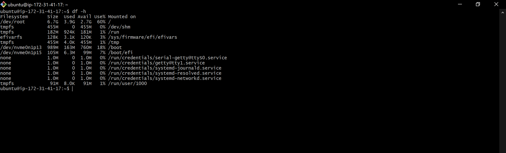

---

#### Screenshot 4 — Output of `sudo du -sh /var/* | sort -h`

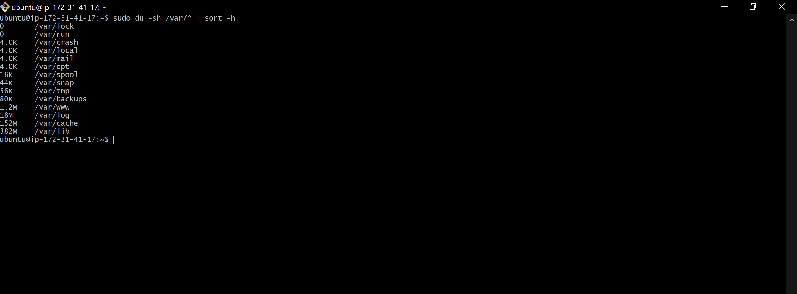
---

### Notes

Answer the following in your own words:

**1. Which resource looks most critical right now? (CPU/load, memory, or disk) Explain why.**

Right now, none of the three resources exhibit any critical signal: the disk is at a comfortable 60%, the CPU is idle, and memory has a healthy amount of available headroom with no swap pressure. In contrast to CPU or memory pressure, which typically exhibit noticeable slowness first, disk is the resource most likely to quietly creep upward over time (via log growth or package cache accumulation) without any obvious symptom until it's suddenly critical. If one had to rank which one deserves the closest ongoing attention as this server scales, it would be disk.

---

**2. What happens if disk becomes 100% full in a production server?**

It's particularly risky when logs stop being able to write new entries because that's frequently when you need them the most during an active occurrence. Applications that require scratch space to write temporary files, such as package managers and build tools, may crash or fail. A database may become damaged or refuse writes if it were operating locally. In extreme circumstances, the OS itself may become unstable; if there is actually no disk space left for the system to operate with, even simple tasks like SSH login may fail.

---

# Task 5 — Configuration & Deployment Verification

## Goal

Ensure the correct React build is deployed and Nginx is serving it properly.

### Evidence

#### Screenshot 1 — Output of `ls -lah /var/www/html | head -n 20`

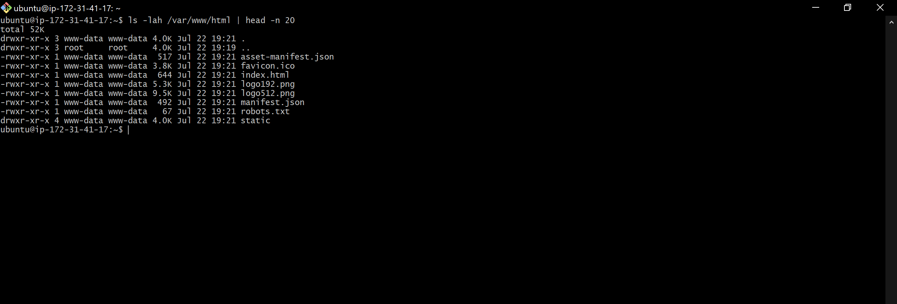
---

#### Screenshot 2 — Output of `grep -R "Deployed by" -n /var/www/html 2>/dev/null | head`

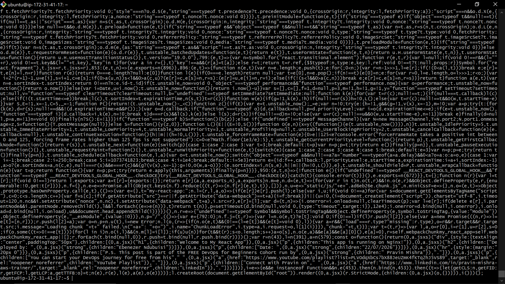
---

#### Screenshot 3 — Output of `grep -n "try_files" /etc/nginx/sites-available/default`

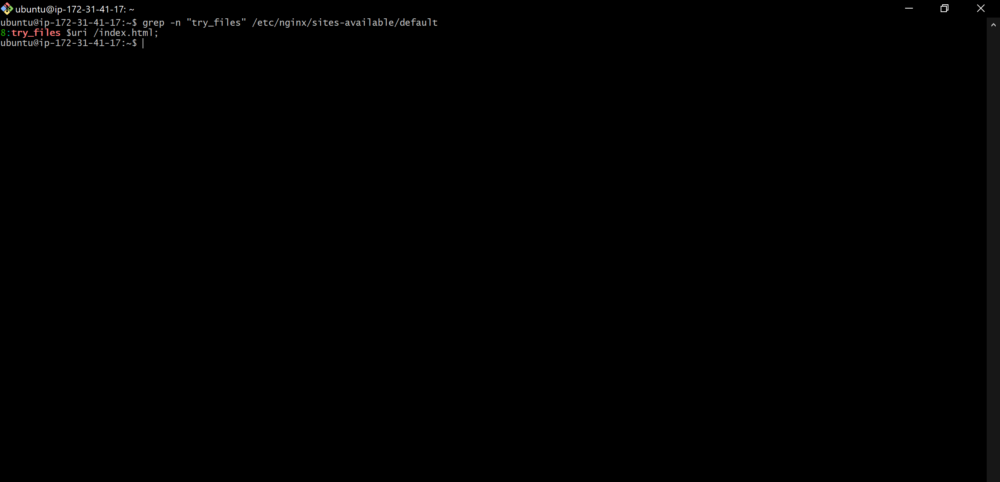
---

### Notes

Answer the following in your own words:

**1. How do you confirm that the correct version of the application is deployed?**

Instead of using a single command, a tiered check was used to confirm deployment correctness:

1. The existence of a legitimate Create React App production build index.html, a static/ folder containing generated JS/CSS bundles, and standard CRA metadata files was verified by ls -lah /var/www/html. These files are owned by www-data, the user that Nginx's worker processes operate as.
2. Using the accompanying source map, grep -R "Deployed by" verified that the particular custom identifying text was compiled into the live JavaScript bundle and matched the original source, demonstrating that this precise build rather than a stale or generic one—is what's live.
3. grep -n "try_files" verified that Nginx's configuration appropriately falls back to index.html for unmatched routes, guaranteeing that the SPA functions properly for all application routes, not just the homepage.
4. Lastly, this was compared to the previous curl test in Task 3, which demonstrated that the live server was truly returning this exact index.html content over HTTP, linking the on-disk files to what is actually being provided to actual users.

---

# Task 6 — Nginx Configuration Failure Simulation

## Goal

Simulate a real-world Nginx misconfiguration and recover the service safely.

### Evidence

#### Screenshot 1 — Output of `sudo nginx -t` showing the syntax error (broken config)

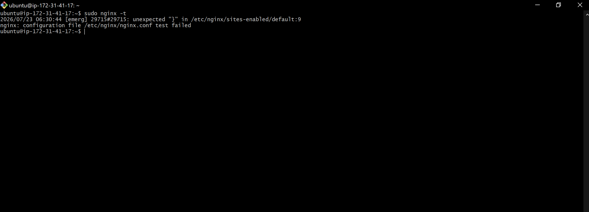
---

#### Screenshot 2 — Output of `sudo nginx -t` showing syntax ok (fixed config)

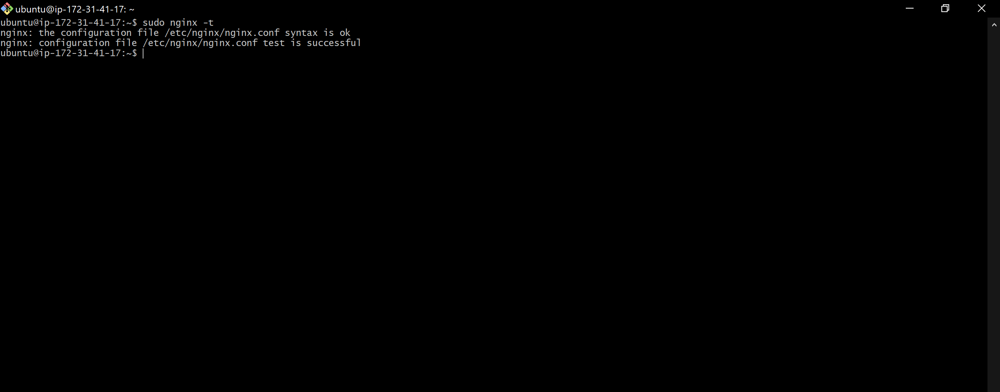

---

#### Screenshot 3 — Output of `curl -I http://<public-ip>` confirming recovery (200 OK)

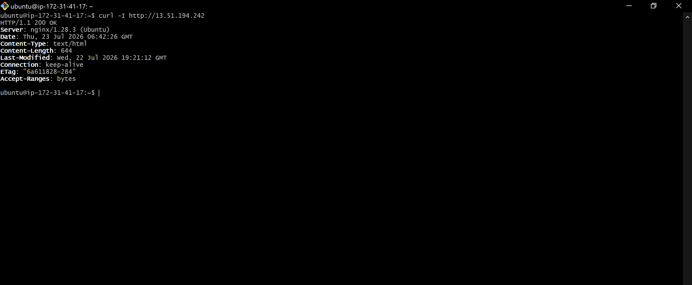
---

### Notes

Answer the following in your own words:

**1. What caused the configuration failure?**

There are two missing semicolons in /etc/nginx/sites-available/default: one was purposefully deleted from the try_files $uri /index.html; directive as directed, and the other was discovered to be absent from the error_page 404 /index.html; line. The absence of a semicolon was sufficient to prevent Nginx's parser from correctly interpreting the server block, resulting in a syntax error.

---

**2. How did you fix the issue?**

Before restarting the service, I reopened the configuration file, fixed the two missing semicolons, and ran sudo nginx -t again to make sure the syntax was correct. Systemctl restarted nginx only when I saw that the syntax was accurate and the test was successful. Then, I used an external curl to make sure the real application was operating properly once more.

---

**3. How can you avoid this kind of issue in real production systems?**

Before restarting or reloading, always run nginx -t following any configuration changes.
Keep Nginx config files in version control (git), so a poor modification can be promptly returned to a known-good state instead than painstakingly retyped from memory.
To test configuration changes before they reach production, use a staging environment.
Automate configuration validation whenever possible as part of a deployment process so that a malfunctioning configuration is detected in continuous integration and never makes it to the live server.

---

# Task 7 — Web Application Failure Simulation

## Goal

Simulate missing deployment content and recover the application safely.

### Evidence

#### Screenshot 1 — Output of `curl -I http://<public-ip>` showing failure (non-200 response)

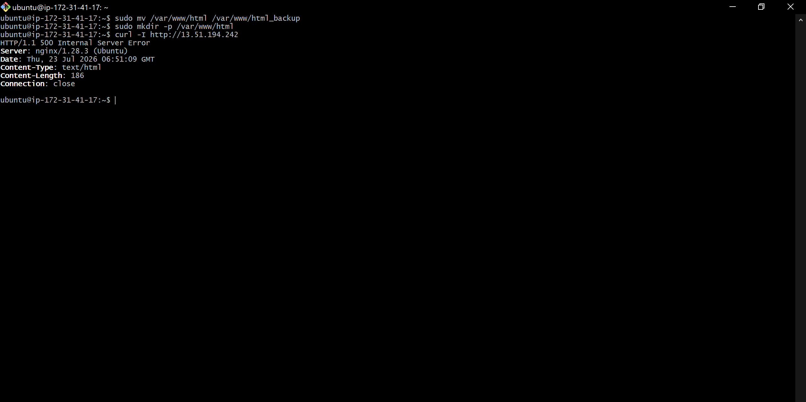
---

#### Screenshot 2 — Output of `curl -I http://<public-ip>` confirming recovery (200 OK)

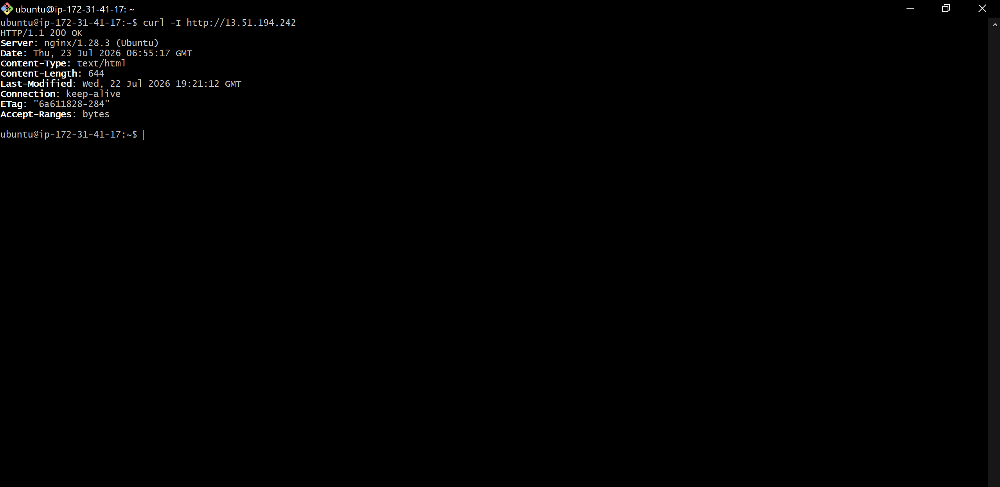

---

### Notes

Answer the following in your own words:

**1. What caused the application to break in this scenario?**

All deployment files were removed from the web root directory (/var/www/html), which is the precise path from which Nginx serves content. Although Nginx was still operational and set up appropriately, it was unable to serve the React application and instead returned a 500 Internal Server Error because there was no content or fallback file accessible.

---

**2. How did you fix the issue and restore the application?**

Recovery required deleting the empty, damaged directory and relocating the backup to the proper location because the initial deployment had already been securely backed up (moved to html_backup rather than deleted). The recovery was verified externally using curl -I, which returned 200 OK with identical content metadata (Content-Length, Last-Modified, ETag) to the pre-incident state, demonstrating that the exact same build was successfully restored. Nginx was restarted to make sure it was serving cleanly from the restored files.

---

**3. What steps would you take to prevent this kind of issue in real production systems?**

Automated pre-deployment backups allow for the instantaneous rollback of each release without the need for human involvement.

Instead of overwriting the live directory, a failed deploy will never leave the live path empty or partially written by deploying to a versioned, distinct directory and atomically changing a symlink (such as /var/www/current) to point to it.

Before declaring a release complete, CI/CD pipeline checks make sure a deployment was successful (e.g., ensuring index.html exists and is non-empty).

After every deployment, post-deployment health checks and monitoring automatically confirm that the live site delivers a healthy 200 response, detecting this type of failure in a matter of seconds instead of depending on someone discovering it by hand.

---

# Task 8 — Security & Reliability Review

## Goal

Review and reflect on the security and reliability practices applied during this assignment.

### Security & Reliability Notes

Answer the following in your own words:

**1. Why is SSH key-based authentication more secure than sharing passwords?**

Because SSH key-based authentication uses asymmetric cryptography that is, the actual secret credential never leaves your local device and is never sent to the server, it is more secure than passwords. Conventional passwords are susceptible to interception, server-side data leaks, and human mistake because they must be transferred over the network for validation.

**2. Why should only required ports be open on a production server?**

On a production server, keeping just necessary ports open reduces your attack surface, lessens the effect of compromised services, and stops unwanted access. You can drastically cut down on the ways that hackers and automated bots can compromise your system by shutting off unused ports.

---

**3. Why is it important for Nginx to be enabled on boot?**

Nginx must be enabled on boot in order for your web server and apps to continue traffic routing as soon as the system restarts. It minimizes human downtime, provides continuous user access without intervention, and reliably restores reverse proxy or load-balancing configurations without administrative effort.

---

**4. What are the risks of sharing secrets, keys, or credentials publicly?**

Critical security risks include data breaches, financial loss, and unauthorized access to your infrastructure when secrets, API keys, or passwords are shared publicly (e.g., on GitHub or public forums).
Automated bots may scan and harvest these tokens in a matter of minutes when sensitive data is exposed, giving attackers the ability to:
Cloud Resource Hijacking: Cybercriminals can set up costly servers (for mining cryptocurrencies, for example) and charge your hacked cloud accounts directly.
Access Sensitive Databases: Private user data can be read, stolen, or erased by intruders using exposed database credentials.
Compromise CI/CD Pipelines: Malicious code can be injected into your software supply chain by bad actors thanks to leaked deployment keys.

---

**5. Why should cloud resources be stopped or terminated when they are no longer needed?**

To avoid overspending, remove security flaws, and lessen your environmental impact, you must stop or terminate unnecessary cloud resources. Leaving idle resources running increases your attack surface, loses energy, and results in needless expenses.

# LinkedIn Post (Required)

## Evidence

#### LinkedIn Post URL

Paste your LinkedIn post URL here:

`Add your URL here`

---

#### Screenshot — Published LinkedIn post

Add your screenshot here.

---

# Submission Instructions

- Add all required screenshots in your submission
- Full name must be visible in required screenshots
- Do not expose sensitive information (keys, passwords, account IDs)

---

# Completion Checklist

- [✅] Task 1: Screenshots (browser, ip a, ss -tulpen, ufw status) + Notes answered
- [✅] Task 2: Screenshots (nginx status, nginx -t, ss port 80) + Notes answered
- [✅] Task 3: Screenshots (access log, error log, journalctl) + Notes answered
- [✅] Task 4: Screenshots (uptime, free -h, df -h, du -sh) + Notes answered
- [✅] Task 5: Screenshots (ls html, grep deployed by, grep try_files) + Notes answered
- [✅] Task 6: Screenshots (nginx -t fail, nginx -t pass, curl recovery) + Notes answered
- [✅] Task 7: Screenshots (curl failure, curl recovery) + Notes answered
- [✅] Task 8: Security & Reliability Notes answered
- [✅] LinkedIn post published and URL submitted
- [✅] Full Name visible in all required screenshots
- [✅] No sensitive data exposed

---

## 📌 About DMI & CloudAdvisory

DevOps Micro Internship (DMI) is a project-based DevOps program run by Pravin Mishra (The CloudAdvisory) focused on real-world execution, systems thinking, and career readiness.

It helps learners build strong DevOps foundations with hands-on experience.

---

## 📌 Resources

- 🌐 DMI Official Website: https://pravinmishra.com/dmi
- 🎓 DevOps for Beginners (Udemy): https://www.udemy.com/course/devops-for-beginners-docker-k8s-cloud-cicd-4-projects/
- 🎓 Agentic AI DevOps with Claude Code: https://www.udemy.com/course/ultimate-agentic-ai-devops-with-claude-code/
- 🎓 DevOps with Claude Code: Terraform, EKS, ArgoCD & Helm: https://www.udemy.com/course/devops-with-claude-code-terraform-eks-argocd-helm/
- ▶️ YouTube Playlist: https://www.youtube.com/playlist?list=PLFeSNDtI4Cho
- 🔗 Pravin Mishra (LinkedIn): https://www.linkedin.com/in/pravin-mishra-aws-trainer/
- 🏢 CloudAdvisory (LinkedIn): https://www.linkedin.com/company/thecloudadvisory/

---

_This submission is part of DevOps Micro Internship (DMI) Cohort 3 — Agentic AI Track._
