# Assignment 5 — Bash Script Automation Drill (OPS Checklist)

Part of the DevOps Micro Internship (DMI) Cohort 3 with Agentic AI

---

## Purpose

In this assignment, you will practice Bash scripting by building a series of small automation scripts covering environment setup, variables, arrays, loops, file conditionals, if-else logic, and functions. These scripts form the foundation of real-world Linux automation used in DevOps, cloud, and production support environments.

---

# Task 1 — Bash Environment & Workspace Setup

## Goal

Verify that Bash is available on your system and create a clean workspace for this assignment.

### Evidence

#### Screenshot 1 — Output of `echo $SHELL` and `bash --version`

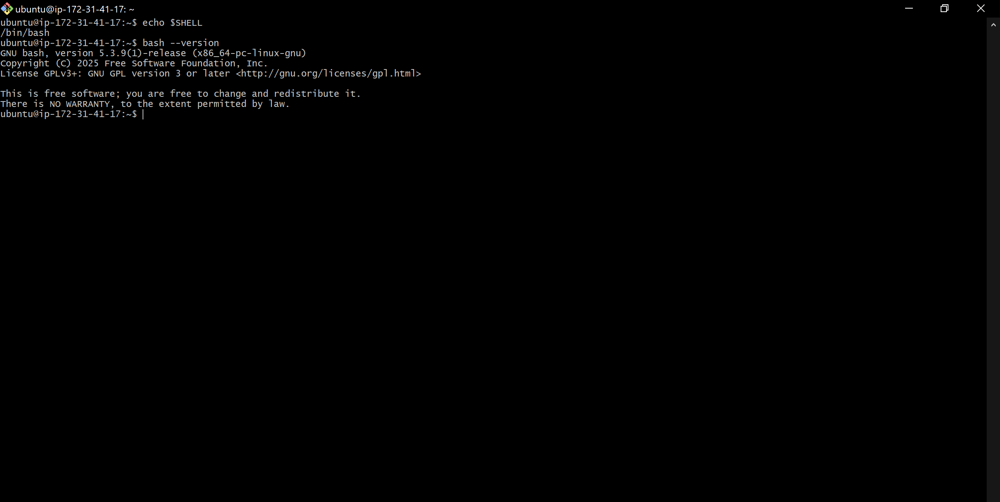

---

#### Screenshot 2 — Output of `pwd` and `ls -lah` showing the scripts directory

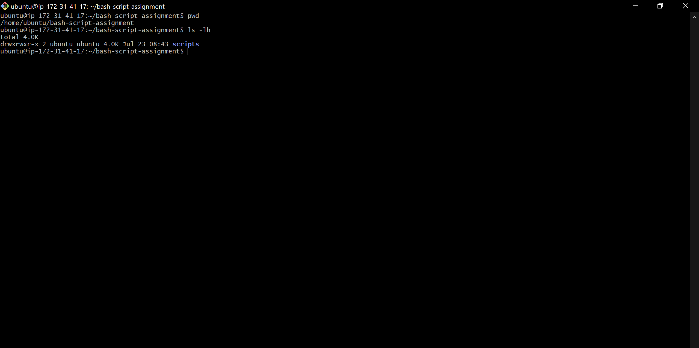

---

### Notes

Answer the following in your own words:

**1. What is Bash?**

Bourne Again Shell is what Bash stands for. It is a programming language and command-line shell. Bash asks the operating system to carry out the necessary actions after reading user-entered or script-stored commands. One of the most popular shells on Linux systems is bash.

---

**2. What is the difference between shell and Bash?**

A software that offers an interface for interacting with the operating system is called a shell. One particular kind of shell is bash. Fish, sh, zsh, and ksh are additional shells. Although the fundamental functions of many shells are similar, they may differ in terms of syntax, functionality, configuration files, and scripting capabilities.

---

**3. Why is it important to confirm the Bash version before writing scripts?**

Verifying the Bash version finds the available version and confirms that Bash is installed. This helps guarantee that the system supports the syntax and features we utilize in our scripts.

---

# Task 2 — Your First Bash Script

## Goal

Create your first Bash script, make it executable, and run it from the terminal.

### Evidence

#### Screenshot 1 — Content of `first-script.sh`

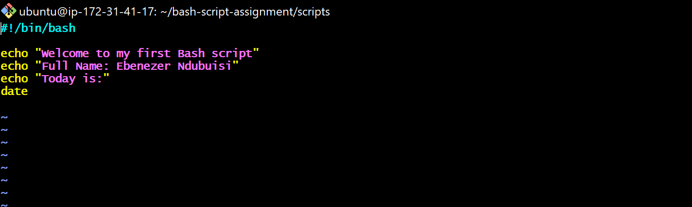
---

#### Screenshot 2 — Output of `./first-script.sh`

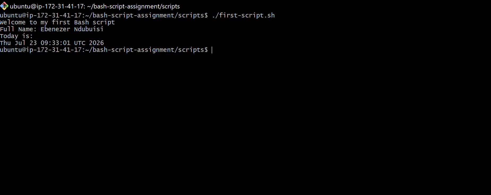

---

#### Screenshot 3 — Output of `ls -l first-script.sh` showing executable permission

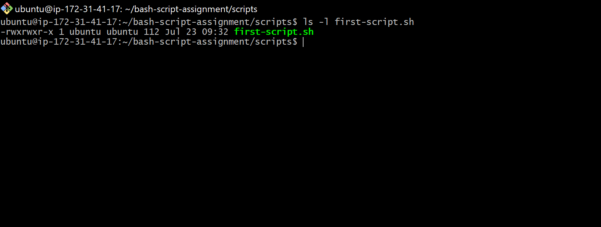

---

### Notes

Answer the following in your own words:

**1. What is the purpose of `#!/bin/bash`?**

The shebang line is #!/bin/bash. It instructs the operating system to execute the script's commands using the Bash interpreter.

---

**2. Why do we use `chmod +x` before running a script?**

It's possible that a freshly written script lacks execute authorization. By adding execute permission with the chmod +x command, we may execute the script immediately using ./first-script.sh.

---

**3. What is the difference between running a script using `./script.sh` and `bash script.sh`?**

The system launches the file directly when we type ./script.sh. As a result, the script needs to have execute permission, and the interpreter that runs it is determined by the shebang line.

We are requesting Bash to read and execute the script when we run: bash script.sh. Bash is utilized even if the script has a separate shebang, and the script does not require execute permission for this method.

---

# Task 3 — Variables: User Information Script

## Goal

Use variables to store and display user-related information.

### Evidence

#### Screenshot 1 — Content of `user-info.sh`

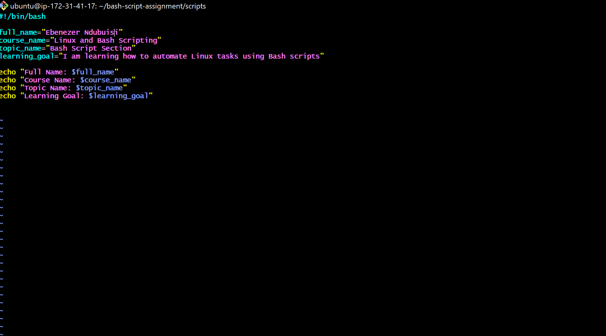

---

#### Screenshot 2 — Output of `./user-info.sh`

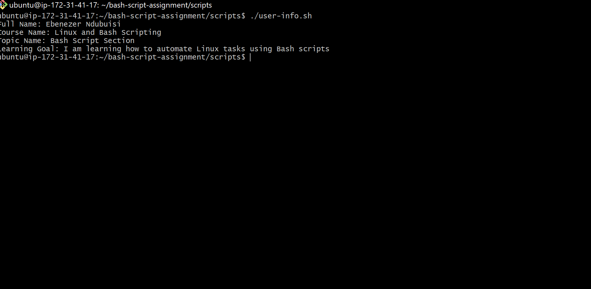

---

### Notes

Answer the following in your own words:

**1. What is a variable in Bash?**

A variable is a name for a value that can be utilized in the script at a later time. For instance, we may use a variable to save and show a person's name as needed.

**2. Why should we avoid spaces around the `=` sign when creating variables?**

When assigning a value to a variable, Bash does not permit spaces around the = sign. Bash might treat the variable name and value as distinct commands rather than a variable assignment if we include spaces.

---

**3. How do you access the value stored inside a Bash variable?**

To retrieve the variable's stored value, we put the $ symbol before the variable name.

---

# Task 4 — Arrays & Loops: Tools Checklist Script

## Goal

Use arrays and loops to print a checklist of tools used in Bash scripting.

### Evidence

#### Screenshot 1 — Content of `tools-checklist.sh`

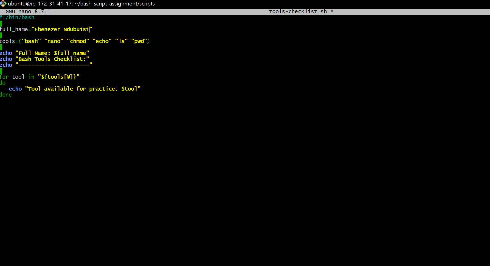

---

#### Screenshot 2 — Output of `./tools-checklist.sh`

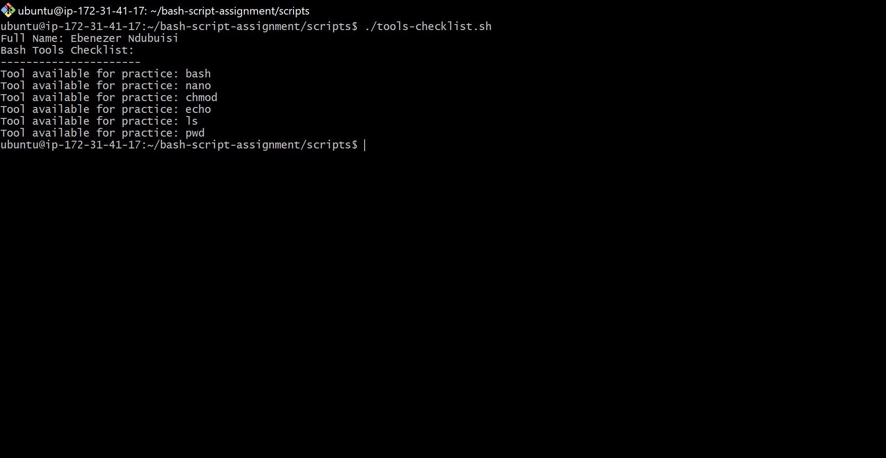

---

### Notes

Answer the following in your own words:

**1. What is an array in Bash?**

In Bash, an array is a data structure that can hold several values in a single variable name.

---

**2. Why are arrays useful in scripts?**

It enables us group related values together using arrays. We can keep all of the tools in a single array and process them using a loop rather than making a different variable for each tool. As a result, the script is shorter and simpler to update.

**3. What does `"${tools[@]}"` mean?**

All of the values kept within the tools array are represented by "[tools[@]"). Every tool in the array is made accessible to the loop in this script.

**4. What is the purpose of the `for` loop in this script?**

A for loop checks every item in the tools array. Each time it runs, it puts the current item into the tool variable and shows it on the screen.

# Task 5 — Loops: Number Counter Script

## Goal

Use loops to repeat a task multiple times.

### Evidence

#### Screenshot 1 — Content of `counter.sh`

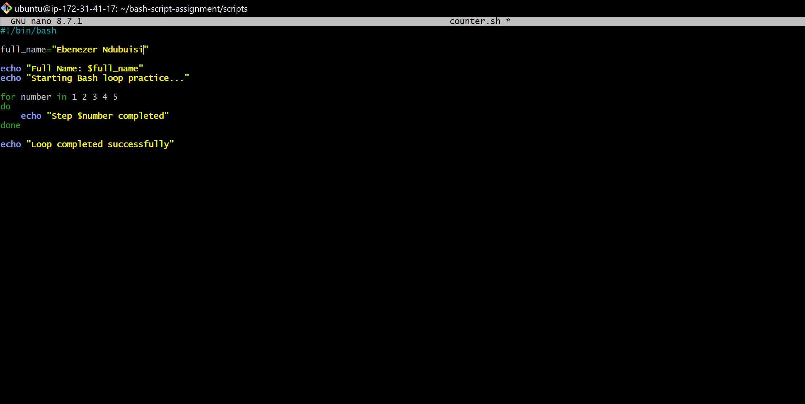
---

#### Screenshot 2 — Output of `./counter.sh`

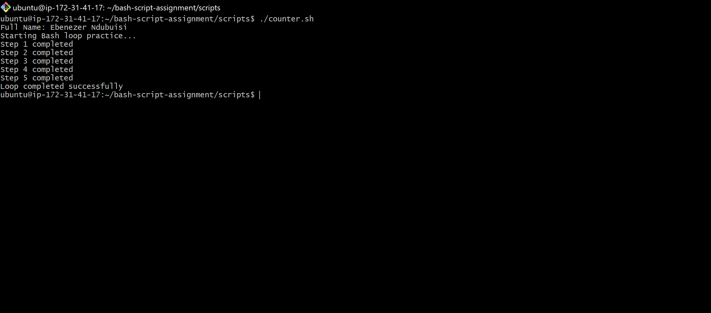

---

### Notes

Answer the following in your own words:

**1. What is a loop?**

A loop is used for the reptition of multiple tasks. We can write the same command once inside a loop rather than repeatedly.

---

**2. Why do we use loops in Bash scripting?**

Loops are used to automate repetitive processes. They reduce the length of our scripts and prevent us from repeatedly writing the same commands.

---

**3. How many times did the loop run in your script?**

It ran my script five times

---

**4. What would you change if you wanted the loop to run 10 times?**

Numbers 6 to 10 will be added to the for loop
for number in 1 2 3 4 5 6 7 8 9 10
do
echo "Step $number completed"
done

---

# Task 6 — Files & Conditionals: File Validation Script

## Goal

Use file checks and conditionals to verify whether files and directories exist.

### Evidence

#### Screenshot 1 — Output of `ls -lah ../test-folder`

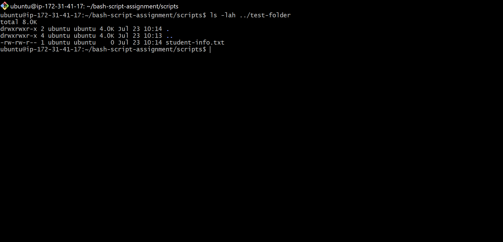

---

#### Screenshot 2 — Content of `file-check.sh`

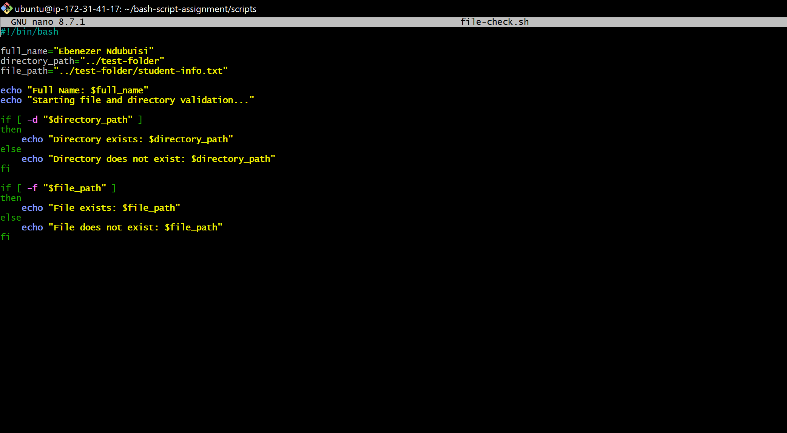

---

#### Screenshot 3 — Output of `./file-check.sh`

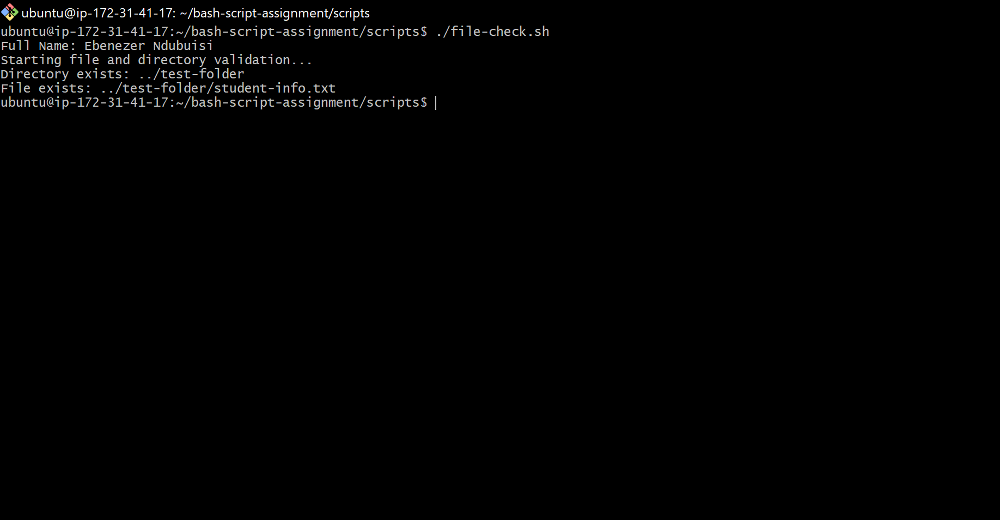

---

### Notes

Answer the following in your own words:

**1. What does `-d` check in Bash?**

The -d option determines if the specified path is a directory and if it exists. The condition gets true if the directory is present.

**2. What does `-f` check in Bash?**

The -f option determines whether the specified path is a regular file and whether it exists. The condition becomes true if the file is present.

---

**3. Why should file and directory paths be stored in variables?**

The script is easier to understand and update when paths are stored in variables. Instead of altering the same path several times, we just need to update the variable when a path changes.

---

**4. What happens if the file does not exist?**

The -f check is false if the file is not present. As a result, the commands under else will execute and the message that follows will appear:
The file ../test-folder/student-info.txt does not exist.

---

# Task 7 — Conditionals: Pass or Retry Script

## Goal

Use if-else conditionals to make decisions based on a variable value.

### Evidence

#### Screenshot 1 — Content of `score-check.sh` with `score=85`

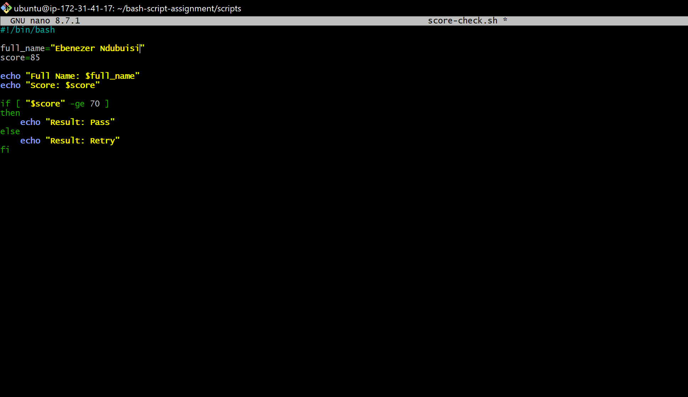
---

#### Screenshot 2 — Output showing `Result: Pass`

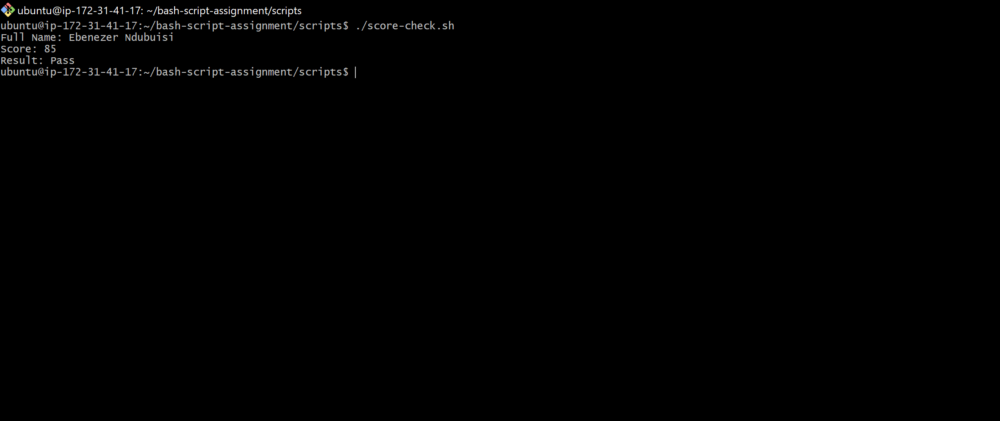

---

#### Screenshot 3 — Content of `score-check.sh` with `score=55`

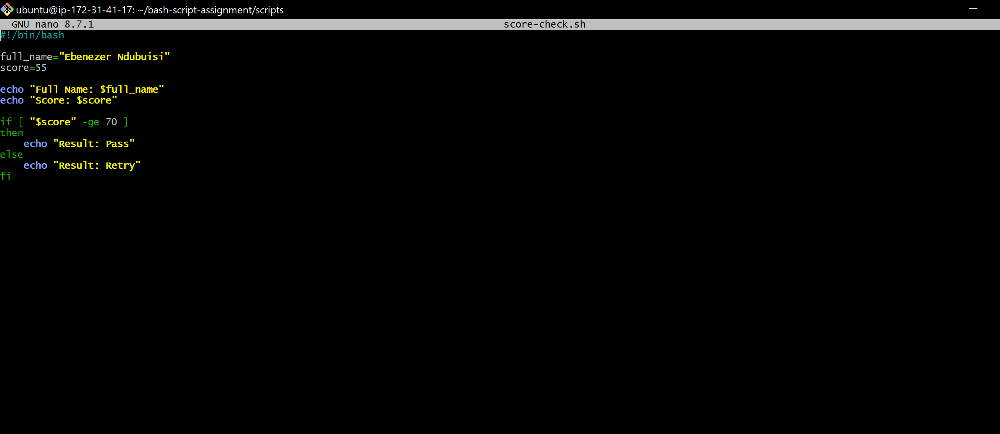.

---

#### Screenshot 4 — Output showing `Result: Retry`

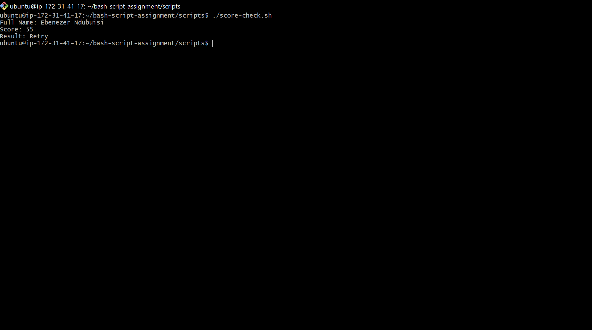

---

### Notes

Answer the following in your own words:

**1. What is the purpose of if-else in Bash?**

A decision can be made by the script using an if-else expression. It executes a single set of commands if the specified condition is true. It executes a different set of commands if the condition is false.

---

**2. What does `-ge` mean?**

-ge means greater than or equal to.

---

**3. Why should conditions be tested with different values?**

To ensure that every potential outcome functions well, we should test circumstances with various values.

**4. How can conditionals help in automation scripts?**

Conditionals assist automation scripts in making decisions based on the circumstances at hand. For instance, a script can determine whether a file exists, a service is operating, or a disk is nearly full before acting appropriately.

---

# Task 8 — Functions: Final Bash Automation Script

## Goal

Create a final Bash script using functions to organize reusable code.

### Evidence

#### Screenshot 1 — Content of `final-automation.sh`

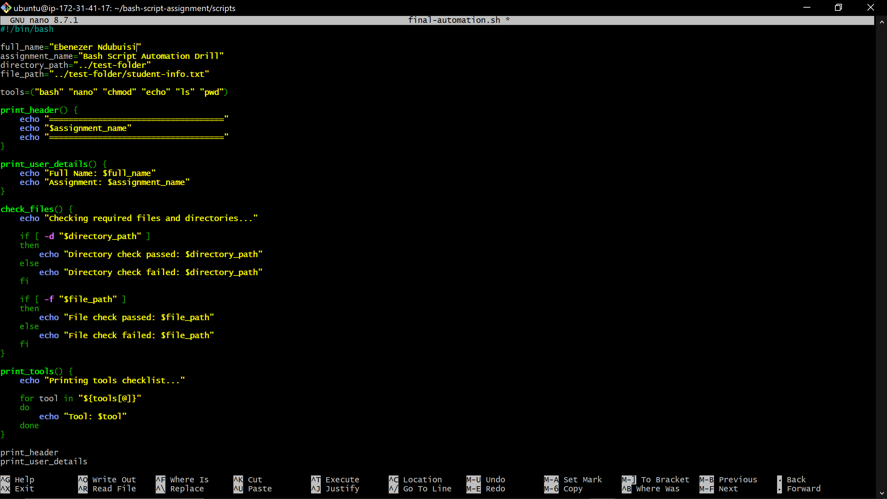

---

#### Screenshot 2 — Output of `./final-automation.sh`

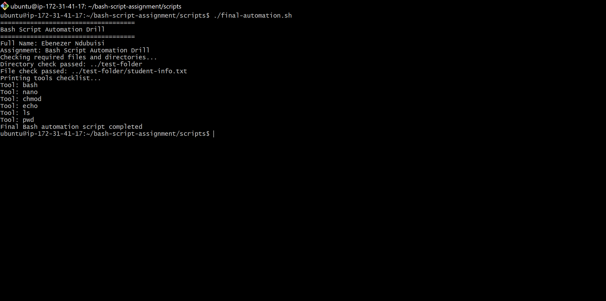

---

#### Screenshot 3 — Output of `ls -lah` showing all created scripts

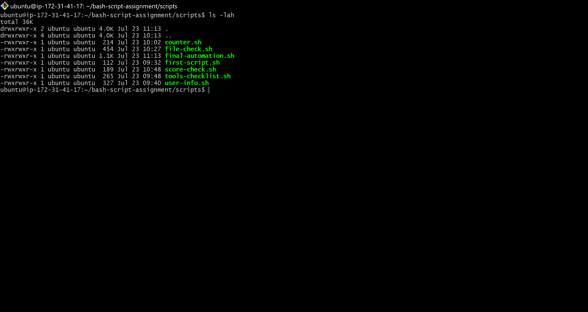
---

### Notes

Answer the following in your own words:

**1. What is a function in Bash?**

A named block of commands designed to carry out a particular task is called a function. Once it is created, we may call the function name to execute all of its actions.

---

**2. Why are functions useful in scripts?**

A huge script can be divided into smaller parts with the use of functions. This facilitates reading, managing, and troubleshooting the script. Rather of recreating the function's commands, we can use it again if we require the same task more than once.

---

**3. Which functions did you create in this script?**

print_header prints the assignment header.
print_user_details prints my full name and the assignment name.
check_files checks whether the required directory and file exist.
print_tools uses a loop to print each tool stored in the array.

---

**4. How does this final script combine variables, arrays, loops, conditionals, files, and functions?**

My name, the assignment name, and the necessary paths are all stored in variables by the script. The tool names are stored in an array, and they are printed one at a time using a loop.
It checks the necessary directory and file using if-else conditionals with -d and -f. In order to execute the entire automation script, the relevant instructions are finally arranged into functions and invoked in the proper sequence.

---

# LinkedIn Post (Required)

## Evidence

#### LinkedIn Post URL

Paste your LinkedIn post URL here:

[LinkedIn Post](https://www.linkedin.com/posts/ebenezer-ndubuisi_dmibypravinmishra-agenticai-devops-share-7487611557267308544-cVh8/?utm_source=share&utm_medium=member_desktop&rcm=ACoAAF6Vv-YBpareXxzEoePT2MVfT83U98JRzVU)

---

#### Screenshot — Published LinkedIn post

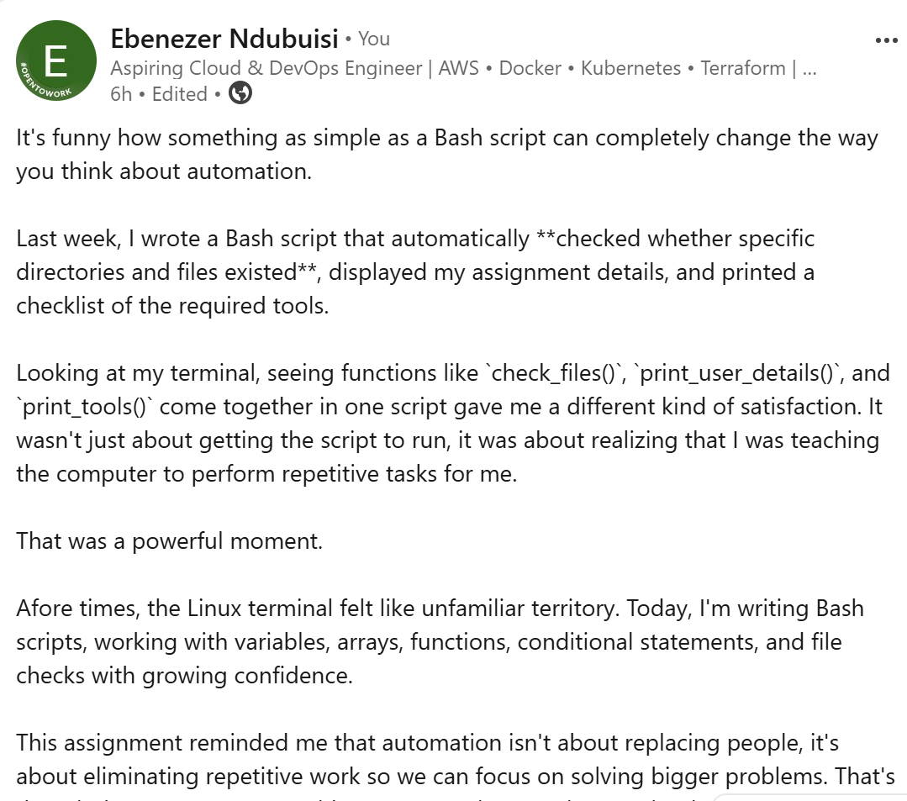

---

# Submission Instructions

- Add all required screenshots in your submission
- Full name must be visible in required screenshots
- All script files must be created and run successfully
- Required notes must be answered clearly for every task
- Do not expose sensitive information (keys, passwords, credentials)

---

# Completion Checklist

- [✅] Task 1: Environment setup verified, workspace created (Screenshots 1–2, Notes answered)
- [✅] Task 2: First script created, executed, permissions verified (Screenshots 1–3, Notes answered)
- [✅] Task 3: Variables script created and run (Screenshots 1–2, Notes answered)
- [✅] Task 4: Arrays and loops script created and run (Screenshots 1–2, Notes answered)
- [✅] Task 5: Counter loop script created and run (Screenshots 1–2, Notes answered)
- [✅] Task 6: File validation script created and run (Screenshots 1–3, Notes answered)
- [✅] Task 7: Pass/Retry conditional script tested with both values (Screenshots 1–4, Notes answered)
- [✅] Task 8: Final automation script created and run (Screenshots 1–3, Notes answered)
- [✅] All scripts run without errors
- [✅] Full Name visible in all required screenshots
- [✅] LinkedIn post published and URL submitted
- [✅] No sensitive data exposed

---

## 📌 About DMI & CloudAdvisory

DevOps Micro Internship (DMI) is a project-based DevOps program run by Pravin Mishra (The CloudAdvisory) focused on real-world execution, systems thinking, and career readiness.

It helps learners build strong DevOps foundations with hands-on experience.

---

## 📌 Resources

- 🌐 DMI Official Website: https://dmi.pravinmishra.com?utm_source=github&utm_medium=readme  
- 🎓 University: https://university.pravinmishra.com?utm_source=github&utm_medium=readme  
- 💬 Discord Community: https://discord.pravinmishra.com?utm_source=github&utm_medium=readme  
- 📝 Blog: https://dmi.pravinmishra.com/blog?utm_source=github&utm_medium=readme  
- ▶️ YouTube Playlist: https://www.youtube.com/playlist?list=PLFeSNDtI4Cho  
- 🔗 Pravin Mishra (LinkedIn): https://www.linkedin.com/in/pravin-mishra-aws-trainer/  
- 🏢 CloudAdvisory (LinkedIn): https://www.linkedin.com/company/thecloudadvisory/

---

_This submission is part of DevOps Micro Internship (DMI) Cohort 3 — Agentic AI Track._
