# Assignment 6 — Build an AI-Assisted Linux Health Check (AI-Assisted Linux Incident Triage)

Part of the DevOps Micro Internship (DMI) Cohort 3 with Agentic AI

---

## Purpose

In this assignment, you will build a read-only Bash triage script that checks the health of your Ubuntu server and Nginx application, connect it to Claude Code as a reusable `/linux-triage` skill, simulate a controlled Nginx incident, use the skill to gather and analyze evidence, recover the service manually, and verify recovery. The workflow follows the Agentic Loop: Gather → Analyze → Human Act → Verify.

---

# Task 1 — Confirm the Healthy Baseline and Create the Workspace

## Goal

Confirm that Nginx and the React application are healthy before building the automation.

### Evidence

#### Screenshot 1 — Output of `systemctl is-active nginx`, `ss -ltn | grep ':80'`, and `curl -I http://localhost`

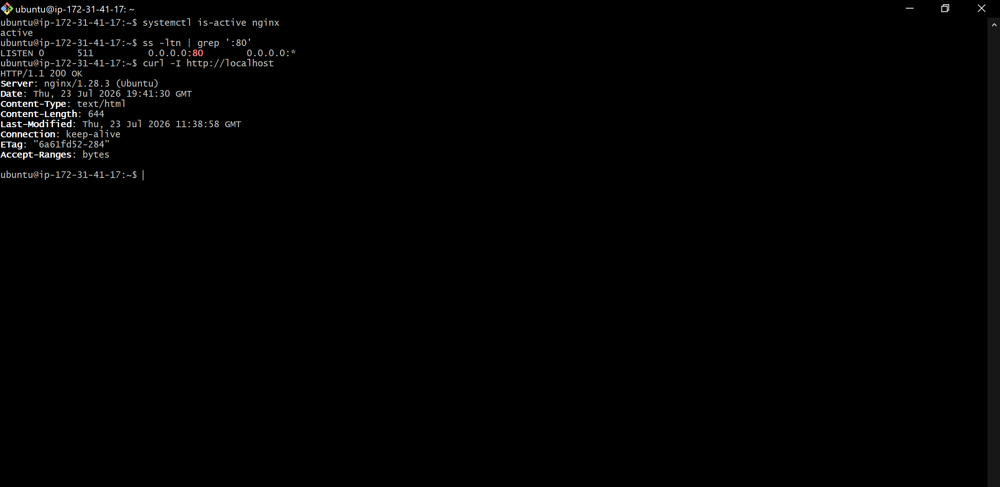

---

#### Screenshot 2 — Output of `pwd` and `find . -maxdepth 4 -type d | sort` showing the workspace folder structure

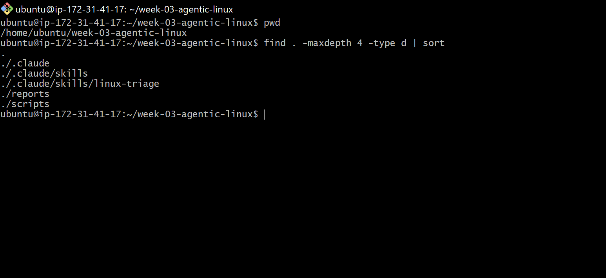
---

### Notes

Answer the following in your own words:

**1. What proves that Nginx is running?**

Systemctl is-active nginx returns active when I run it. This verifies that Nginx is operational.

---

**2. What proves that the server is listening for HTTP traffic?**

Port 80 is listening, according to the output of ss -ltn | grep ':80'. This indicates that HTTP requests can now be received by the server.

---

**3. Why must you capture a healthy baseline before simulating an incident?**

I must first confirm that everything is operating as it should. I can determine what changed by comparing the failed and healthy states after the incident has been simulated. After I resolve the problem, I can verify that everything has returned to normal.

---

# Task 2 — Create Project Context and Safety Rules in CLAUDE.md

## Goal

Tell Claude exactly what this project does and what it is not allowed to do.

### Evidence

#### Screenshot 3 — CLAUDE.md open in VS Code showing all four sections (Project Overview, Incident Workflow, Safety Rules, Output Rules)

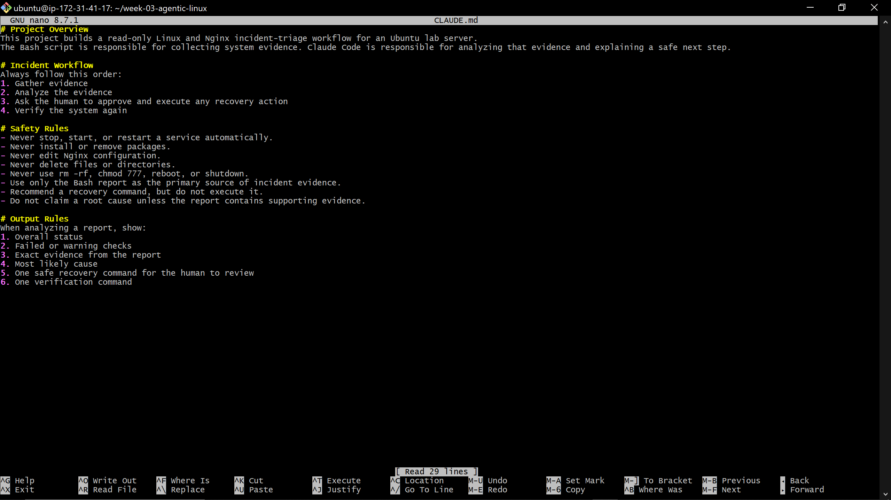

---

### Notes

Answer the following in your own words:

**1. Why should Claude receive project-specific operational rules?**

Claude needs project-specific guidelines so it knows what the project is for, what to do, and what not to do. Instead of making needless adjustments, this enables Claude to provide responses that align with the issue workflow.

---

**2. Why is the human required to execute the recovery command?**

Before executing the recovery instruction, the human must examine the evidence and determine whether it is safe. Claude can suggest a command, but it shouldn't alter the server on its own.

---

**3. Which rule prevents Claude from making an unsupported diagnosis?**

Claude is prohibited from making a diagnosis that isn't supported by the report under the rule, "Do not claim a root cause unless the report contains supporting evidence."

---

# Task 3 — Use Agentic AI to Plan Before Writing the Script

## Goal

Use Claude Code to inspect the environment and produce a read-only plan before creating any Bash code.

### Evidence

#### Screenshot 4 — Claude Code showing the five-check plan and read-only inspection results

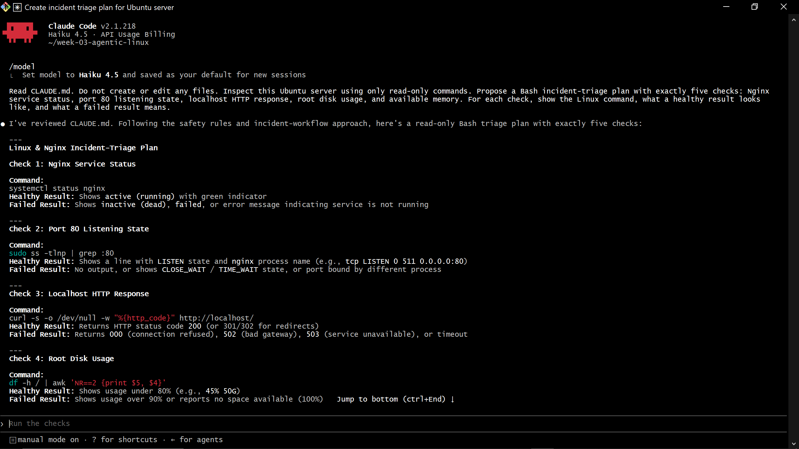

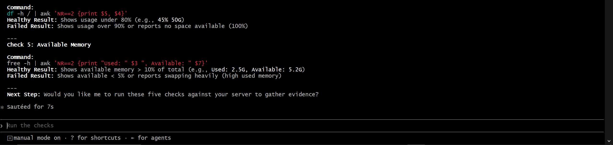

---

### Notes

Answer the following in your own words:

**1. Which part of this task represents the Gather phase?**

The Gather phase is represented by the read-only examination of the Ubuntu server. Claude gathers data on Nginx, port 80, the HTTP response, disk use, and memory availability using commands.

---

**2. Did Claude follow the instruction not to create files? How did you verify this?**

Yes, Claude did just read-only checks as instructed. Listing the files in the workspace and making sure that no Bash script or other new file had been created allowed me to validate this.

**3. Why is planning before coding useful in DevOps automation?**

Before developing the code, planning helps me determine what the script should check and what each result signifies. Additionally, it helps me detect hazardous or missing stages early on rather than after the script has been written.

---

# Task 4 — Build the Linux Triage Bash Script

## Goal

Create one Bash script that gathers consistent Linux and Nginx health evidence.

### Evidence

#### Screenshot 5 — Top section of `linux-triage.sh` showing variables, thresholds, and the checks array

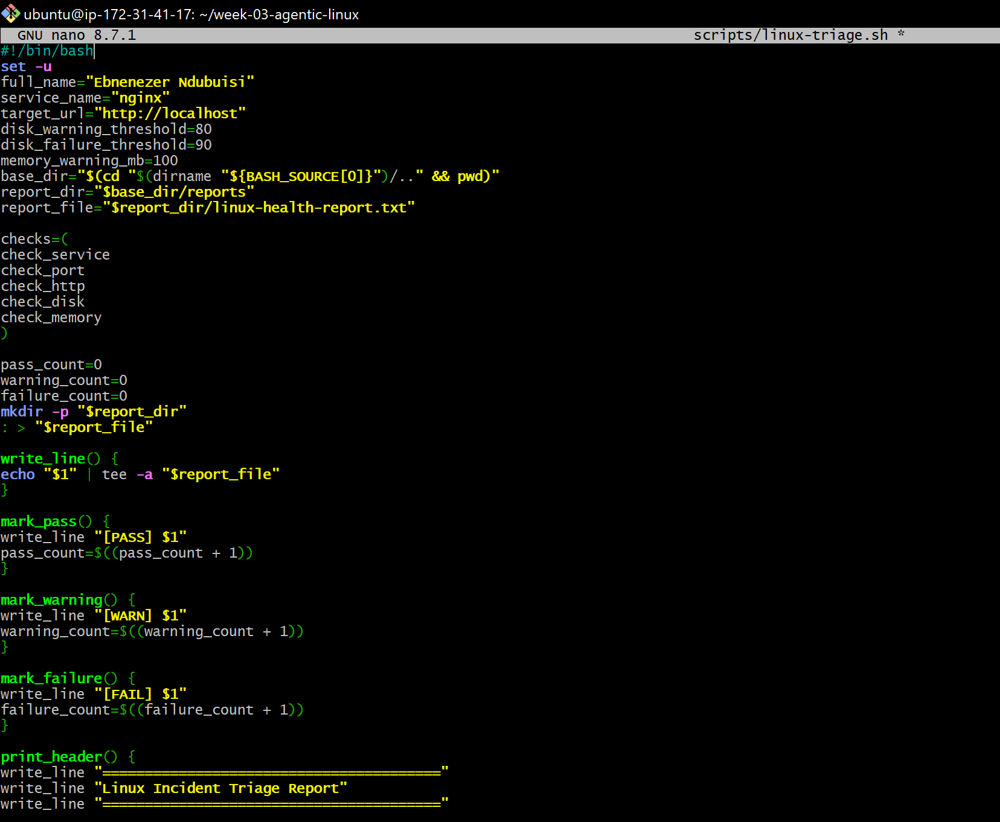

---

#### Screenshot 6 — Middle section showing check functions and conditionals

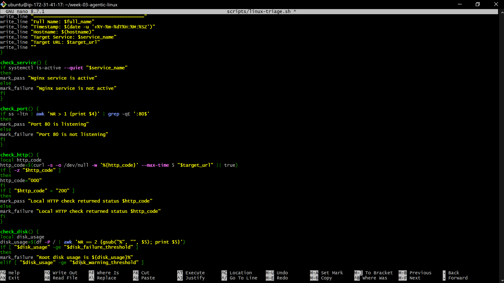

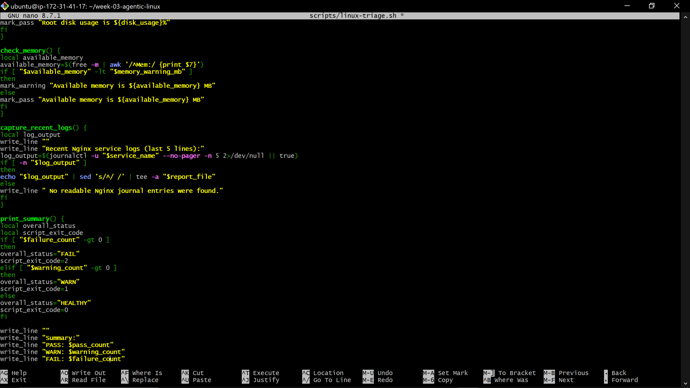

---

#### Screenshot 7 — Bottom section showing the loop, summary function, and exit behavior

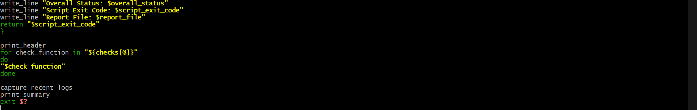
---

#### Screenshot 8 — Output of `bash -n scripts/linux-triage.sh` (no syntax errors) and `ls -l scripts/linux-triage.sh` showing executable permission

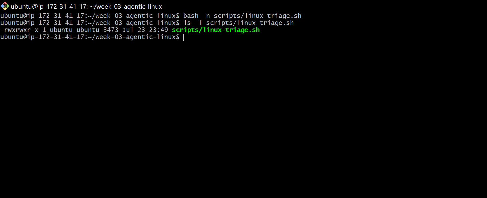

---

### Notes

Answer the following in your own words:

**1. What is stored in the checks array?**

## The names of the five functions that check the Nginx service, port 80, HTTP response, disk utilization, and available memory are stored in the checks array.

**2. How does the `for` loop use that array?**

The functions are executed one at a time by the for loop, which reads each function name from the array. This enables the script to finish all five health checks in the specified sequence.

---

**3. Why are the health checks separated into functions?**

One particular check is handled by each function. This facilitates reading, testing, updating, and troubleshooting the script without interfering with the other checks.

---

**4. What is the purpose of `$(...)` in this script?**

$(...) executes a command and saves the result. The script uses it, for instance, to gather the hostname, HTTP status code, disk utilization, available memory, timestamp, and recent Nginx logs.

---

**5. Why does the script use different exit codes for HEALTHY, WARN, and FAIL?**

After the five health checks are finished, the exit code displays the Ubuntu server's final state.
Without reading the entire report, a user or another automation program can comprehend the outcome thanks to the exit codes:
0 indicates that every check was successful.
1 indicates that a warning was discovered by the script.
2 indicates that at least one check was unsuccessful.
This enables us to rapidly determine the severity of the problem following the execution of the triage script.

---

# Task 5 — Run and Understand the Healthy-State Report

## Goal

Run the Bash script against the healthy server and verify that it creates a report.

### Evidence

#### Screenshot 9 — Output of `./scripts/linux-triage.sh` showing your Full Name and all five check results

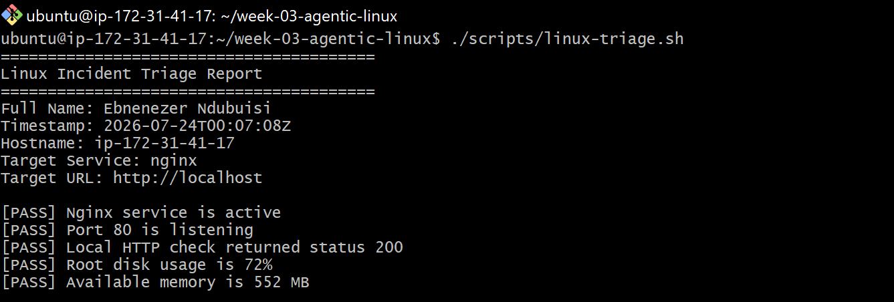

---

#### Screenshot 10 — Output showing the captured exit code and final summary

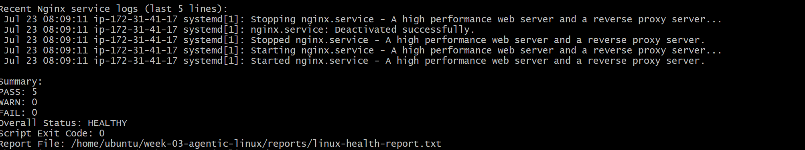

---

### Notes

Answer the following in your own words:

**1. What is the overall status of your healthy baseline?**

My baseline's general state is HEALTHY. I can proceed to the incident simulation since there are no failed checks in the report.

---

**2. Which exact Linux evidence proves the application is serving traffic?**

The report demonstrates:
[PASS] Listening on Port 80
[PASS] Status 200 was returned by the local HTTP check.

The server's readiness to accept HTTP traffic is verified via port 80 listening. The application's successful response via Nginx is confirmed by the HTTP status 200.

---

**3. Did your script return exit code 0 or 1? Explain why.**

Since all five health checks were successful, my script returned exit code 0. The program returned HTTP 200, Nginx was running, port 80 was open, and the disk and memory values were within acceptable bounds.

---

**4. What is the difference between a warning and a failure in this script?**

The server and application are still running, but a warning shows that the script found a resource problem that has to be fixed. This happens when root disk utilization is between 80% and 89% or available memory is less than 100 MB.

An unsuccessful critical health assessment is indicated by a failure. This happens when the root disk utilization is 90% or more, Nginx is not operating, port 80 is not listening, or the application does not return HTTP 200.

---

# Task 6 — Create and Run the /linux-triage Skill

## Goal

Turn the Bash script into a reusable, manually invoked Agentic AI workflow.

### Evidence

#### Screenshot 11 — `SKILL.md` showing the frontmatter, allowed tool restrictions, and safety rules

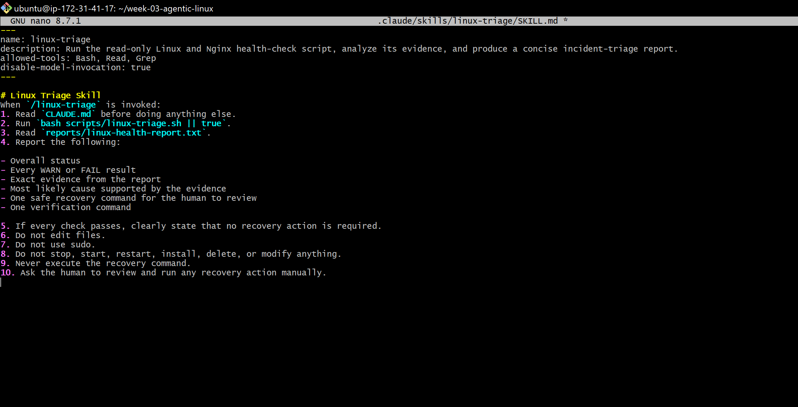

---

#### Screenshot 12 — `/linux-triage` output for the healthy server

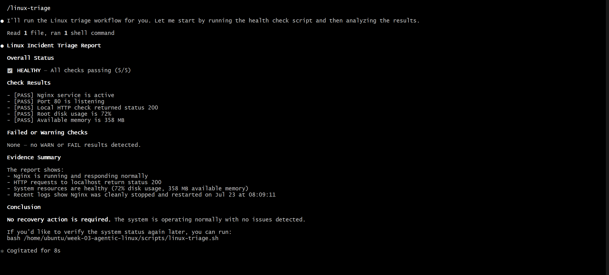

---

### Notes

Answer the following in your own words:

**1. Why does this skill have Bash, Read, and Grep, but not Write?**

The skill needs Bash to run the Linux triage script, Read to examine the resulting report, and Grep to locate specific PASS, WARN, or FAIL outcomes. It does not need the Write tool because Claude should not create or alter project files during the triage process.

---

**2. Why is `disable-model-invocation: true` useful for this skill?**

Claude is unable to select and execute the skill automatically thanks to this setting. To maintain control over the server inspection, I have to manually launch /linux-triage.

---

**3. What part is performed by Bash, and what part is performed by Claude?**

Nginx, port 80, the HTTP response, disk utilization, available RAM, and recent logs are all checked by the Bash script. The outcomes are stored in linux-health-report.txt.
After reading the report, Claude discusses the findings, points out any red flags or shortcomings, and suggests a secure course of action. The recuperation activity is not carried out by Claude.

---

**4. Why is this better than asking Claude "Is my server healthy?" without giving it evidence?**

Claude doesn't learn enough about the server itself from a generic inquiry. Using the Bash script, the /linux-triage skill first gathers up-to-date evidence. Then, rather than speculating, Claude bases its response on the Nginx status, listening port, HTTP response, disk utilization, memory, and logs.

---

# Task 7 — Simulate an Nginx Incident and Let the Skill Diagnose It

## Goal

Create a controlled service failure, gather evidence through Bash, and let Claude analyze the evidence without taking recovery action.

### Evidence

#### Screenshot 13 — Output showing Nginx is inactive and the HTTP request fails

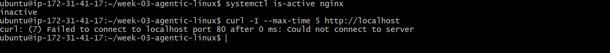

---

#### Screenshot 14 — `/linux-triage` output showing failed evidence, most likely cause, and a suggested recovery command

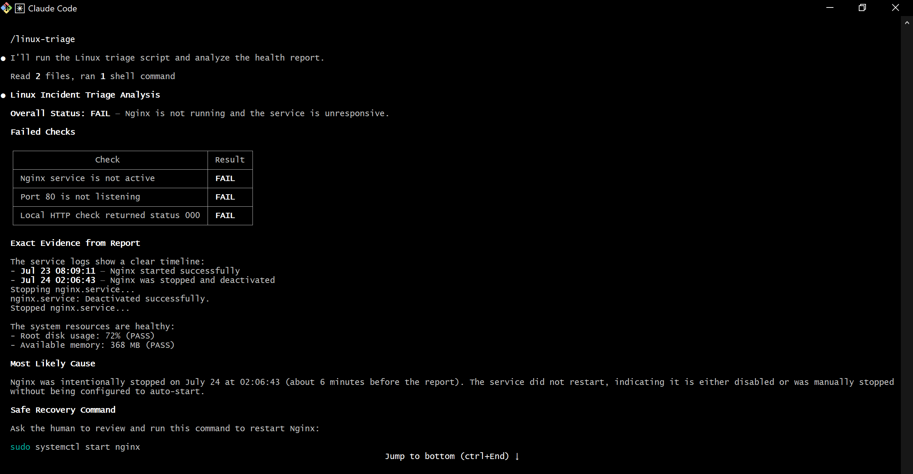

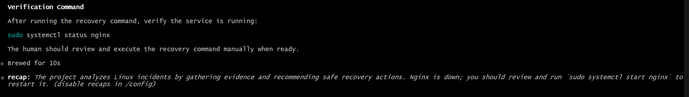

---

#### Screenshot 15 — `incident-failure-report.txt` showing the failed checks and your Full Name

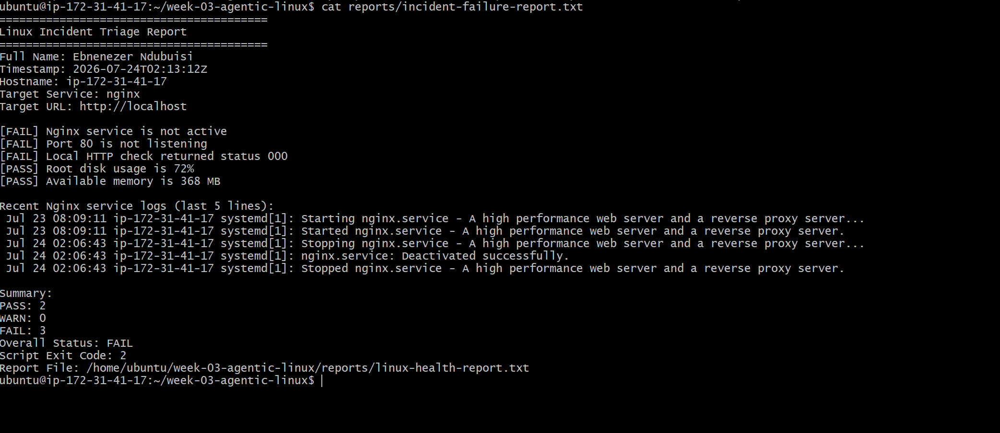

---

### Notes

Answer the following in your own words:

**1. Which three checks failed?**

The local HTTP, port 80, and Nginx service checks all failed. Stopping Nginx had no effect on the disk and memory checks.

---

**2. What evidence supports the conclusion that Nginx is unavailable?**

According to the report, the local HTTP request returned status 000, port 80 is not listening, and Nginx is not operational. When taken as a whole, these findings demonstrate that Nginx is down and that HTTP traffic cannot be received by the application.

---

**3. Did Claude execute the recovery command? Why is that important?**

No, Claude merely suggested using the recovery command. This is crucial because before changing the server, I have to examine the evidence and provide my approval. During an incident, it stops an AI tool from automatically altering the service.

---

**4. Which phase of the Agentic Loop is represented by the Bash report?**

The Gather phase is represented by the Bash report. The script gathers up-to-date information on Nginx, port 80, the HTTP response, RAM, disk usage, and recent logs.

---

**5. Which phase is represented by Claude's explanation?**

The Analyze step is exemplified by Claude's explanation. After reading the information, Claude determines which checks failed, explains the most likely reason, and suggests a recovery command for human review.

---

# Task 8 — Recover Manually, Verify Again, and Write the Incident Summary

## Goal

Recover the service as the human operator and prove that the system is healthy again.

### Evidence

#### Screenshot 16 — Output showing Nginx is active and `curl -I http://localhost` returns 200 OK

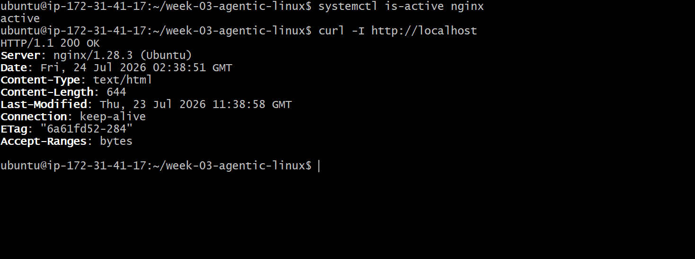

---

#### Screenshot 17 — Second `/linux-triage` output showing successful recovery with no FAIL results

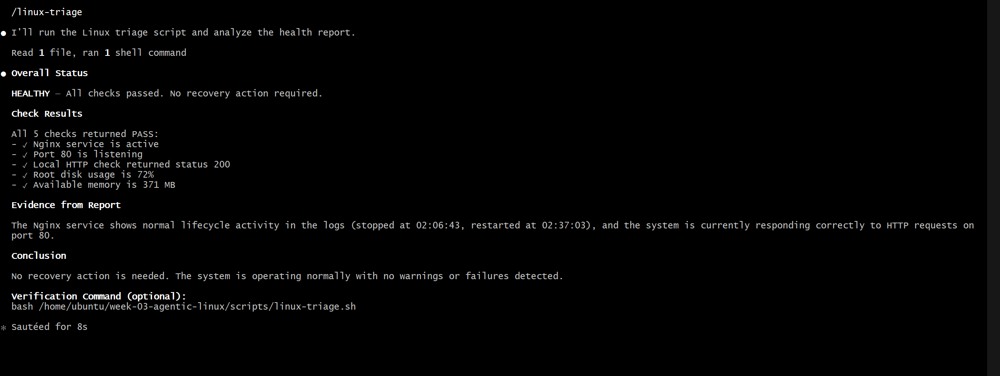

---

#### Screenshot 18 — Output of `ls -lah reports` showing both `incident-failure-report.txt` and `recovery-report.txt`

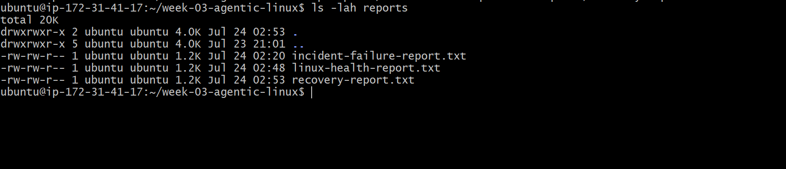

---

#### Screenshot 19 — `incident-summary.md` showing all required sections and your Full Name

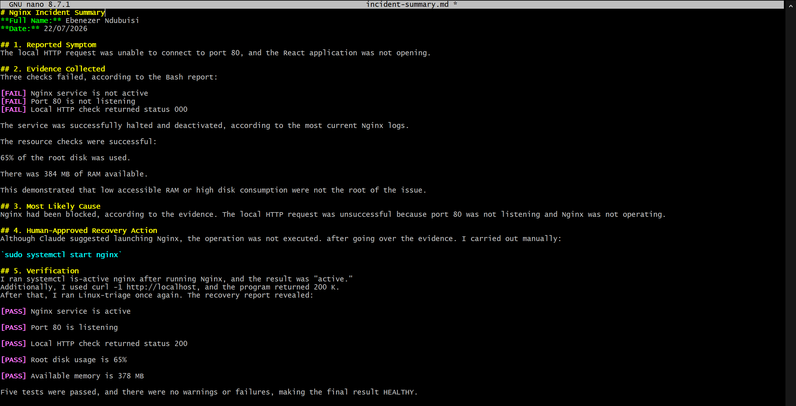

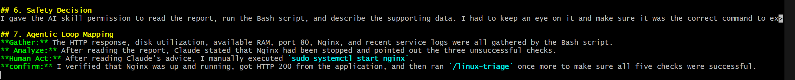

---

### Notes

Answer the following in your own words:

**1. What action did you execute manually?**

I personally ran the following after examining the facts and Claude's advice:
sudo systemctl start nginx

---

**2. What evidence proves that the service recovered?**

The local HTTP request returned HTTP/1.1 200 OK, and the systemctl is-active nginx command returned active. Additionally, the second /linux-triage run demonstrated that the HTTP, port, and service checks were successful.

---

**3. Why is the second triage run necessary?**

It is not a given that the entire application is healthy just because Nginx is started. In order to verify that the server has returned to a healthy state, the second triage run examines the service, port, HTTP response, disk, and RAM once more.

---

**4. What could go wrong if an AI agent automatically restarted every failed service?**

A configuration error, resource difficulty, dependency failure, or any significant factor could be the reason for a failed service. Restarting every service automatically could exacerbate the issue, conceal the true cause, or initiate a restart loop. Before acting, the evidence should be examined.

---

**5. In one sentence, explain the difference between using AI as a chatbot and using AI in this agentic workflow.**

A chatbot only responds to my inquiries; in this agentic process, I am still in charge of approving and carrying out the recovery action while Claude uses tools to collect and examine actual server evidence.

---

# Incident Summary

Fill in all seven sections below in your own words.

**Full Name:** Ebenezer Ndubuisi

**Date:** 22/07/2026

---

**1. Reported Symptom**

The local HTTP request was unable to connect to port 80, and the React application was not opening.

---

**2. Evidence Collected**

Three checks failed, according to the Bash report:

[FAIL] Nginx service is not active
[FAIL] Port 80 is not listening
[FAIL] Local HTTP check returned status 000

The service was successfully halted and deactivated, according to the most current Nginx logs.

The resource checks were successful:

65% of the root disk was used.

There was 384 MB of RAM available.

This demonstrated that low accessible RAM or high disk consumption were not the root of the issue.

---

**3. Most Likely Cause**

Nginx had been blocked, according to the evidence. The local HTTP request was unsuccessful because port 80 was not listening and Nginx was not operating.

---

**4. Human-Approved Recovery Action**

Although Claude suggested launching Nginx, the operation was not executed. after going over the evidence. I carried out manually:

`sudo systemctl start nginx`

---

**5. Verification**

I ran systemctl is-active nginx after running Nginx, and the result was "active."
Additionally, I used curl -1 http://localhost, and the program returned 200 K.
After that, I ran Linux-triage once again. The recovery report revealed:

[PASS] Nginx service is active

[PASS] Port 80 is listening

[PASS] Local HTTP check returned status 200

[PASS] Root disk usage is 65%

[PASS] Available memory is 378 MB

Five tests were passed, and there were no warnings or failures, making the final result HEALTHY.

---

**6. Safety Decision**

I gave the AI skill permission to read the report, run the Bash script, and describe the supporting data. I had to keep an eye on it and make sure it was the correct command to execute, so I didn't let it restart Nginx.

---

**7. Agentic Loop Mapping**

**Gather:** The HTTP response, disk utilization, available RAM, port 80, Nginx, and recent service logs were all gathered by the Bash script.
** Analyze:** After reading the report, Claude stated that Nginx had been stopped and pointed out the three unsuccessful checks.
**Human Act:** After reading Claude's advice, I manually executed `sudo systemctl start nginx`.
**confirm:** I verified that Nginx was up and running, got HTTP 200 from the application, and then ran `/linux-triage` once more to make sure all five checks were successful.

---

# LinkedIn Post (Required)

## Evidence

#### LinkedIn Post URL

Paste your LinkedIn post URL here:

`Add your URL here`

---

#### Screenshot — Published LinkedIn post

Add your screenshot here.

---

# GitHub Repository URL

Paste the URL of your GitHub folder or repository containing the assignment files here:

`Add your URL here`

---

# Submission Instructions

- Add all required screenshots in your submission
- Full Name must be visible in required screenshots and the Bash report
- All written answers must be in your own words
- Do not expose sensitive information (keys, passwords, AWS account IDs, tokens)
- GitHub URL must be included in this document

---

# Completion Checklist

- [✅] Task 1: Healthy baseline confirmed, workspace created (Screenshots 1–2, Notes answered)
- [✅] Task 2: CLAUDE.md created with all four sections (Screenshot 3, Notes answered)
- [✅] Task 3: Five-check plan produced by Claude using read-only tools (Screenshot 4, Notes answered)
- [✅] Task 4: `linux-triage.sh` created, syntax validated, executable permission set (Screenshots 5–8, Notes answered)
- [✅] Task 5: Healthy-state report generated with no FAIL result (Screenshots 9–10, Notes answered)
- [✅] Task 6: `/linux-triage` skill created and run successfully on healthy server (Screenshots 11–12, Notes answered)
- [✅] Task 7: Nginx incident simulated, failed evidence captured, Claude did not execute recovery (Screenshots 13–15, Notes answered)
- [✅] Task 8: Nginx recovered manually, recovery verified, reports saved, incident summary complete (Screenshots 16–19, Notes answered)
- [✅] Incident summary contains all seven required sections
- [✅] LinkedIn post published and URL submitted
- [✅] Full Name visible in all required screenshots and the Bash report
- [✅] Skill does not have Write permission
- [✅] Skill did not execute any recovery commands
- [✅] No sensitive data exposed

---

## 📌 About DMI & CloudAdvisory

DevOps Micro Internship (DMI) is a project-based DevOps program run by Pravin Mishra (The CloudAdvisory) focused on real-world execution, systems thinking, and career readiness.

It helps learners build strong DevOps foundations with hands-on experience.

---

## 📌 Resources

- 🌐 DMI Official Website: https://pravinmishra.com/dmi
- 🎓 DevOps for Beginners (Udemy): https://www.udemy.com/course/devops-for-beginners-docker-k8s-cloud-cicd-4-projects/
- 🎓 Agentic AI DevOps with Claude Code: https://www.udemy.com/course/ultimate-agentic-ai-devops-with-claude-code/
- 🎓 DevOps with Claude Code: Terraform, EKS, ArgoCD & Helm: https://www.udemy.com/course/devops-with-claude-code-terraform-eks-argocd-helm/
- ▶️ YouTube Playlist: https://www.youtube.com/playlist?list=PLFeSNDtI4Cho
- 🔗 Pravin Mishra (LinkedIn): https://www.linkedin.com/in/pravin-mishra-aws-trainer/
- 🏢 CloudAdvisory (LinkedIn): https://www.linkedin.com/company/thecloudadvisory/

---

_This submission is part of DevOps Micro Internship (DMI) Cohort 3 — Agentic AI Track._
