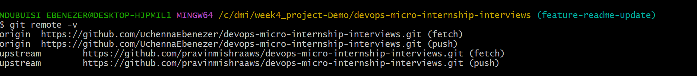
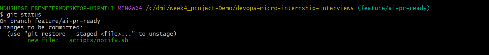
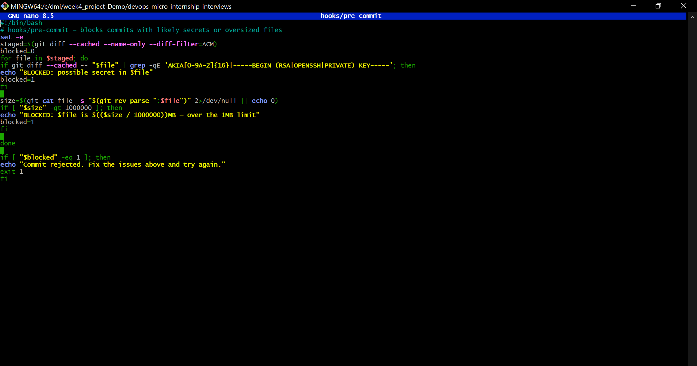
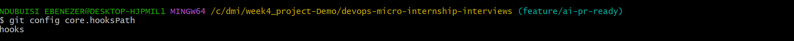
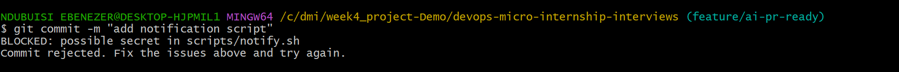
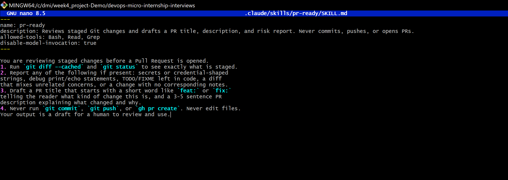
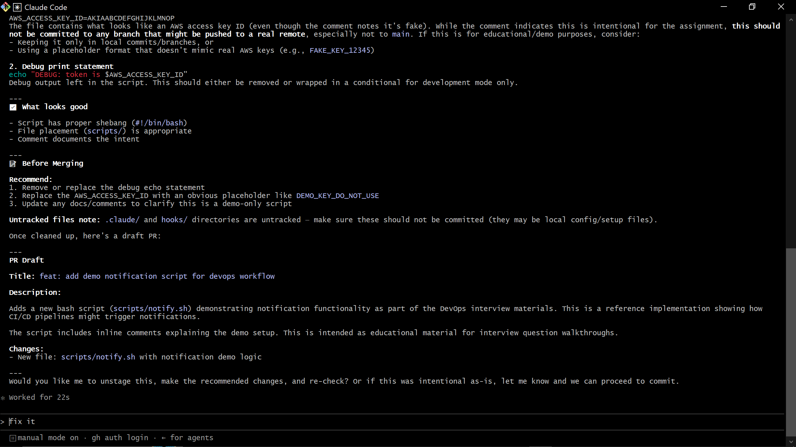
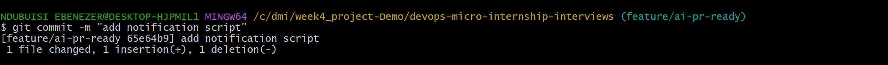
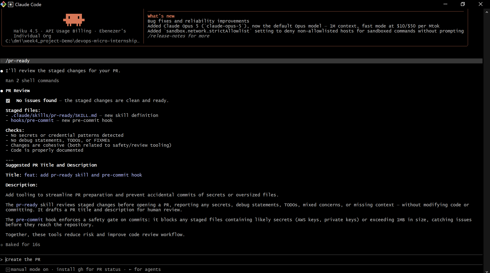
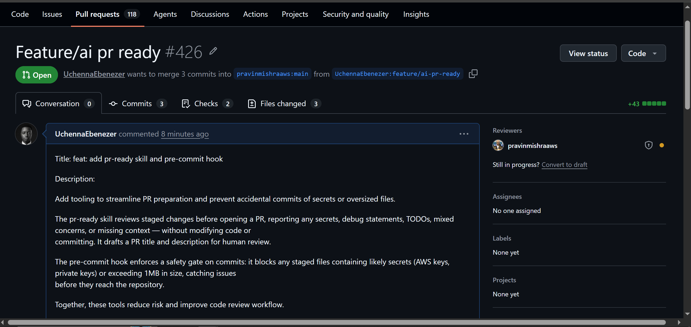

# Assignment 6 — Building an AI-Assisted Git Safety Net (PR Ready Check)

Part of the DevOps Micro Internship (DMI) Cohort 3 with Agentic AI

---

## Purpose

In Week 2 you built Claude Code hooks that block a dangerous action *before* it happens (`PreToolUse`), and a restricted skill that could look but not touch (`allowed-tools` without `Write`). In this assignment you will discover that Git has the exact same idea, decades older: a **pre-commit hook** that blocks a commit before it's created.

You will build both halves of a real "PR Ready" workflow:

1. A **Git hook that follows fixed rules** — scans staged changes for hardcoded secrets and oversized files and refuses the commit. No AI involved, no guessing, just a rule that gives the same answer every time.
2. A **restricted Claude Code skill** (`/pr-ready`) that reads your staged diff and drafts a Pull Request title, description, and a short list of things worth a second look — the kind of judgment a fixed rule can't make (mixed changes, missing context, unclear intent). The skill never commits, pushes, or opens the PR. You do that yourself, using its draft as a starting point.

This mirrors the Agentic Loop from Week 3's Linux triage assignment: **Gather → Analyze → Human Act → Verify**. The hook and the skill both gather and analyze; only you act.

---

# Task 0 — Confirm Your Fork and Create a Feature Branch

## Goal

Confirm you are working in your own fork, then create a dedicated branch for this assignment.

### Evidence

#### Screenshot 1 — Output of git remote -v and git branch showing the new branch

---

### Notes

**1. Why create a dedicated branch instead of doing this work on main?**

Your work is kept apart from the main branch by creating a separate branch. This enables you to safely develop, test, and make modifications without impacting the project's stable version. Additionally, it facilitates the creation of a clear Pull Request with just the modifications needed for this task.

---

# Task 1 — Stage a Change With Realistic Risk

## Goal

On your own fork of this repository (the one you've been submitting your DMI work in since onboarding), create a new branch and stage a change that a real reviewer should catch: a hardcoded-looking secret and a leftover debug statement.

### Evidence

#### Screenshot 1 — Output of  `git status` showing the staged file on feature/ai-pr-ready

---

### Notes

**1. Why does this assignment use an obviously fake key instead of a real one?**

The pre-commit hook and Claude Code skill are expected to identify common security flaws in the staged file before the code is committed, creating a realistic test case for the remainder of the assignment. This shows how automated checks can help prevent debugging code and sensitive information from being pushed to a repository.

---

# Task 2 — Write a Real Git Pre-Commit Hook

## Goal

Create a tracked, shareable pre-commit hook that blocks a commit containing secret-like patterns or files over 1MB.

### Evidence

#### Screenshot 2 — `hooks/pre-commit` open in VS Code showing the full script

---

#### Screenshot 3 — Output of `git config core.hooksPath` confirming it points to `hooks`

---

### Notes

**1. Why is `hooks/pre-commit` tracked in the repo instead of living only in `.git/hooks/`?**

Files located in.git/hooks/ are local to a single clone and are not shared or committed via Git. The team can review, version, and apply the same safety check by tracking the hook in hooks/.

---

**2. Compare this to `PreToolUse` from Week 2 Assignment 6. What does each one intercept, and what do they have in common?**

Before a commit is made, the Git commit process is intercepted by hooks/pre-commit. It looks for files larger than 1 MB, private keys, and presumably AWS access keys in staged files. The commit is blocked if any of these are found.

Bash instructions are intercepted by the PreToolUse hook before Claude Code runs them. It prevents potentially harmful operations like aws s3 rm, aws s3 rb, terraform destroy, and terraform apply -auto-approve.

They are both preventive safety controls, meaning they can halt an operation when it deviates from predetermined safety regulations and inspect an action before it is finished. The distinction is in what they safeguard: hooks/pre-commit prevents the repository from committing secrets or large files, whereas PreToolUse regulates risky commands before to execution.

---

# Task 3 — Prove the Hook Blocks the Risky Commit

## Goal

Attempt to commit the staged file from Task 1 and show the hook rejecting it.

### Evidence

#### Screenshot 4 — Terminal showing `git commit` rejected with the hook's "BLOCKED" message naming the exact file

---

### Notes

**1. Which line in `hooks/pre-commit` matched your fake key, and why did it match?**

AKIA[0-9A-Z]{16}

Because the fictitious value begins with AKIA and is followed by precisely 16 capital letters or numbers, a format similar to an AWS access key ID, it matched.

---

**2. Could this hook have caught a poorly-named variable that stores a secret without the `AKIA` prefix? What does that tell you about the limits of a fixed rule like this?**

No. If the value did not include a private-key header or the AKIA prefix, this hook might not detect a badly named variable that contained a secret. This demonstrates that a fixed rule can only identify the particular patterns for which it has been programmed. Although it is helpful for identifying known secret formats, it is not a comprehensive security solution and may overlook secrets that employ alternative naming conventions or formats.

---

# Task 4 — Build the `/pr-ready` Skill

## Goal

Create a manually invoked Claude Code skill that reads your staged changes and produces a PR-readiness report and a draft PR description — without writing, committing, or pushing anything itself.

### Evidence

#### Screenshot 5 — `SKILL.md` frontmatter showing `allowed-tools: Bash, Read, Grep` (no `Write`) and `disable-model-invocation: true`

---

#### Screenshot 6 — `/pr-ready` output while the risky file is still staged, showing it flagged the secret and/or debug statement

---

### Notes

**1. Why does `/pr-ready` have `Bash` and `Read` but not `Write`?**

Because it is not a good practice to give Ai permission to write your file, Agentic Ai operations should be human reviewed not autonomous.

---

**2. The pre-commit hook and `/pr-ready` both looked at the same staged diff. Did they flag the same things? What did one catch that the other didn't?**

The pre-commit hook blocked oversized files and likely secrets while /pr-ready blocks only likely secrets.

---

# Task 5 — Fix the Issues and Re-Verify

## Goal

Remove the secret and debug statement, then prove both gates now pass clean.

### Evidence

#### Screenshot 7 — `git commit` succeeding after the fix (no BLOCKED message)

---

#### Screenshot 8 — Second `/pr-ready` run showing a clean risk report and a drafted PR title + description

---

### Notes

**1. What exactly did you change to satisfy the pre-commit hook?**

I removed the likely secret I added aforetime.

---

# Task 6 — Push and Open a Pull Request Using the AI Draft

## Goal

Push your branch and open a real Pull Request, using `/pr-ready`'s drafted title and description as your starting point — read it critically and edit before you use it.

**Important:** Open this Pull Request with base repository set to **your own fork** — not the shared upstream `pravinmishraaws/devops-micro-internship-pravinmishra` repository. This assignment's hook and skill files are your own practice work, not a change meant for the shared class repo.

### Evidence

#### Screenshot 9 — Your Pull Request showing the base repository is your own fork, plus the title and description, with the `/pr-ready` draft visible for comparison (paste it in the PR conversation or your notes below)

---

#### PR Link

[PR Link](https://github.com/pravinmishraaws/devops-micro-internship-interviews/pull/426)

---

### Notes

**1. What, if anything, did you edit in the AI's drafted PR description before using it? Why?**

The AI's created PR description appropriately described the staged modifications and the assignment's goal, so I didn't revise it before deploying it. I checked the AI-generated document to make sure it didn't include any irrelevant changes, secrets, or inaccurate information. I utilized it as drafted because it was correct and appropriate for the Pull Request.

---

**2. If you had blindly copy-pasted the AI's draft without reading it, what could go wrong?**

I might have missed a crucial risk in the staged changes, missed a secret or credential-shaped string, or included erroneous information if I had simply copied and pasted the AI's draft without examining it. Additionally, it might have included irrelevant information or detailed changes that weren't actually made, creating a false Pull Request. By going over the AI's draft first, I can make sure that I'm still in charge of the finished product and can fix any mistakes before using it.

---

**3. Why does this PR need to target your own fork instead of the shared upstream repository?**

Since this assignment is an exercise in my personal working repository rather than a contribution to the shared upstream repository, this pull request must target my own fork. The assignment changes are kept separate from the upstream project by using my fork as the base, which also stops irrelevant or private assignment files from being uploaded to the shared repository. Additionally, it enables me to securely practice the Pull Request workflow in my own repository.

---

# Task 7 — Map the Workflow to the Agentic Loop

## Goal

Explain this assignment's workflow using the same Gather → Analyze → Human Act → Verify structure from Week 3.

### Notes

**1. Which step(s) represent Gather?**

Examining the staged changes prior to initiating the Pull Request is an example of the Gather phase. To find out exactly what has been staged, use git diff --cached and git status. Next, potential secrets, credential-shaped strings, debug statements, TODO/FIXME comments, irrelevant modifications, and missing notes are all gathered by the /pr-ready skill.

---

**2. Which step(s) represent Analyze?**

The hook uses size restrictions and preset patterns to evaluate the staged data. For contextual issues like debug statements, mixed modifications, missing explanations, and credential-shaped strings, the /pr-ready skill examines the same staged changes.

---

**3. Which step is Human Act, and why must a human — not Claude — run `git commit`, `git push`, and open the PR?**

The hazardous content is eliminated by the human, who also stages the updated files, executes the commit, pushes the branch, examines the AI draft, and initiates the Pull Request.Because these operations change repository history or impact the shared GitHub workflow, they must be completed by a human. Although Claude offers guidance, it should not be relied upon for unchecked implementation.

---

**4. Which step is Verify?**

Verifying that the operations carried out by humans were effective and that the final repository state is accurate is a representation of the Verify phase. This entails verifying that the branch was pushed to my fork, the pull request was opened against the appropriate base repository, and the commit was properly produced. It also entails checking the final Pull Request to make sure that no secrets or inadvertent modifications were included, and that the desired changes and description are present.

---

**5. In one or two sentences: why do you need *both* the fixed-rule pre-commit hook and the AI skill? Isn't one enough?**

While the AI talent can recognize contextual issues that are challenging to articulate as set patterns, the fixed hook offers quick and predictable enforcement for particular rules. Because the AI cannot ensure constant detection and the hook has limited judgment, neither is enough on its own.

---

# Task 8 — LinkedIn Post

## Goal

Publish a LinkedIn post summarizing what you built and what you learned about combining fixed-rule safety checks with AI-assisted review.

### Evidence

#### LinkedIn Post URL

Add your LinkedIn post URL here...

---

## Key Learnings

Add 3-5 bullet points on what you learned this week.

I discovered how to use permitted tools to develop a constrained Claude Code skill without To manage AI's interaction with a repository, write disable-model-invocation: true.

I discovered that a Git pre-commit hook may automatically check staged changes and prevent dangerous commits from being added to the repository.

I discovered that while fixed-rule checks are trustworthy for well-known patterns, they are ineffective when risks deviate from the precise rules.

In order to assess staged changes without changing, committing, or pushing code, I learnt how to establish a read-only Claude Code/pr-ready skill.

---

# Submission Instructions

- Ensure `hooks/pre-commit` and `.claude/skills/pr-ready/SKILL.md` are committed to your GitHub repository
- Add all required screenshots to your submission
- All written answers must be in your own words
- Do not use a real secret or credential anywhere in your submission — the fake key in Task 1 is intentional and must stay clearly fake
- Open your Pull Request against your own fork, not the shared upstream repository
- Push your final changes to your forked repository
- Include your PR link and LinkedIn post URL

---

## GitHub Repository URL

Paste your forked repository URL here:

[GitHub](https://github.com/UchennaEbenezer/devops-micro-internship-pravinmishra.git)

---

# Completion Checklist

- [✅] Branch `feature/ai-pr-ready` created with a staged file containing a fake secret and a debug statement
- [✅] `hooks/pre-commit` created and tracked in the repo (not only in `.git/hooks/`)
- [✅] `core.hooksPath` configured to point at `hooks/`
- [✅] Pre-commit hook shown blocking the risky commit
- [✅] `.claude/skills/pr-ready/SKILL.md` created with correct `allowed-tools` (no `Write`) and `disable-model-invocation: true`
- [✅] `/pr-ready` run against the risky diff and shown flagging issues
- [✅] Risky file fixed; `git commit` succeeds cleanly
- [✅] `/pr-ready` re-run showing a clean report and drafted PR title/description
- [✅] Pull Request opened using the AI draft as a starting point, with your own fork as the base repository (not upstream), PR link included
- [✅] Agentic Loop mapping (Task 7) completed in your own words
- [✅] LinkedIn post published and URL submitted
- [✅] All required screenshots added
- [✅] GitHub repository URL provided

---

## 📌 About DMI & CloudAdvisory

DevOps Micro Internship (DMI) is a project-based DevOps program run by Pravin Mishra (The CloudAdvisory) focused on real-world execution, systems thinking, and career readiness.

It helps learners build strong DevOps foundations with hands-on experience.

---

## 📌 Resources

- 🌐 DMI Official Website: https://dmi.pravinmishra.com?utm_source=github&utm_medium=readme  
- 🎓 University: https://university.pravinmishra.com?utm_source=github&utm_medium=readme  
- 💬 Discord Community: https://discord.pravinmishra.com?utm_source=github&utm_medium=readme  
- 📝 Blog: https://dmi.pravinmishra.com/blog?utm_source=github&utm_medium=readme  
- ▶️ YouTube Playlist: https://www.youtube.com/playlist?list=PLFeSNDtI4Cho  
- 🔗 Pravin Mishra (LinkedIn): https://www.linkedin.com/in/pravin-mishra-aws-trainer/  
- 🏢 CloudAdvisory (LinkedIn): https://www.linkedin.com/company/thecloudadvisory/

---

*This submission is part of DevOps Micro Internship (DMI) Cohort 3 — Agentic AI Track.*
