# Assignment 4 — Gotto Job: Backlog Refinement & Sprint 1 in Jira

Part of the DevOps Micro Internship (DMI) Cohort 3 with Agentic AI

---

## Purpose

In this 90-minute, time-boxed exercise, you will act as a Scrum team — or run in Solo Mode, playing every role yourself — to turn the Gotto Job template into a value-ordered backlog, estimate the work in story points, plan Sprint 1, open the burndown chart, and ship one small UI-only increment (text, color, spacing, a label, or a CTA — no backend changes).

---

# Task 1 — Roles & Mode Setup (Team vs Solo)

## Goal

Choose Team Mode or Solo Mode, and document how each Scrum role (Product Owner, Scrum Master, Dev Lead, DevOps Lead) was handled.

### Evidence

#### Screenshot 1 — Jira "Create project" screen, or the project sidebar after creation

---

### Notes

Write one line for each role: PO (what you prioritized), SM (how you ensured process), Dev Lead (what you built), DevOps Lead (how you shipped).

Mode: Individual Mode. To be honest, it was a one-person exercise because I played all four roles myself.

Product Owner: Before making any estimates, I arranged the backlog according to value rather than work. Because a visitor who cannot identify an appropriate job never gets far enough to care whether the site seems genuine, discoverability was valued higher than trust. Thus, footer trust signals and form labeling followed after the search call-to-action, the number of results, and the content of the job card.

Scrum Master: I maintained the sprint's integrity and the exercise's time limit. Not six at eleven, but three stories at four points. Additionally, I kept the sprint scope fixed once it had begun, which is the easiest guideline to violate when no one else would be around.

Dev Lead: I only increased the text on the main search button and the hero header. UI only; no data or backend. The smallest alteration that still provides what the top-ranked Story describes.

DevOps Lead: Using a different Nginx location and a different directory outside of /var/www/html, I deployed the Gotto Job template to the same EC2 instance that was already hosting my portfolio website. Because the portfolio deploy script clears its own webroot on each run and would have otherwise erased this website, that separation was crucial.

---

# Task 2 — Create the Jira Project (Team-managed → Scrum)

## Goal

Create a Team-managed Scrum project named `Gotto Job – Team <#>` (Team Mode) or `Gotto Job – <YourName>` (Solo Mode).

### Evidence

#### Screenshot 2 — Project created page showing the project name and key

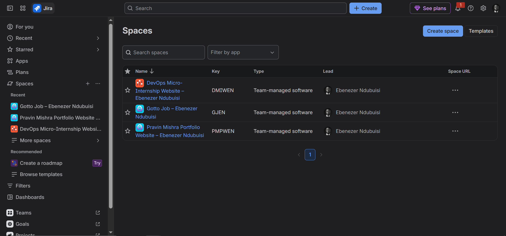

---

# Task 3 — Create the Epic

## Goal

Create the Epic `Improve Gotto Job UI discoverability & trust` to group the UI improvement initiative.

### Evidence

#### Screenshot 3 — Backlog showing the Epic panel with the Epic visible

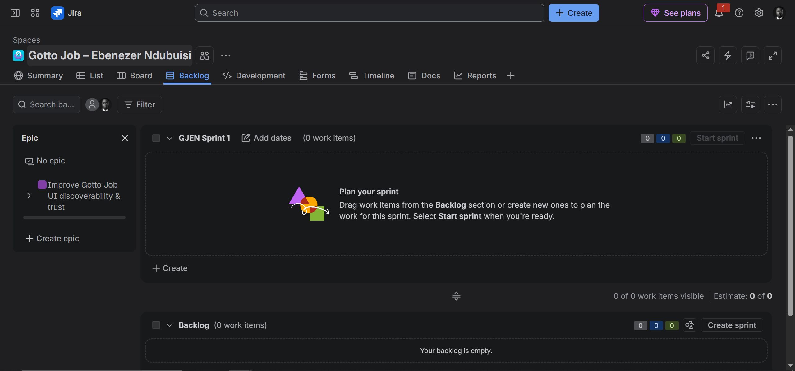

---

# Task 4 — Seed the Product Backlog (6–8 Stories + Fibonacci Points + Ranking)

## Goal

Create at least six Stories under the Epic, estimate each with 1, 2, or 3 story points, and rank them by value.

### Evidence

#### Screenshot 4 — Backlog showing the Epic and at least six Stories under it

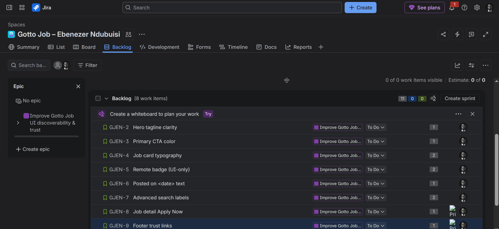

---

#### Screenshot 5 — One Story opened showing its Story Points and acceptance criteria filled in

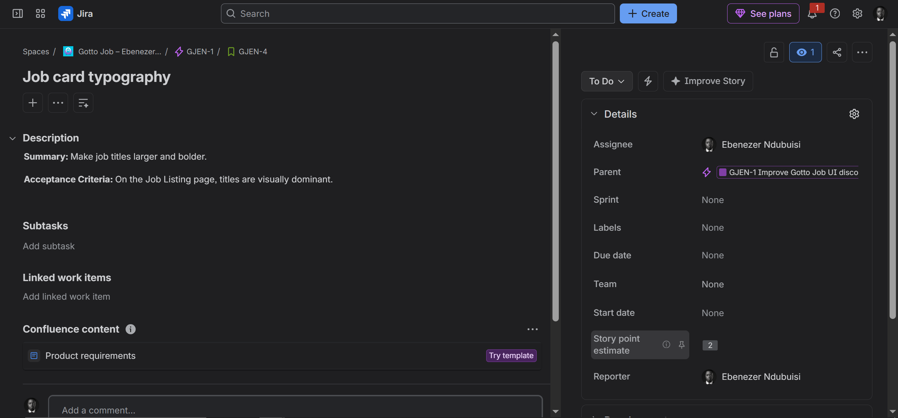

---

# Task 5 — Planning Poker (Estimate + Debate Notes)

## Goal

Confirm the Story Points (1, 2, or 3) for each Story and record brief reasoning for each estimate.

### Evidence

#### Screenshot 6 — Backlog showing Story Points visible, or two or three Stories opened showing their points

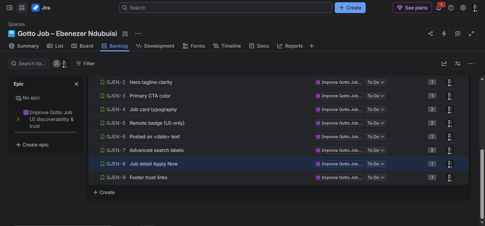

---

### Notes

For each story, explain in one or two lines why it is a 1, 2, or 3 (mention any debate, even in Solo Mode).

S1-Hero tagline (1 point): This is a simple task that only needs one heading to be changed.

S2-Button color (1 point): The button color is the only thing that needs to be changed. Since it affects several buttons, I briefly thought about giving it two points, but since it's only a straightforward CSS modification, I decided to keep it at one.

S3-Job card typography (2 points): This calls for adjusting the font's weight and size before making sure the arrangement remains accurate across a range of screen sizes.

S4-REMOTE badge (2 points): This is a little more complicated than a straightforward text modification since it entails creating a new badge and only displaying it for remote jobs.

S5-Posted on date (1 point): This is a straightforward text addition devoid of any additional reasoning.

S6-Search labels (2 points): It takes more work than a single text change because many labels and placeholders must be updated and tested.

S7: "Apply Now" Button for Job Details (1 Point): adds a single "Apply Now" button that connects to a placeholder URL or email address. It is estimated at one point because it is a straightforward modification without any extra reasoning.

S7 – Job Detail "Apply Now" Button (1 Point): adds a single "Apply Now" button that connects to a placeholder URL or email address. It is estimated at one point because it is a straightforward modification without any extra reasoning.

S8: Trust Links in the Footer (1 Point): "About" and "Contact" are two new footer links. This is rated at one point because it only needs a minor HTML update and has no complicated functionality.

---

# Task 6 — Sprint Planning: Create Sprint 1 + Sprint Goal + Scope

## Goal

Create Sprint 1, move three or four Stories into it (approximately 3–6 points), set the Sprint Goal, and break each selected Story into Build, Verify, Deploy, and Screenshot Sub-tasks.

### Evidence

#### Screenshot 7 — Sprint 1 with the selected Stories inside it

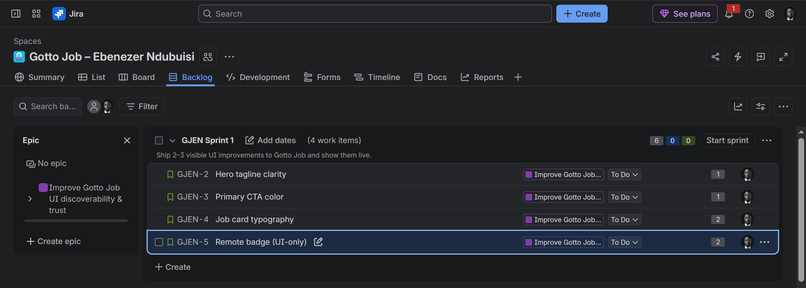

---

#### Screenshot 8 — One Story showing the Sub-tasks created

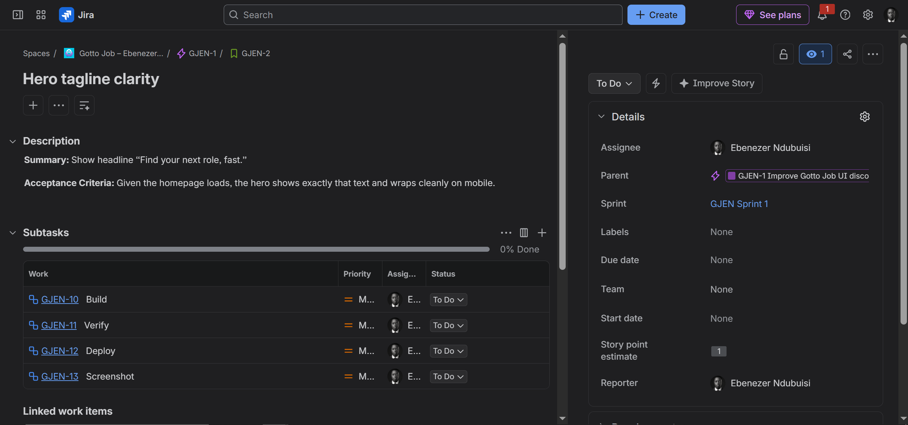

---

# Task 7 — Reports: Open Burndown Chart

## Goal

Open the Burndown Chart and confirm it exists for Sprint 1. It is acceptable if the chart is not yet populated.

### Evidence

#### Screenshot 9 — Burndown Chart page opened, even if empty

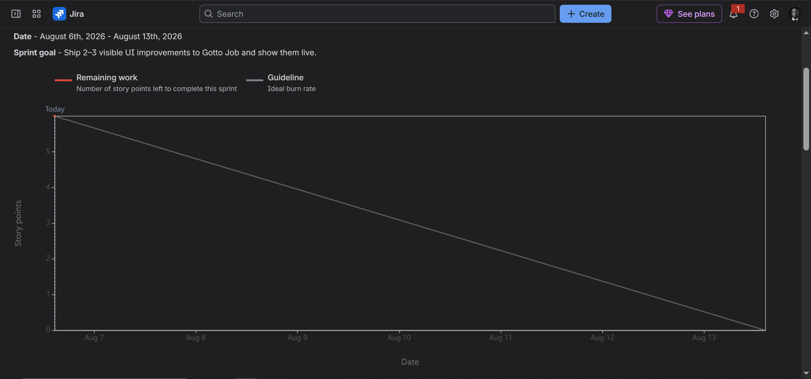

---

# Task 8 — Ship One Small Increment (Build + Deploy + Proof)

## Goal

Implement one small UI-only Story from Sprint 1, commit it, deploy it live, and move the Story and its Sub-tasks to Done in Jira.

### Evidence

#### Screenshot 10 — Jira board showing the Story moved to Done

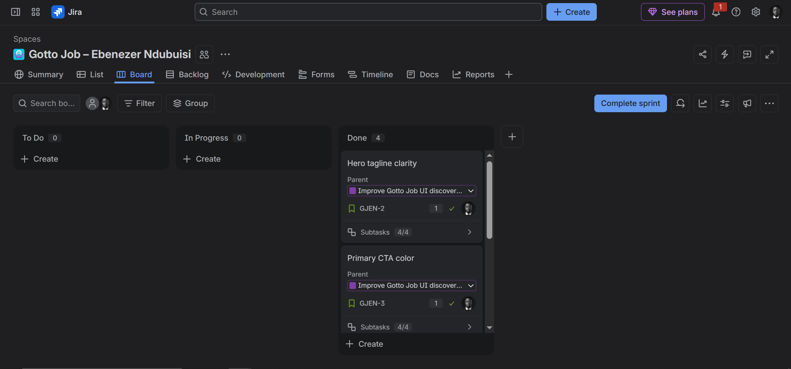

---

#### Screenshot 11 — Git commit output

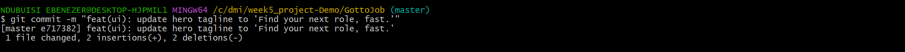

---

#### Screenshot 12 — Live URL in the browser showing the UI change, with the URL visible

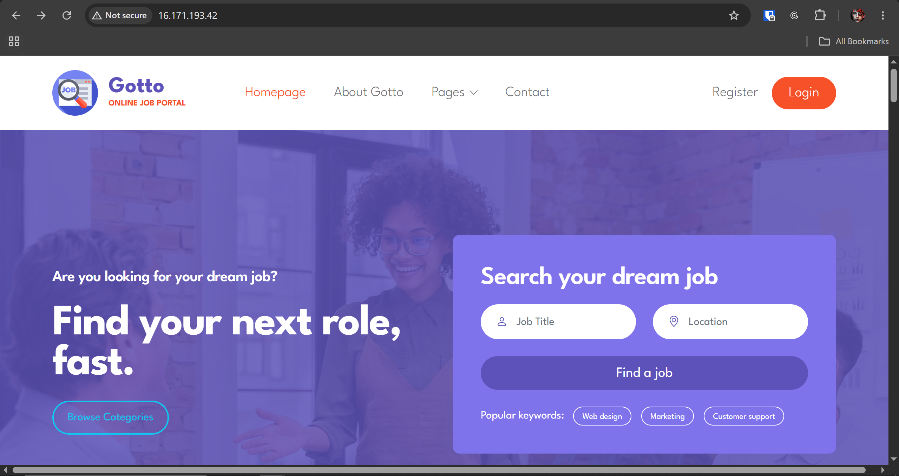

---

# Task 9 — Retro Notes (Scrum Pillar + Value)

## Goal

Add a retro comment covering what went well, what to improve, one Scrum pillar observed (Transparency, Inspection, or Adaptation), and one Scrum value (Openness, Focus, Commitment, Courage, or Respect).

### Evidence

#### Screenshot 13 — Jira retro comment visible

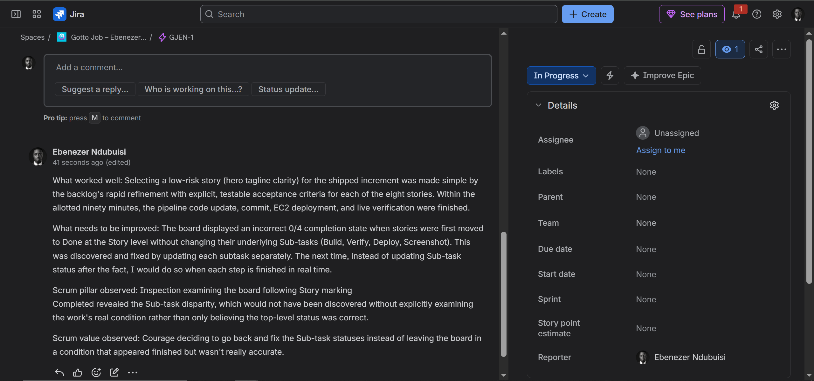

---

# Task 10 — LinkedIn Post (Mandatory)

## Goal

Publish a LinkedIn post about what you delivered, including your live URL, three to five lines on what you did and learned, and one screenshot (Burndown Chart, Sprint board, or the live UI change).

## Evidence

#### LinkedIn Post URL

Paste your LinkedIn post URL here:

`Add your URL here`

---

#### Screenshot 14 — Published LinkedIn post

Add your screenshot here.

---

# Submission Instructions

- Add all 14 required screenshots
- Full name must be visible in required screenshots
- Do not expose sensitive information (keys, passwords, account IDs)

---

# Completion Checklist

- [✅] Task 1: Team Mode or Solo Mode selected and all four roles documented (Screenshot 1 & Notes)
- [✅] Task 2: Team-managed Scrum project created with the required name (Screenshot 2)
- [✅] Task 3: UI improvement Epic created (Screenshot 3)
- [✅] Task 4: 6–8 Stories added under the Epic and ranked by value (Screenshots 4 & 5)
- [✅] Task 5: Story Points set (1, 2, or 3) with reasoning recorded (Screenshot 6 & Notes)
- [✅] Task 6: Sprint 1 created with Sprint Goal, 3–4 Stories, and Sub-tasks (Screenshots 7 & 8)
- [✅] Task 7: Burndown Chart opened (Screenshot 9)
- [✅] Task 8: One UI-only increment implemented, committed, deployed, and verified (Screenshots 10–12)
- [✅] Task 9: Retro comment with one Scrum pillar and one Scrum value (Screenshot 13)
- [✅] Task 10: Mandatory LinkedIn post published with the live URL, backlog refinement, Sprint planning, one shipped increment, proof, and Screenshot 14
- [✅] Full Name visible in required screenshots
- [✅] No sensitive data exposed

---

## 📌 About DMI & CloudAdvisory

DevOps Micro Internship (DMI) is a project-based DevOps program run by Pravin Mishra (The CloudAdvisory) focused on real-world execution, systems thinking, and career readiness.

It helps learners build strong DevOps foundations with hands-on experience.

---

## 📌 Resources

- 🌐 DMI Official Website: https://dmi.pravinmishra.com?utm_source=github&utm_medium=readme  
- 🎓 University: https://university.pravinmishra.com?utm_source=github&utm_medium=readme  
- 💬 Discord Community: https://discord.pravinmishra.com?utm_source=github&utm_medium=readme  
- 📝 Blog: https://dmi.pravinmishra.com/blog?utm_source=github&utm_medium=readme  
- ▶️ YouTube Playlist: https://www.youtube.com/playlist?list=PLFeSNDtI4Cho  
- 🔗 Pravin Mishra (LinkedIn): https://www.linkedin.com/in/pravin-mishra-aws-trainer/  
- 🏢 CloudAdvisory (LinkedIn): https://www.linkedin.com/company/thecloudadvisory/

---

*This submission is part of DevOps Micro Internship (DMI) Cohort 3 — Agentic AI Track.*
