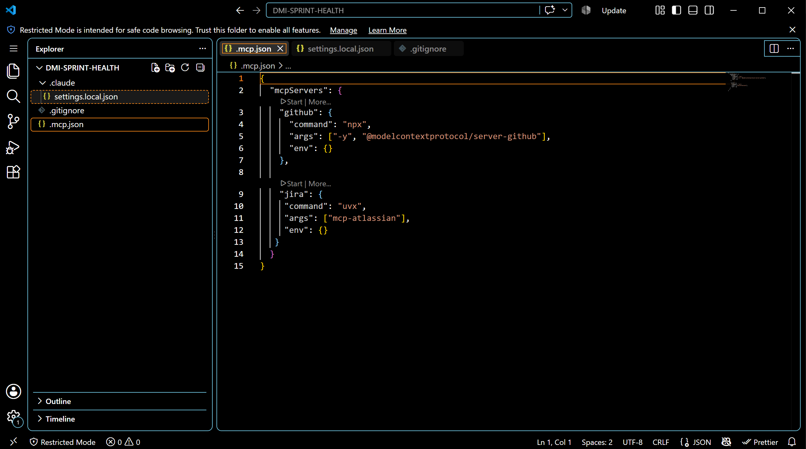
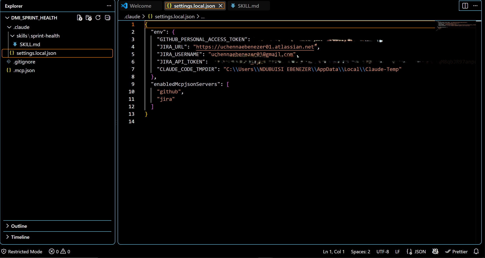
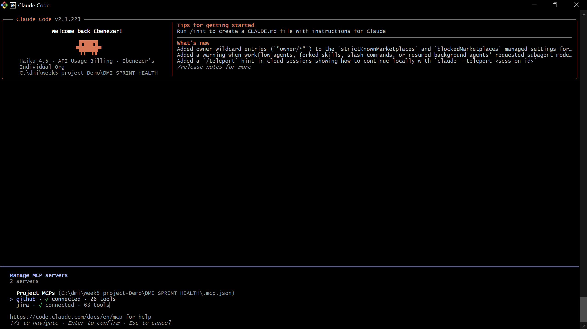
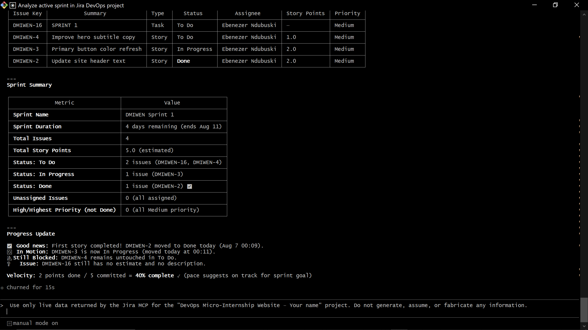
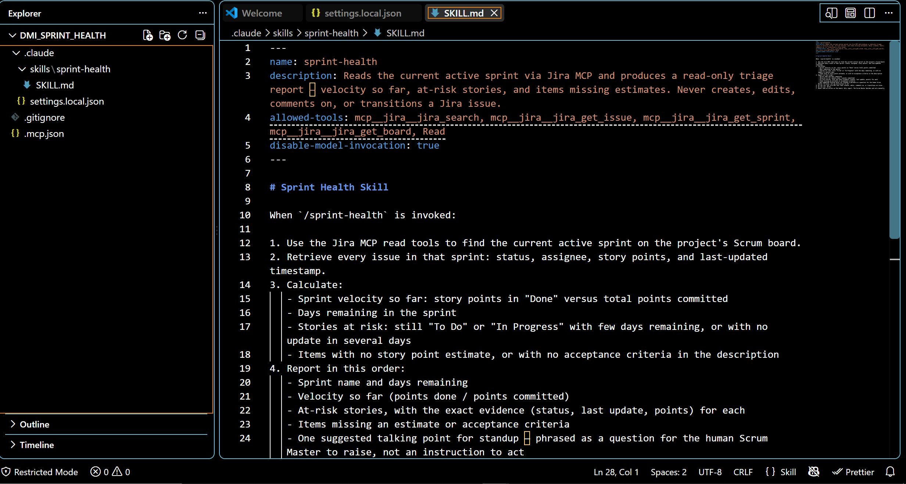
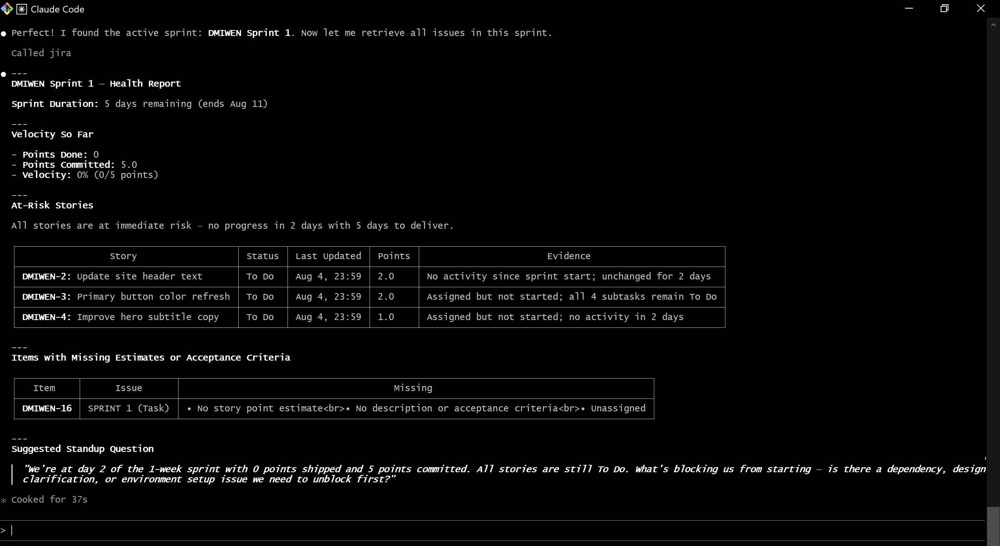

# Assignment 5 — AI-Assisted Sprint Health Report via Jira MCP

Part of the DevOps Micro Internship (DMI) Cohort 3 with Agentic AI

---

## Purpose

In this assignment, you will connect Claude Code to your Jira board through an MCP server, the same way you connected it to GitHub in Week 2, and build a read-only `/sprint-health` skill. The skill reads your current sprint through Jira's API and reports sprint velocity, stories at risk of missing the sprint, and items missing an estimate — but it must never create, edit, comment on, or transition a single ticket itself. You will prove that boundary holds by making a real change on the board yourself and confirming the skill only ever reports, never acts.

---

# Task 1 — Create a Jira API Token

## Goal

Generate an API token from your Atlassian account that the MCP server will use to authenticate with your Jira site. Do not screenshot the token value itself.

### Evidence

#### Screenshot 1 — Jira API token creation confirmation page showing the token name, with the token value not visible

### Notes You Must Write (Very Important):

Why does the MCP server need your site URL and account email in addition to the token?

Because Atlassian hosts numerous distinct instances (your-site.atlassian.net is yours specifically, distinct from anyone else's), the token alone does not identify which Atlassian account it belongs to or which Jira site to connect to. Jira's REST API authenticates using Basic Auth, which requires a username (your email) and a secret (the API token). The email states "on behalf of this specific account," the token verifies "this really is you," and the URL states "talk to this specific Jira instance, not some other one."

---

# Task 2 — Create .mcp.json at the Project Root

## Goal

Create or update `.mcp.json` at your project root with a Jira MCP server block, following the same shape as the GitHub MCP server you configured in Week 2.

### Evidence

#### Screenshot 2 — `.mcp.json` open in VS Code showing the Jira server configuration

### Notes You Must Write (Very Important):

Compare this jira block to the github block from Week 2 Assignment 5. The GitHub server ran via npx (a Node.js package); this one runs via uvx (a Python package) — what stays exactly the same shape despite that difference, and why doesn't Claude Code care which language a given MCP server is written in?

Claude Code treats an MCP (Model Context Protocol) server as a black-box subprocess and communicates over a language-agnostic wire protocol, thus it doesn't care what language the server is written in.

---

# Task 3 — Add Your Credentials to settings.local.json

## Goal

Add your Jira site URL, account email, and API token to `.claude/settings.local.json`, and confirm that file is listed in `.gitignore` so it is never committed.

### Evidence

#### Screenshot 3 — `settings.local.json` open in VS Code showing the `env` section, with the actual token value blurred or covered

### Notes You Must Write (Very Important):

Why must JIRA_API_TOKEN live in settings.local.json and never in .mcp.json?

JIRA_API_TOKEN needs to be in the settings.local.json and never in.mcp.json since git tracks and shares.mcp.json with your team during the configuration process.Git ignores local.json in order to preserve secrets.

---

# Task 4 — Verify the Connection with /mcp

## Goal

Restart Claude Code and confirm the Jira MCP server shows as connected.

### Evidence

#### Screenshot 4 — `/mcp` output showing `jira: connected`

---

# Task 5 — Run a Live Query to Prove Real Board Data

## Goal

Ask Claude to list the issues in your current active sprint through the Jira MCP connection, and confirm the result matches what you see on your live board in the browser.

### Evidence

#### Screenshot 5 — Claude's response showing the live sprint issue list retrieved via Jira MCP

### Notes You Must Write (Very Important):

How did you confirm this was real board data and not something Claude guessed?

The sprint details, all issues in the sprint, their status, assignees, story points, priorities, and an overall sprint summary are all included in the returned data.
The response accurately depicts the project's current status since the information was taken straight from Jira.

---

# Task 6 — Build the /sprint-health Skill

## Goal

Create a `/sprint-health` skill restricted to read-only Jira tools plus `Read`, with no issue-mutating tools and no `Write`. Run it and confirm it produces a report covering sprint velocity, at-risk stories, and items missing an estimate.

### Evidence

#### Screenshot 6 — `SKILL.md` frontmatter showing `allowed-tools` limited to read-only Jira tools plus `Read`, with `disable-model-invocation: true`

#### Screenshot 7 — `/sprint-health` output showing the full triage report against your real sprint

### Notes You Must Write (Very Important):

1. Which Jira MCP tools does this skill's allowed-tools list include, and which mutating tools (create issue, update issue, transition issue, add comment) does it deliberately exclude?

The ability enables five Jira tools in addition to Read:

mcp__jira__jira_get_agile_boards to discover the board mcp__jira__jira_get_sprints_from_board to find the active sprint mcp__jira__jira_get_sprint_issues to obtain its contents mcp__jira__jira_search for additional JQL mcp__jira__jira_get_issue for specific issue details
All 25 of the server's modifying tools—jira_create_issue, jira_update_issue, jira_transition_issue, jira_add_comment, jira_delete_issue, jira_assign_issue, jira_move_issue, jira_link_to_epic, jira_add_issues_to_sprint, jira_create_sprint, and jira_update_sprint—are not included.

The intriguing element is that two of the exclusions were judgment calls rather than clear ones.

Although it uploads files to the local disk, jira_download_attachments is read-only from Jira's perspective. "Read-only" is not a single property since it fails the boundary for a different reason than the modifying tools.

Nothing is altered by jira_get_transitions. Only the accessible transitions are listed. Even still, I didn't include it as a talent that can't execute a transition has no need to list them. In addition to being harmless, keeping it would have been dishonest about the purpose of the skill.

In general, I permitted five of the 38 read-only tools that were offered. The floor, not the objective, is read-only. Even though it couldn't do anything harmful, a report that could read every user profile and service desk queue would have too many permissions.

The skill is also unable to write to the local disk because write is completely absent.

2. Why does a Scrum Master need this restriction more than almost any other role in this course?

Instead of making decisions for the team, a Scrum Master's role is to watch, report, and mentor the group. A skill may unintentionally taint the sprint or supersede human judgment if it had the ability to transfer issues or amend tickets. I make sure the skill remains a tool for transparency and insight rather than a decision-making automaton by restricting it to read-only. The board is owned by the team. The ability just sheds light on the situation.

---

# Task 7 — Prove the Skill Never Mutates the Board

## Goal

Manually update one ticket on your board in the browser (for example, move a story to "Done" or add a missing estimate), then run `/sprint-health` again and confirm the new report reflects your change — proving the skill only ever reads live state and never wrote to the board itself.

### Evidence

#### Screenshot 8 — Second `/sprint-health` run showing the report now reflects your manual board change

### Notes You Must Write (Very Important):

Map this assignment to Gather → Analyze → Human Act → Verify from Week 3 Assignment 6. Which step did you perform manually in the browser, and why must that step stay human?

Gather: Using MCP (automatic), the sprint-health skill reads real-time sprint data from Jira.
Analyze: The ability generates an automated report that identifies gaps, velocity, and dangers.
Human Act: I made the human decision to manually change a story in the browser to Done.
Verify: The report reflected my modification, as confirmed by the second sprint-health run (automated verification). Since only individuals should determine which tickets to relocate, which to estimate, and which to deprioritize, the Human Act step must remain human. The ability provides information but never makes a decision.

---

# Submission Instructions

Complete all tasks in sequence.

Your submission must include:
- All 8 required screenshots
- All the required notes

---

# Completion Checklist

- [✅] Task 1: Jira API token created, value never screenshotted (Screenshot 1)
- [✅] Task 2: `.mcp.json` has the Jira server block (Screenshot 2)
- [✅] Task 3: Credentials stored in `settings.local.json`, token blurred, file gitignored (Screenshot 3)
- [✅] Task 4: `/mcp` shows the Jira server connected (Screenshot 4)
- [✅] Task 5: Live query returned real sprint data, verified against the browser (Screenshot 5)
- [✅] Task 6: `/sprint-health` skill created with correct read-only `allowed-tools`, and produced a full report (Screenshots 6–7)
- [✅] Task 7: A manual board change was reflected in a second `/sprint-health` run (Screenshot 8)
- [✅] Skill never created, edited, transitioned, or commented on any issue
- [✅] Reflection answered (Notes)
- [✅] No API token value exposed

---

## 📌 About DMI & CloudAdvisory

DevOps Micro Internship (DMI) is a project-based DevOps program run by Pravin Mishra (The CloudAdvisory) focused on real-world execution, systems thinking, and career readiness.

It helps learners build strong DevOps foundations with hands-on experience.

---

## 📌 Resources

- 🌐 DMI Official Website: https://dmi.pravinmishra.com?utm_source=github&utm_medium=readme  
- 🎓 University: https://university.pravinmishra.com?utm_source=github&utm_medium=readme  
- 💬 Discord Community: https://discord.pravinmishra.com?utm_source=github&utm_medium=readme  
- 📝 Blog: https://dmi.pravinmishra.com/blog?utm_source=github&utm_medium=readme  
- ▶️ YouTube Playlist: https://www.youtube.com/playlist?list=PLFeSNDtI4Cho  
- 🔗 Pravin Mishra (LinkedIn): https://www.linkedin.com/in/pravin-mishra-aws-trainer/  
- 🏢 CloudAdvisory (LinkedIn): https://www.linkedin.com/company/thecloudadvisory/

---

*This submission is part of DevOps Micro Internship (DMI) Cohort 3 — Agentic AI Track.*
