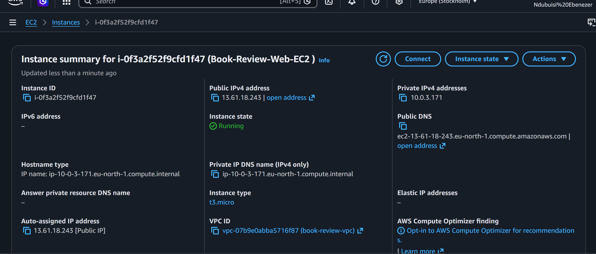
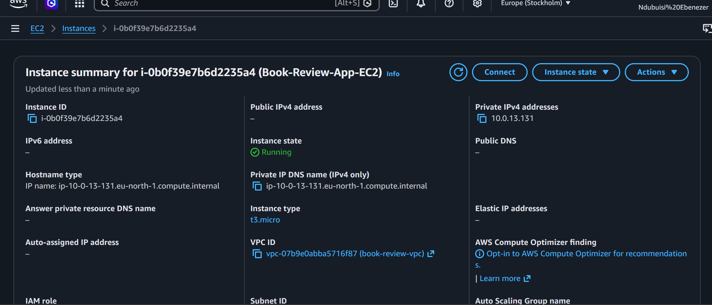
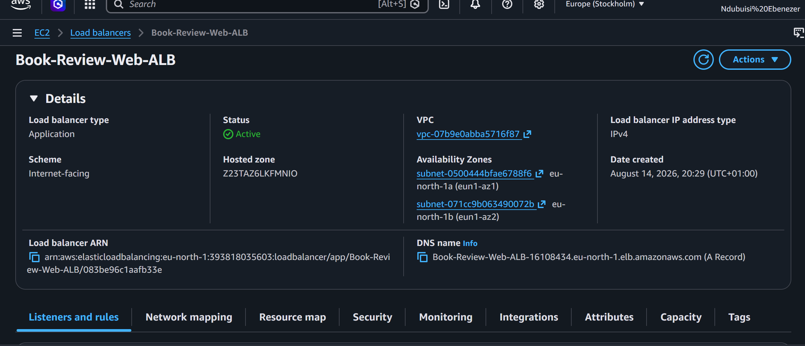
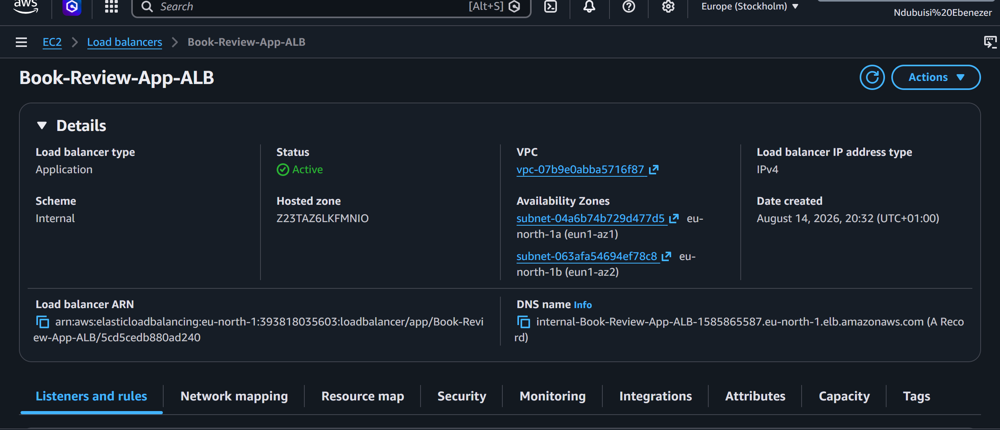
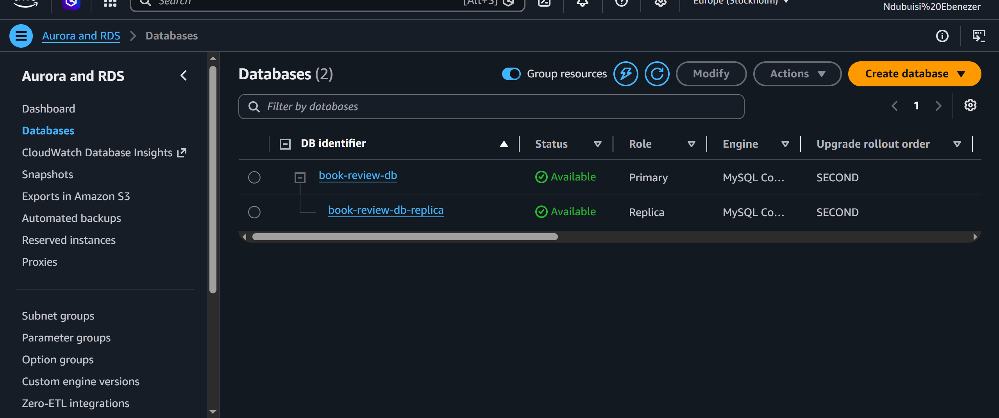
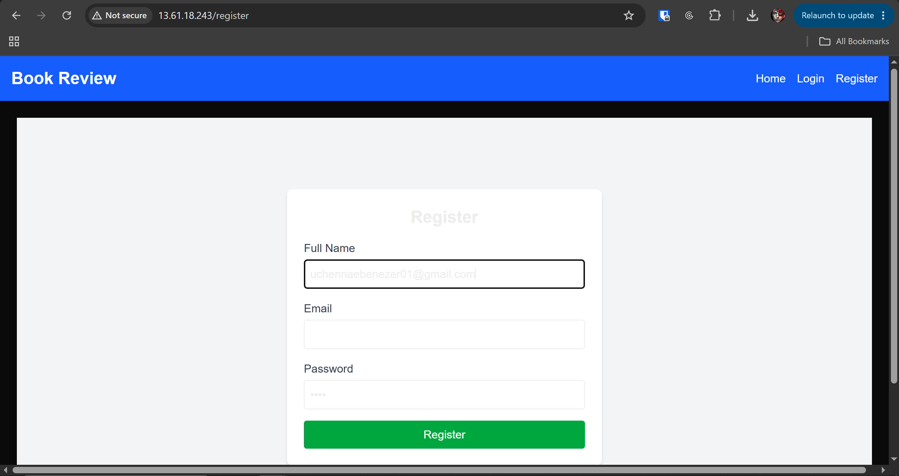

# Assignment 6 — Capstone Assignment — Deploy Book Review App (Three-Tier Architecture) on AWS

Part of the DevOps Micro Internship (DMI) Cohort 3 with Agentic AI

---

## Purpose

This is the most important assignment of the course. You will deploy the Book Review App in a fully production-style three-tier architecture on AWS: a Next.js Web Tier behind Nginx and a public ALB, a private Node.js/Express App Tier behind an internal ALB, and a private Multi-AZ MySQL RDS database with a read replica. You are expected to design, deploy, isolate, debug, and document the result independently.

---

# Task 1 — Architecture Diagram

## Goal

Create an architecture diagram showing the custom VPC (10.0.0.0/16), the six subnets across two Availability Zones (two public Web Tier, two private App Tier, two private Database Tier), the public ALB, Web Tier EC2/Nginx, internal ALB, private App Tier EC2, private Multi-AZ RDS with its read replica, and the permitted traffic flow.

### Evidence

#### Diagram image or link

---

# Task 2 — AWS Region & Services Used

## Goal

Record the AWS Region used and list every AWS service used across networking, compute, load balancing, security, and the database.

### Notes

**Region:**

eu-north-1

---

**Services:**

Amazon VPC

EC2

Application Load Balancer

Amazon RDS for MySQL

Route Tables

Internet Gateway

Nat Gateway 

Security Groups

---

# Task 3 — Public Entry Point

## Goal

Confirm the Book Review App loads through the public ALB DNS name.

### Evidence

#### Public ALB DNS

Paste your public ALB DNS name here:

[ALB DNS name](http://Book-Review-Web-ALB-16108434.eu-north-1.elb.amazonaws.com)

---

# Task 4 — Evidence Screenshots

## Goal

Capture visual proof of every tier and load balancer.

### Evidence

#### Web EC2

---

#### App EC2

---

#### Public ALB

---

#### Internal ALB

---

#### RDS + Replica

---

#### App UI proof

---

# Task 5 — Summary

## Goal

Summarize what worked in the final deployment, the issues encountered and how each was fixed, and the tools or sources used to research and debug.

### Notes

**What worked:**

The Book Review App was successfully deployed in a three-tier AWS architecture. The custom VPC and six-subnet architecture partitioned the Web, App, and Database tiers across two Availability Zones. I deployed the Web Tier on EC2 with Nginx serving the Next.js application on port 80 behind a public Application Load Balancer (ALB). The App Tier was deployed privately, with the Node.js/Express backend running on port 3001 behind an internal Application Load Balancer. I deployed Amazon RDS for MySQL in the private Database Tier with Multi-AZ for high availability and a read replica for read scaling. Traffic flow and Security Group isolation between the different tiers was also implemented as required.

---

**Issues + fixes:**

App Tier target showed an unhealthy status: After attaching Book-Review-App-EC2 to Book-Review-App-TG, the target was initially reported as unhealthy. The Node.js application was verified to be running and listening on port 3001 using ss and curl, so the issue was narrowed down to the Application Load Balancer health-check configuration and connectivity to the App Tier.

Internal ALB and App Tier port configuration required clarification: The App Tier was configured to run Node.js on port 3001, while the internal ALB listener was configured on port 80 and the target group on port 3001. This was reviewed to ensure the listener, target group, backend process, and Security Group rules remained consistent with the assignment's required App Tier port of 3001.

Security Group traffic flow required troubleshooting: The Security Group configuration was reviewed to ensure that traffic between the Web Tier, internal ALB, App Tier, and Database Tier followed the required tier-to-tier access model rather than exposing the private App or Database tiers publicly.

---

**Tools/sources used:**

AWS Documentation: Used as a reference for AWS networking, load balancing, Security Groups, EC2, and RDS configuration.

AWS Management Console: Used to create, configure, and validate the VPC, subnets, route tables, Security Groups, EC2 instances, Application Load Balancers, Target Groups, and Amazon RDS.

ChatGPT: Used to research architecture decisions, troubleshoot deployment issues, analyze errors, and validate configuration choices.

Linux/Ubuntu Terminal: Used to manage the EC2 instances and verify application services, ports, and connectivity.

Nginx: Used to serve the Next.js frontend on the Web Tier.

Node.js/Express: Used to run and test the backend application on port 3001.

Google: Used to research technical issues and compare troubleshooting approaches where necessary.

Book Review App source code: Used as the application codebase for the frontend and backend deployment

---

# LinkedIn Post (Required)

## Goal

Publish a LinkedIn post sharing the capstone deployment, including the public ALB DNS (or a redacted screenshot), three to five lines on what you built and why it is production-style, and one proof screenshot.

## Evidence

#### LinkedIn Post URL

Paste your LinkedIn post URL here:

[LinkedIn post]()

---

#### Screenshot of LinkedIn post

Add your screenshot here.

---

# Submission Instructions

- Add all required screenshots and links in your submission
- Do not expose passwords, RDS credentials, connection strings, private keys, or account IDs

---

# Completion Checklist

- [✅] Task 1: Architecture diagram completed
- [✅] Task 2: AWS Region and services documented
- [✅] Task 3: Public ALB DNS confirmed working
- [✅] Task 4: All six evidence screenshots captured (Web Tier, App Tier, both ALBs, RDS + replica, app UI)
- [✅] Task 5: Deployment summary completed (what worked, issues/fixes, tools/sources)
- [✅] LinkedIn post published and URL submitted
- [✅] App Tier and Database Tier confirmed not publicly accessible
- [✅] No sensitive data exposed

---

## 📌 About DMI & CloudAdvisory

DevOps Micro Internship (DMI) is a project-based DevOps program run by Pravin Mishra (The CloudAdvisory) focused on real-world execution, systems thinking, and career readiness.

It helps learners build strong DevOps foundations with hands-on experience.

---

## 📌 Resources

- 🌐 DMI Official Website: https://dmi.pravinmishra.com?utm_source=github&utm_medium=readme  
- 🎓 University: https://university.pravinmishra.com?utm_source=github&utm_medium=readme  
- 💬 Discord Community: https://discord.pravinmishra.com?utm_source=github&utm_medium=readme  
- 📝 Blog: https://dmi.pravinmishra.com/blog?utm_source=github&utm_medium=readme  
- ▶️ YouTube Playlist: https://www.youtube.com/playlist?list=PLFeSNDtI4Cho  
- 🔗 Pravin Mishra (LinkedIn): https://www.linkedin.com/in/pravin-mishra-aws-trainer/  
- 🏢 CloudAdvisory (LinkedIn): https://www.linkedin.com/company/thecloudadvisory/

---

*This submission is part of DevOps Micro Internship (DMI) Cohort 3 — Agentic AI Track.*