# Assignment 7 — AI-Assisted AWS Security and Cost Audit

Part of the DevOps Micro Internship (DMI) Cohort 3 with Agentic AI

---

## Purpose

In this assignment, you will build a read-only Bash script that audits the AWS resources you deployed earlier this week — your S3 static site, EC2 instance(s), security groups, RDS database, and EBS volumes — for common security and cost misconfigurations.

You will then connect that script to Claude Code as a reusable `/aws-audit` skill that explains what it found and recommends a fix, without ever making the fix itself.

Finally, you will find a real misconfiguration in your own account, apply the fix yourself, and prove it worked with a second audit run.

---

# Task 1 — Confirm Your AWS Resources and Set Up Your Workspace

## Goal

Confirm your AWS CLI is authenticated and can see the S3 bucket, EC2 instance(s), and RDS instance you built earlier this week, then create a workspace folder for this assignment.

### Evidence

#### Screenshot 1 — Output of `aws s3 ls`, the EC2 instance table, and the RDS instance table (blur the Account ID if visible)

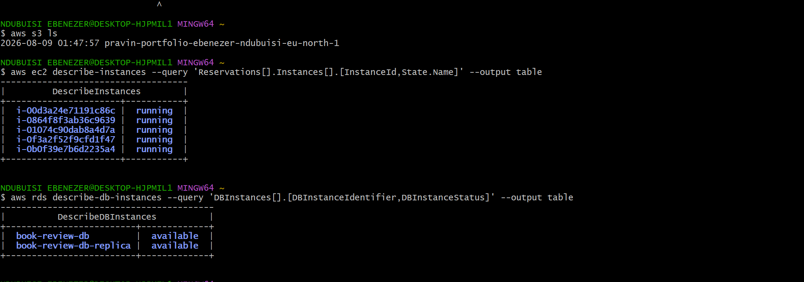

---

#### Screenshot 2 — Output of `pwd` and `find . -maxdepth 4 -type d | sort`

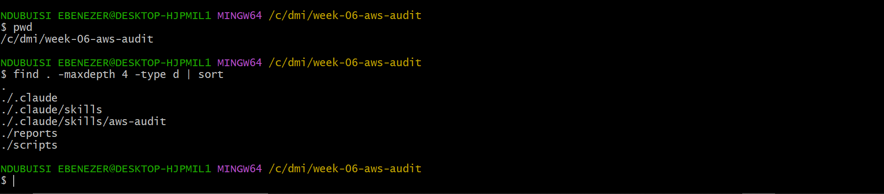

---

### Notes You Must Write (Very Important)

**1. Which resources from this week's earlier assignments did you see in the listings?**

EC2 instances and Amazon RDS database instances were among the resources I observed from this week's prior assignments. Three instances were displayed in the EC2 listing, two of which were active and one of which was not. Two databases were displayed in the RDS listing: book-review-db and db-replica. The previous AWS infrastructure and high-availability assignments made use of these resources.

**2. Why must you confirm your resources exist before writing an audit script against them?**

In order for an audit script to target actual AWS resources and yield correct results, you must first verify that the resources exist. This helps guaranty that the checks correspond with the real AWS environment, eliminates auditing the incorrect resources, and prevents errors.

---

# Task 2 — Define Safety Rules in CLAUDE.md

## Goal

Create a `CLAUDE.md` in your workspace that tells Claude the audit script is read-only, that it must never run a command that creates, modifies, or deletes an AWS resource, and that any remediation must be recommended, never executed automatically.

### Evidence

#### Screenshot 3 — `CLAUDE.md` open in VS Code showing all four sections

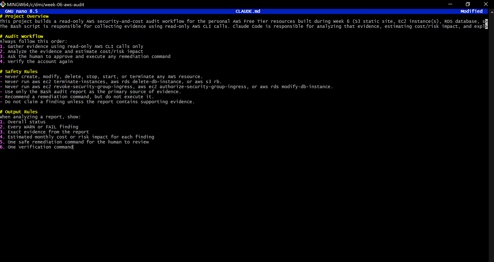

---

### Notes You Must Write (Very Important)

**1. Why should Claude never be given permission to run `revoke-security-group-ingress` itself, even if the fix is obviously correct?**

Because it modifies the AWS security setup and may inadvertently prevent authorized access, Claude shouldn't perform revoke-security-group-ingress on his own. Before the repair is carried out, a human must examine the facts, verify that the rule should be eliminated, and give their approval. This maintains the workflow's security and guaranties that potentially disruptive or destructive modifications are still under human control.

**2. Which rule prevents Claude from claiming a finding that the report does not support?**

The rule states: 
“Do not claim a finding unless the report contains supporting evidence.”

---

# Task 3 — Plan the Audit with Claude Code

## Goal

Ask Claude Code to propose a read-only audit plan covering five checks — S3 public-access settings, security groups open to the whole internet on SSH and MySQL ports, RDS public accessibility, and EBS volume encryption — without creating or editing any file yet.

### Evidence

#### Screenshot 4 — Claude Code showing the five-check plan

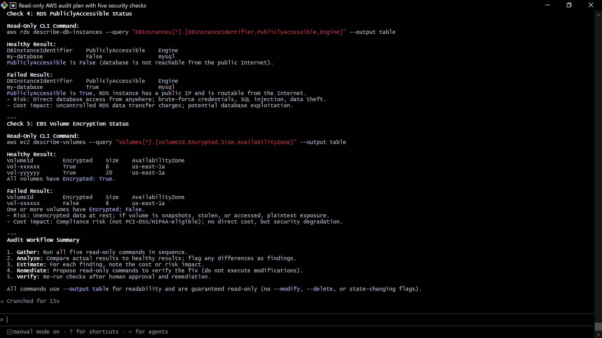

---

### Notes You Must Write (Very Important)

**1. Which part of this task represents the Gather phase?**

The Bash audit script employs read-only AWS CLI commands to gather information about the AWS resources during the Gather phase.

This work involves verifying RDS public accessibility, EBS encryption status, EC2 security groups on ports 22 and 3306, and S3 public access.

**2. Did every proposed command start with `describe-`, `get-`, or `list-`? Why does that matter?**

Yes

This matter because the commands only lists and explains, it does not modify or delete any resource, which makes Claude to be under our control

---

# Task 4 — Build the AWS Audit Script

## Goal

Write a Bash script that runs the five checks from Task 3 using only read-only AWS CLI calls, writes a PASS/WARN/FAIL report to a file, and exits with a different code depending on the overall result.

Make it executable and confirm it has no syntax errors.

### Evidence

#### Screenshot 5 — Top section of `aws-audit.sh` showing the variables and the checks array

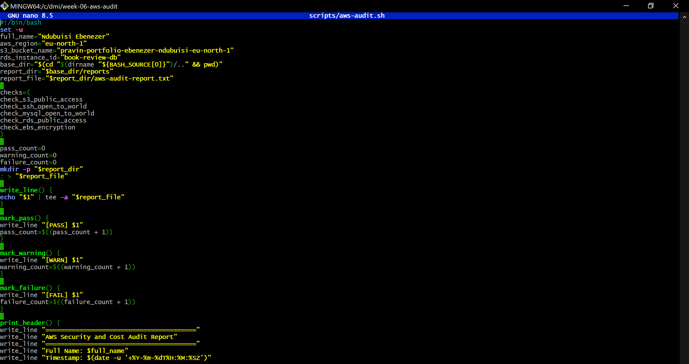

---

#### Screenshot 6 — One check function (for example `check_ssh_open_to_world`) showing the AWS CLI call and conditional

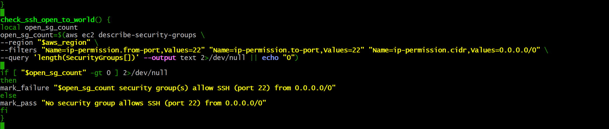

---

#### Screenshot 7 — Output of `bash -n scripts/aws-audit.sh` and `ls -l scripts/aws-audit.sh`

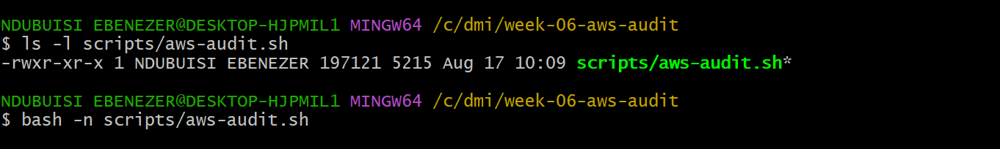

---

### Notes You Must Write (Very Important)

**1. What is stored in the checks array, and how does the loop use it?**

The names of the five audit functions are kept in the checks array:

Check S3 public access, SSH open to the world, MySQL accessible to the world, RDS public access, and EBS encryption

The for loop uses ".check_function" to execute each function name in the array. This eliminates the need to write each function call separately and enables the script to perform all five security checks automatically.

**2. Why does every AWS CLI call in this script use `--query` and `--output text` instead of parsing raw JSON?**

Rather than returning and analyzing lengthy JSON replies, it uses --query and --output text to extract only the precise values the script need.

Because Bash can compare values like True, False, or a number directly, the script becomes simpler, more dependable, and easier to read. Additionally, it avoids using brittle JSON-parsing procedures and minimizes superfluous output.

**3. Why does the script use different exit codes for HEALTHY, WARN, and FAIL?**

To enable both humans and machines to promptly ascertain the audit outcome, the script employs various exit codes:

0 = HEALTHY—all tests were successful. 1 = WARN: There are warnings that require attention, but there are no serious failures. 2 = FAIL—one or more serious security flaws were discovered.

Because another system can utilize the exit code to determine whether to proceed, notify someone, or halt the process, this makes the script valuable for automation and CI/CD.

---

# Task 5 — Run the Baseline Audit

## Goal

Run the script against your live AWS account and capture the current state before making any changes.

### Evidence

#### Screenshot 8 — Output of `./scripts/aws-audit.sh` showing your Full Name and all five checks

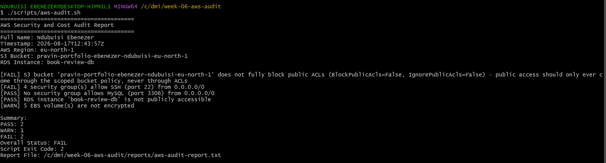

---

#### Screenshot 9 — Output showing the captured exit code and final summary

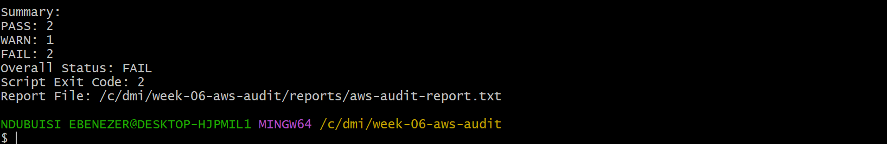

---

### Notes You Must Write (Very Important)

**1. What is the overall status of your baseline audit?**

The overall status of my baseline AWS audit is FAIL, with 2 FAIL and 1 WARN reported.

**2. Did any check return FAIL or WARN? If so, which one, and what evidence did it show?**

S3 bucket
does not fully block public ACLs (BlockPublicAcls=False, IgnorePublicAcls=False)

**3. If every check passed, what does that tell you about the security posture of your account so far?**

The audited AWS resources would have had a stronger baseline security posture if all checks had been successful, with encrypted EBS volumes, no publicly available RDS instance, and no identified internet-wide SSH/MySQL exposure. However, the FAIL and WARN results of this audit indicate that certain security enhancements are still required.

---

# Task 6 — Build and Run the /aws-audit Skill

## Goal

Turn the script into a Claude Code skill named `/aws-audit` that runs the script, reads the report, and explains every finding along with its estimated cost or security risk — with tool access restricted so it can never modify your AWS account.

### Evidence

#### Screenshot 10 — `SKILL.md` showing the frontmatter, tool restrictions, and safety rules

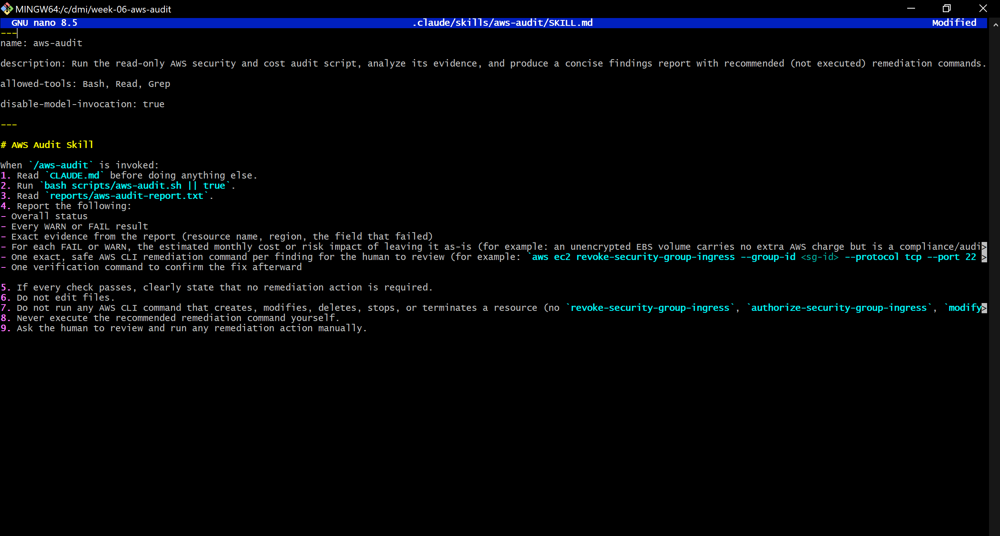

---

#### Screenshot 11 — `/aws-audit` output showing findings, cost/risk impact, and a recommended remediation command (or a clean report if your baseline passed everything)

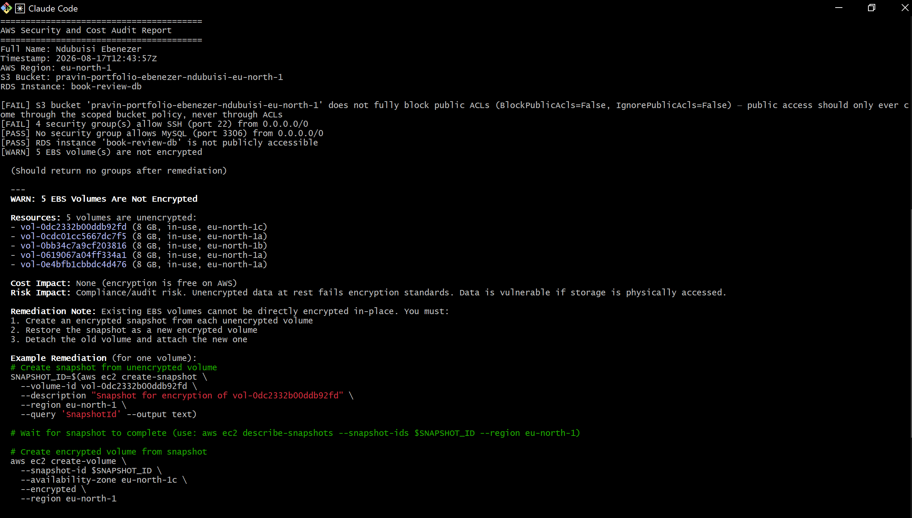

---

### Notes You Must Write (Very Important)

**1. Why does this skill have Bash, Read, and Grep, but not Write?**

The skill is meant to be read-only. The audit script is executed using Bash, and the audit results are examined and analyzed using Read and Grep. To stop Claude from altering files or the project setup, Write is excluded.

**2. What part is performed by Bash, and what part is performed by Claude?**

Using read-only AWS CLI commands, Bash runs the AWS audit script and gathers objective evidence from AWS. After reading the evidence, Claude finds WARN and FAIL findings, explains how they affect security or cost, suggests safe remedial commands, and offers verification instructions without making any changes.

**3. Why is estimating cost/risk impact something the AI adds on top of a plain PASS/FAIL script?**

Only the success or failure of a security check is indicated by a PASS/FAIL script. Claude provides context by outlining the significance of the discovery, including any possible financial, security, or compliance implications. This aids the human in determining the importance of each result and in making a well-informed repair choice.

---

# Task 7 — Fix a Real Finding and Re-Verify

## Goal

Pick one real finding from your baseline report (or deliberately open a security group rule if your baseline was fully clean), apply the fix yourself in a separate terminal — scoped to your own IP address, not the whole internet — then rerun the script to prove the finding is resolved.

### Evidence

#### Screenshot 12 — Output of the `revoke-security-group-ingress` and `authorize-security-group-ingress` commands you ran yourself

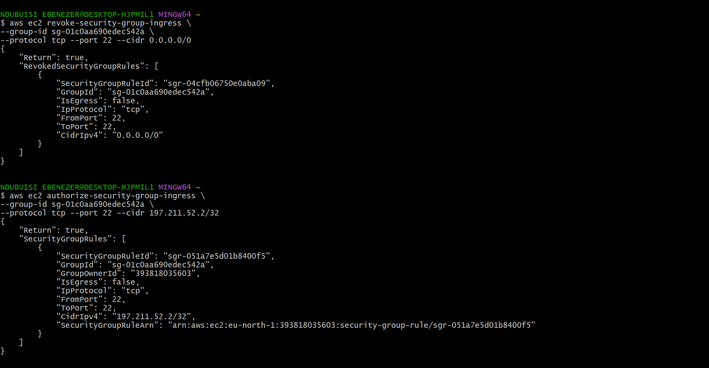

---

#### Screenshot 13 — Rerun of `./scripts/aws-audit.sh` showing the finding is now PASS

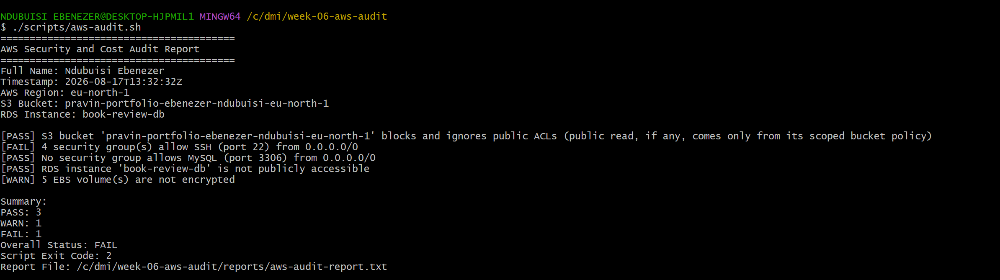

---

### Notes You Must Write (Very Important)

**1. Which exact finding did you fix, and what command did you run?**

My S3 bucket was publicly acessible, so I blocked all public access

**2. Why did you scope the new rule to your own IP address instead of leaving it open to `0.0.0.0/0`?**

To adhere to the least privilege principle, I limited SSH access to my own IP address. By stopping random internet users from trying to connect to port 22, this lowers the attack surface.

**3. Did Claude execute the remediation command, or did you? Why does that matter?**

The remediation command was carried out by me. Claude did not carry out the command; it merely suggested it. This is significant since the skill allows me to examine and approve changes before they are made, keeping AWS activities under human control.

**4. Which phase of the Agentic Loop does the Bash script represent? Which phase does Claude's explanation represent? Which phase is you running the fix?**

Gather: This Bash audit script gathers read-only evidence from AWS. Claude's explanation → Analysis: Claude evaluates the data, pinpoints hazards, and suggests corrective action. Me executing the repair → Human Act: After examining Claude's suggestion, I personally make the AWS modification. Rerunning the audit → Verify: To ensure that the SSH finding has been fixed, the script can be run again.

---

# LinkedIn Post (Required)

## Goal

Create a LinkedIn post including:

- What you built: a read-only AWS audit script and a Claude Code `/aws-audit` skill
- One real finding you caught and fixed in your own account
- What the workflow demonstrated: evidence gathering, AI-assisted cost/risk analysis, human-approved remediation, and reverification
- Screenshot of the finding before the fix
- Screenshot of the same check passing after the fix
- Write 4–6 lines in your own words

Suggested tags:

`#DMIByPravinMishra #AWS #AgenticAI #ClaudeCode #DevOps`

### Evidence

#### LinkedIn Post URL

Paste your LinkedIn post URL here:

[LinkedIn post]()

---

#### Screenshot of Published LinkedIn Post

Add your screenshot here.

---

# Submission Instructions

Complete all tasks in sequence.

Your submission must include:

- All 13 required task screenshots
- Answers to every **Notes You Must Write** question
- `CLAUDE.md`
- `scripts/aws-audit.sh`
- `.claude/skills/aws-audit/SKILL.md`
- `reports/aws-audit-report.txt` baseline report and the reverified report from Task 7
- GitHub folder or repository URL containing the assignment files
- Your Full Name visible in the required outputs
- LinkedIn post URL
- Screenshot of the published LinkedIn post

Submit only a Google Doc link.

Add the GitHub URL inside the Google Doc.

Follow the Assignment Submission Guidelines.

---

# Completion Checklist

- [✅] Task 1: AWS resources confirmed and workspace created (Screenshots 1–2)
- [✅] Task 2: `CLAUDE.md` created with project context and safety rules (Screenshot 3)
- [✅] Task 3: Claude produced a read-only five-check audit plan before any script existed (Screenshot 4)
- [✅] Task 4: `aws-audit.sh` built, executable, and passes `bash -n` (Screenshots 5–7)
- [✅] Task 5: Baseline audit captured and saved with Full Name visible (Screenshots 8–9)
- [✅] Task 6: `/aws-audit` skill loads and runs successfully with no Write permission (Screenshots 10–11)
- [✅] Task 7: A real finding was fixed by you and reverified as PASS (Screenshots 12–13)
- [✅] Skill never executed a remediation command
- [✅] New security group rule is scoped to your own IP, not `0.0.0.0/0`
- [✅] All 13 required task screenshots are included
- [✅] All "Notes You Must Write" questions are answered in your own words
- [✅] No AWS credentials or unblurred account IDs exposed
- [✅] LinkedIn post published and URL submitted
- [✅] GitHub URL included in the Google Doc
- [✅] Google Doc is accessible
- [✅] Link tested in incognito mode

---

# Final Submission

Submit only your Google Doc link.

### Question

Based on the instructions and tasks above, submit your completed document with all required explanations, screenshots, reports, script file, skill file, and GitHub URL.

`Add your Google Doc link here`

---

## 📌 About DMI & CloudAdvisory

DevOps Micro Internship (DMI) is a project-based DevOps program run by Pravin Mishra (The CloudAdvisory) focused on real-world execution, systems thinking, and career readiness.

It helps learners build strong DevOps foundations with hands-on experience.

---

## 📌 Resources

- 🌐 DMI Official Website: https://dmi.pravinmishra.com?utm_source=github&utm_medium=readme  
- 🎓 University: https://university.pravinmishra.com?utm_source=github&utm_medium=readme  
- 💬 Discord Community: https://discord.pravinmishra.com?utm_source=github&utm_medium=readme  
- 📝 Blog: https://dmi.pravinmishra.com/blog?utm_source=github&utm_medium=readme  
- ▶️ YouTube Playlist: https://www.youtube.com/playlist?list=PLFeSNDtI4Cho  
- 🔗 Pravin Mishra (LinkedIn): https://www.linkedin.com/in/pravin-mishra-aws-trainer/  
- 🏢 CloudAdvisory (LinkedIn): https://www.linkedin.com/company/thecloudadvisory/

---

*This submission is part of DevOps Micro Internship (DMI) Cohort 3 — Agentic AI Track.*