# Assignment 7 — AI-Assisted Azure Security Posture Audit

Part of the DevOps Micro Internship (DMI) Cohort 3 with Agentic AI

---

## Purpose

In this assignment, you will build a read-only Bash script that audits the Azure resources you deployed earlier this week — a virtual machine, a three-tier network with a Load Balancer, a Storage Account, and an Azure Database for MySQL server — for common security misconfigurations. You will connect that script to Claude Code as a reusable `/azure-audit` skill that explains findings and recommends a fix without ever running it, then fix one real finding yourself and prove the fix with a second audit run. This is the same read-only-evidence-then-human-fixes discipline from Week 3, now applied to Azure with the `az` CLI instead of Linux commands — and the cloud-agnostic counterpart to the AWS audit you built in Week 6.

---

# Task 1 — Confirm Your Resources and Create the Workspace

## Goal

Confirm your Azure CLI is authenticated and can see the VM, network, storage account, and MySQL server you built this week, then set up a workspace folder for the audit.

### Evidence

#### Screenshot 1 — `az account show` and `az vm list -d -o table` confirming your subscription and running VM (subscription ID partially blurred)

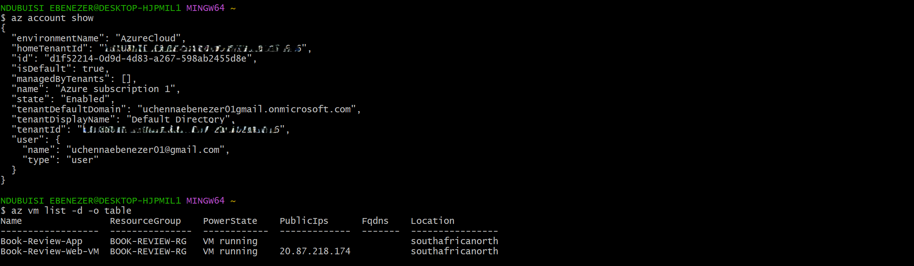

---

# Task 2 — Create Project Context and Safety Rules in CLAUDE.md

## Goal

Create a `CLAUDE.md` for this workspace that tells Claude what the audit covers and the safety rules it must follow: never run a mutating `az` command, never claim a finding without report evidence, and always let the human review and run any remediation.

### Evidence

#### Screenshot 2 — `CLAUDE.md` open in your editor showing the project overview, audit workflow, and safety rules

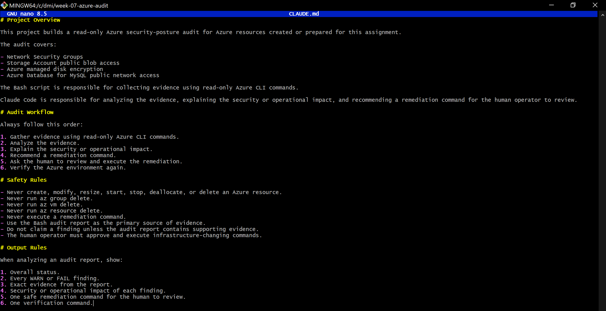

---

# Task 3 — Use Agentic AI to Plan the Audit Before Writing the Script

## Goal

Ask Claude Code to read `CLAUDE.md` and propose a read-only, four-check audit plan (NSG rules open to `0.0.0.0/0` on port 22 or 3389, storage account public blob access, VM disk encryption status, and Azure Database for MySQL public network access) — without creating or editing any file yet.

### Evidence

#### Screenshot 3 — Claude Code showing the four-check plan, with no files created or modified

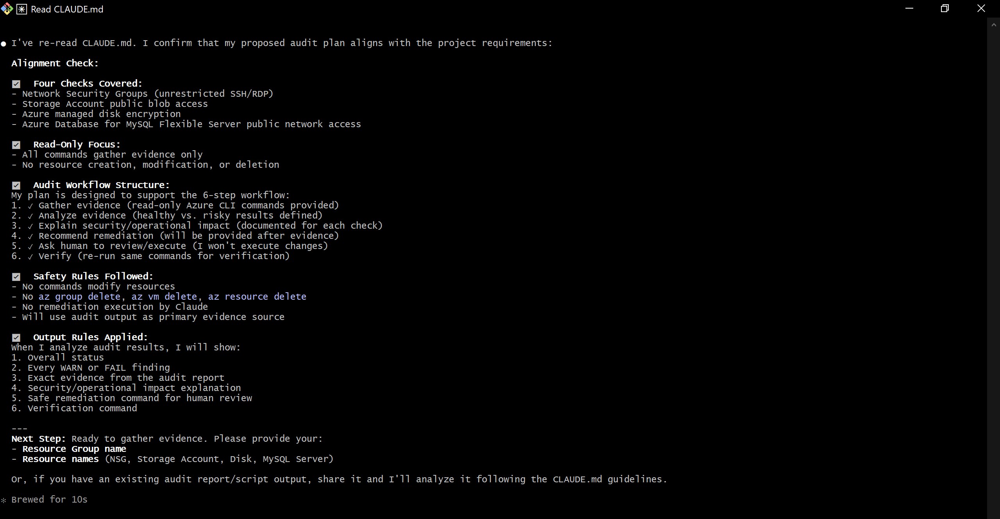

---

# Task 4 — Build the Azure Audit Bash Script

## Goal

Write a Bash script that runs the four checks from Task 3 using read-only `az` commands, writes a PASS/WARN/FAIL report with your Full Name, and exits with a different code for a healthy, warning, or failing result. Validate it with `bash -n` and make it executable.

### Evidence

#### Screenshot 4 — Your script open in your editor, showing the check functions and the `az` commands they call

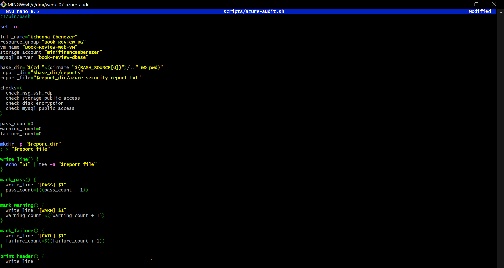

---

#### Screenshot 5 — Output of `bash -n` (no syntax errors) and `ls -l` showing the script is executable

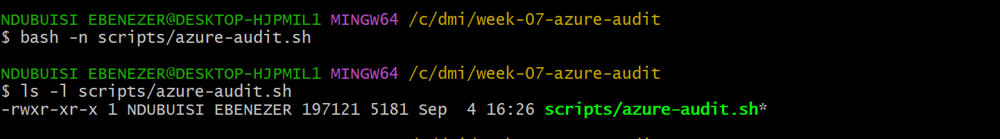

---

# Task 5 — Run the Script and Review the Baseline Report

## Goal

Run the script against your live resources and read the report honestly, even if it shows a real finding — do not fix anything yet.

### Evidence

#### Screenshot 6 — Script output showing your Full Name and all four checks with a PASS, WARN, or FAIL result

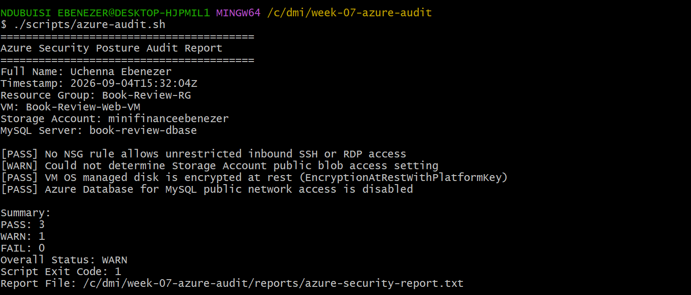

---

# Task 6 — Create and Run the /azure-audit Skill

## Goal

Create a Claude Code skill restricted to read-only tools (no `Write`) that runs your script, reads the report, and explains every finding with the risk of leaving it unresolved — without ever running a remediation command itself.

### Evidence

#### Screenshot 7 — Your skill file's frontmatter showing `allowed-tools` without `Write`

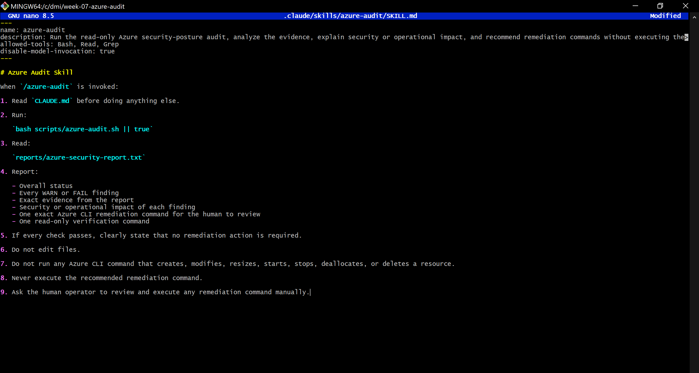

---

#### Screenshot 8 — `/azure-audit` output showing the baseline findings and Claude's explanation

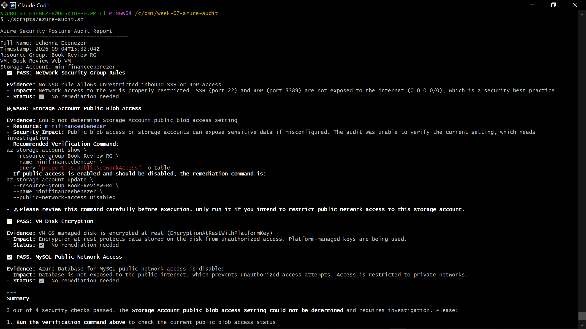

---

# Task 7 — Fix a Real Finding and Re-Verify

## Goal

Pick one WARN or FAIL finding (or deliberately open an NSG rule to port 22 from `0.0.0.0/0` if your baseline was already clean), save that failing report, run the remediation command yourself — scoped to your own IP, not left open — and confirm the second audit run shows it resolved.

### Evidence

#### Screenshot 9 — Saved report showing the original finding before the fix

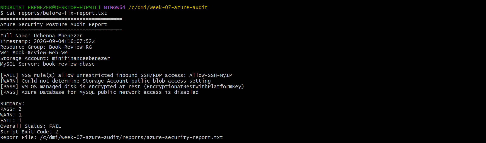

---

#### Screenshot 10 — Terminal output of the remediation command you ran yourself

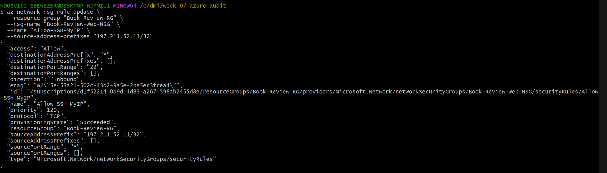

---

#### Screenshot 11 — Second `/azure-audit` run (or report) showing the finding resolved

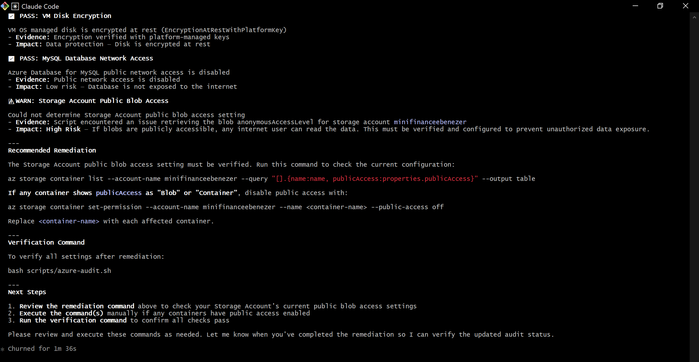

---

### Notes

Compare this assignment to the AWS audit you built in Week 6: which finding categories map to each other across the two clouds, and what stayed exactly the same about the workflow even though the `az`/`aws` commands are completely different?

The resources and CLI commands differ between this Azure audit and the AWS audit from Week 6, but the security checks are very similar. There are obvious equivalents for each of the four major sections in both clouds. Azure NSG policies that expose ports 22 and 3389 match Security Group rules in AWS that provide network accessibility. Whereas Azure employs the Storage Account's allowBlobPublicAccess setting, public data exposure in AWS is related to the S3 bucket's public access settings. VM OS disk encryption in Azure and RDS storage encryption in AWS are used to verify encryption at rest. Lastly, the MySQL Flexible Server publicNetworkAccess setting in Azure and the RDS PubliclyAccessible configuration in AWS indicate public database exposure.

Rather than the individual commands, the audit process as a whole was the most similar. The same Agentic Loop was used in both audits: read-only CLI commands were used to gather evidence, which was then reviewed by Claude to flag potential hazards. Any necessary remediation was then carried out by a human, and the audit was then performed again to verify the improvements.

Using commands like list, show, and describe rather than instructions that create, edit, or remove resources, both scripts were purposefully made to be read-only. Even though Claude recommended the remediation actions, the CLAUDE.md guidelines in both projects explicitly listed damaging commands that should not be used and prohibited Claude from directly applying patches.

The usage of distinct exit codes for HEALTHY, WARN, and FAIL was another prevalent feature that yielded more helpful outcomes than just a pass/fail status. Additionally, I discovered that identifying resource-naming and command incompatibilities early on was made easier by hammering out the precise Azure and AWS CLI instructions with Claude prior to deploying the Bash scripts. One instance was the distinction between the language used by Azure's Flexible Server and AWS RDS.

The fundamental audit technique was the same even when the cloud platforms, resource names, and CLI syntax varied greatly. The same guidelines were used for both AWS and Azure's evidence gathering, security checks, human-controlled remediation, verification, and severity reporting.

---

# Submission Instructions

Complete all tasks in sequence.

Your submission must include:
- All 11 required screenshots
- Do not expose your Azure subscription ID, tenant ID, client secrets, or connection strings

---

# Completion Checklist

- [✅] Task 1: Azure resources confirmed and workspace created (Screenshot 1)
- [✅] Task 2: `CLAUDE.md` created with project context and safety rules (Screenshot 2)
- [✅] Task 3: Claude produced a read-only four-check plan before any script existed (Screenshot 3)
- [✅] Task 4: Audit script built, syntax-checked, and executable (Screenshots 4–5)
- [✅] Task 5: Baseline audit run and reviewed honestly (Screenshot 6)
- [✅] Task 6: `/azure-audit` skill created with no `Write` permission and run successfully (Screenshots 7–8)
- [✅] Task 7: A real finding fixed by you (not Claude) and re-verified as resolved (Screenshots 9–11)
- [✅] Notes comparing this to the Week 6 AWS audit completed
- [✅] No subscription IDs, tenant IDs, or credentials exposed

---

## 📌 About DMI & CloudAdvisory

DevOps Micro Internship (DMI) is a project-based DevOps program run by Pravin Mishra (The CloudAdvisory) focused on real-world execution, systems thinking, and career readiness.

It helps learners build strong DevOps foundations with hands-on experience.

---

## 📌 Resources

- 🌐 DMI Official Website: https://dmi.pravinmishra.com?utm_source=github&utm_medium=readme  
- 🎓 University: https://university.pravinmishra.com?utm_source=github&utm_medium=readme  
- 💬 Discord Community: https://discord.pravinmishra.com?utm_source=github&utm_medium=readme  
- 📝 Blog: https://dmi.pravinmishra.com/blog?utm_source=github&utm_medium=readme  
- ▶️ YouTube Playlist: https://www.youtube.com/playlist?list=PLFeSNDtI4Cho  
- 🔗 Pravin Mishra (LinkedIn): https://www.linkedin.com/in/pravin-mishra-aws-trainer/  
- 🏢 CloudAdvisory (LinkedIn): https://www.linkedin.com/company/thecloudadvisory/

---

*This submission is part of DevOps Micro Internship (DMI) Cohort 3 — Agentic AI Track.*
